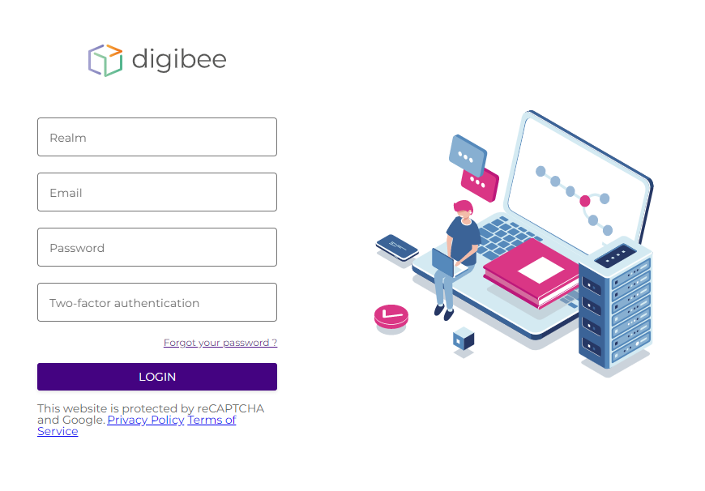

# Fluxo de login

Existem duas maneiras de fazer login na Digibee Integration Platform:

* [Usando credenciais Digibee](fluxo-de-login.md#\_3ingd8lvv5ai)
* [Usando um provedor de identidade (IdP)](fluxo-de-login.md#\_crldaax16nm3)

## Logins com credenciais Digibee 

### Primeiro acesso 

Para acessar a Digibee Integration Platform pela primeira vez, peça ao seu gerente de acessos para **criar um usuário** para você. Para saber como criar um usuário, clique aqui.

Depois que seu gerente de acesso criar o usuário, você receberá **um e-mail solicitando que você defina uma senha de acesso**. Siga as instruções no e-mail.

Depois de configurar sua senha de acesso, faça o login na Digibee Integration Platform usando suas credenciais e informando o _realm_ que deseja acessar. Se a autenticação em duas etapas estiver ativada, você também será solicitado a fornecer um código de verificação.


Em alguns casos, a Digibee detecta seu _realm_ automaticamente. Neste caso, você só precisa inserir seu e-mail e senha.



Logins com credenciais Digibee podem ser bloqueados pelos gestores de acesso do seu _realm_. Nesse caso, você deve [fazer login com um IdP](fluxo-de-login.md#\_crldaax16nm3). Você pode ler mais sobre isso em [nosso artigo Acessos via IdP](../integracao-de-provedor-de-identidades/acessos-via-idp.md).


### Senha expirada 

Por razões de segurança, **a Digibee exige que seus usuários alterem suas senhas a cada 15 dias**. Se você tentar fazer login usando uma senha expirada, você será redirecionado para a tela de redefinição de senha.

## Logins usando um provedor de identidade (IdP) 

Além de usar as credenciais Digibee, você também pode fazer login com IdP. Este IdP deve ser previamente integrado à Digibee. Para saber mais sobre isso, leia nosso artigo sobre [integração do provedor de identidade](../integracao-de-provedor-de-identidades/).

Para fazer login na Digibee Integration Platform usando um IdP, primeiro faça login no seu IdP. Em seguida, ao efetuar login na Digibee Integration Platform, clique no botão referente ao IdP que você está utilizando, conforme a imagem abaixo.

<figure><figcaption>
Página de login com provedor de identidade
</figcaption></figure>

### Melhores práticas ao fazer login 

* Certifique-se de que seu navegador esteja atualizado.
* Desative _plugins_ que possam entrar em conflito com o reCAPTCHA.
* Remova ou desative extensões que executam automações.
* Exclua _cookies_ e/ou dados do histórico do navegador.
* Ative a autenticação de dois fatores da Digibee.
