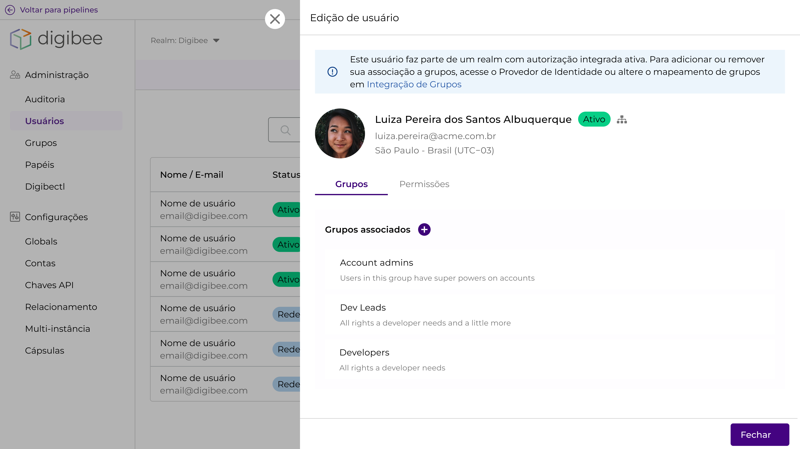

# Visualização da classificação de acesso na página de usuários

Ao acessar a área de usuário na Digibee Integration Platform, é possível visualizar informações importantes sobre a classificação do usuário em termos de características de autenticação (tipo de usuário) e autorização de acesso.&#x20;

<figure><figcaption></figcaption></figure>

A coluna de **Tipo de Acesso** trata das características da autenticação, ou seja, informar se o usuário faz login via provedor de identidade (IdP) ou via Digibee Integration Platform:

* **IdP:** aparece quando o usuário faz login via provedor de identidade.
* **Digibee:** aparece quando o usuário faz login via Digibee Integration Platform.

<figure><figcaption></figcaption></figure>

Já a coluna de **Autorização**, sinaliza as características de autorização do usuário:

* **Pertence a um ou mais grupos Digibee:** usuário está contido em um ou mais  grupos na Digibee Integration Platform.
* **Não pertence a nenhum grupo Digibee:** usuário não está contido em nenhum grupo na Digibee Integration Platform.
* **Pertence a um ou mais grupos IdP integrado:** usuário está contido em um ou mais grupos Digibee integrados com Provedor de Identidade.
* **Não pertence a nenhum grupo IdP integrado:** usuário não está contido em nenhum grupo Digibee integrado com provedor de identidade
* **Não pertence a nenhum grupo IdP:**  usuário não está contido em nenhum grupo do provedor de identidade ou se houve falha na configuração da Integração de Grupos
* **Autorização não definida:** não foi identificado nenhum login por parte do usuário**.**

<figure><figcaption></figcaption></figure>

Além disso, ao clicar em **Editar** o usuário a plataforma também exibe outras informações:

**Para um usuário que faz login via IdP:**

<figure><figcaption></figcaption></figure>

* **Alerta:** o Gestor de Acesso que quiser editar grupos de um usuário que tenha feito login via IdP só poderá fazer essas alterações via provedor de identidade ou alterando o mapeamento dos grupos na área de Integração de Grupos.

<figure><figcaption></figcaption></figure>

* **Ícone:** indica que o usuário está no modelo integrado e que faz login via provedor de identidade. Ao clicar nele, o Gestor é direcionado para a página de Integração de Grupos.

<figure><figcaption></figcaption></figure>

* **Aba de Grupos:** visualização e edição dos grupos atribuídos àquele usuário. Caso seja um um usuário que faz login via IdP e o realm esteja com a autorização integrada ativa, a aba em questão só exibe a opção de visualização (conforme alerta).

<figure><figcaption></figcaption></figure>

* **Aba de Permissões:** apresenta o somatório de permissões do usuário advindas dos grupos aos quais pertence.

<figure><figcaption></figcaption></figure>

**Para um usuário que faz login via Plataforma:**

<figure><figcaption></figcaption></figure>

* **Aba de Grupos:** visualização e edição dos grupos atribuídos àquele usuário (no caso da imagem, o usuário não tem nenhum grupo associado).

<figure><figcaption></figcaption></figure>

* **Aba de Permissões:** apresenta o somatório de permissões do usuário advindas dos grupos aos quais pertence

<figure><figcaption></figcaption></figure>

Ao deixar essas informações evidentes, a plataforma auxilia na autossuficiência do processo de decisão da Gestão de Identidade e Acesso (IAM), pois oferece recursos de análises adequados para que o Gestor de Acesso seja capaz de tratar questões e/ou problemas que venham a surgir com um ou mais usuários.

Isso é relevante, sobretudo, quando gestores de acessos precisam consolidar a governança de realms que passam para o modelo onde possuem provedores de identidade integrados à Digibee Integration Platform.
