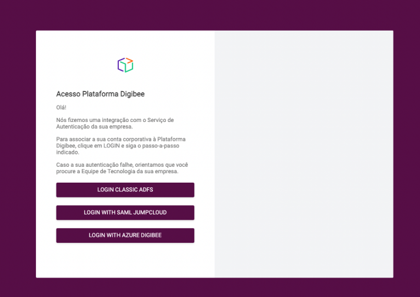

# Integração dos grupos IdP com grupos Digibee

O realm da Digibee que possui integração com provedor de identidade (IdP), poderá integrar os grupos do provedor de identidade com os grupos Digibee para aumentar a eficiência da gestão de acessos dos seus usuários. Isso permite escalar as mudanças das permissões, e garantir mais facilidade ao gestor de acessos.

Para evitar possíveis perdas de acesso, o gestor de acesso do realm deve configurar as integrações de grupos e solicitar a sua ativação via solicitação ao time de suporte ou Customer Success da Digibee.

Quando ativada a integração de Grupos IdP, o controle de acesso terá o seguinte comportamento:

* **Usuários nativos** não são afetados pela integração de grupos IdP, assim eles podem ser associados a qualquer grupo Digibee (integrado ou não).
* **Usuários integrados (IdP)** poderão participar apenas de **grupos integrados (IdP)** quando a integração for ativada pelo time de Suporte (após solicitação). Caso não esteja ativa, estes usuários podem ser associados manualmente a grupos Digibee.

<figure><figcaption></figcaption></figure>

<figure><figcaption></figcaption></figure>

**Nota:** Caso solicitado, a opção de usuários nativos pode ser desativada no realm, após a validação de todo o ambiente.

Todas as etapas descritas abaixo só terão efeito imediato após ativação com o time de suporte.

### **Antes de começar**

Leia os seguintes artigos e conheça mais sobre o funcionamento do Novo Controle de Acesso e da integração com Provedor de Identidade:

* [Novo Controle de Acesso](../novo-controle-de-acesso/)
* [Integração com Provedor Identidade](./)

### **Como criar uma integração**

Para criar uma integração, siga os seguintes passos:

1. Faça login na Digibee Integration Plaform;
2. Clique no ícone de “Administração”;
3. Entre na opção do menu “Grupos”;

<figure><figcaption></figcaption></figure>

4\. Selecione a aba “Integração de grupos”;

5 Clique no botão **+ CRIAR** no canto superior direito;

<figure><figcaption></figcaption></figure>

6\. \*\*\*\* Um formulário solicitando a seguintes informações será exibido:

* **Nome:** nome desejado para a integração.
* **SAML Scheme:** esquema de organização do seu provedor de identidade.
* **Código ID do provedor de identidade:** código identificador do grupo no provedor de identidade.
* **Grupo Digibee:** grupo da Plataforma que será integrado.

Caso seja selecionado “**Custom Scheme**” no campo SAML Scheme, um novo campo será exibido:

* **Xpath:** caminho do XML para obter os IDs do grupo do provedor de identidade.

**Nota:** caso seu provedor de identidade seja apresentado na listagem de SAML Scheme, não é necessário localizar o XPath.

7\. Após preencher os campos, clique em **“SALVAR”** no canto inferior direito.

8\. Uma caixa de diálogo de confirmação aparecerá.Digite uma breve explicação da integração que foi criada. Esta informação será adicionada no Registro de Auditoria da Plataforma.

9\. Clique em **“CRIAR INTEGRAÇÃO”**

Após todos estes passos a integração será criada com sucesso.

### Como simular uma integração

A simulação da integração é um mecanismo que tem por objetivo validar, através de um login simulado de um usuário teste, se uma integração de grupos está funcional.

**IMPORTANTE:** Para simular a integração de grupos é necessário que o usuário-teste esteja contido no grupo do provedor de identidade relacionado à integração que será testada.

#### 1.Clique no ícone “play”

Para iniciar a simulação, acesse o menu **Administração** > **Grupos** > **Aba Integrações de grupos** e localize o ícone ‘play’ (na coluna Ações) ao lado da integração que será simulada.

<figure><figcaption></figcaption></figure>

**Nota:** Para integrações que foram criadas e que não foram simuladas ainda, o status é exibido como **não executado**.

#### **2. Preencher e-mail de usuário teste**

Nesta etapa, é obrigatório fornecer o e-mail do usuário de teste para que a Plataforma identifique o usuário e gere o link para a simulação do login via IdP.

<figure><figcaption></figcaption></figure>

**IMPORTANTE:**&#x20;

* Só é permitido um e-mail de teste para cada simulação de integração;
* É imprescindível que o e-mail pertença a um usuário de teste contido no grupo IdP corresponde à integração que se pretende simular.

**3. Clicar em TESTAR**

Após clicar em testar, é exibida a tela “Instruções de testes de integração” (Passo 4) e o tempo limite para realizar o login simulado é de cinco minutos. Caso esse tempo se exceda, a Plataforma automaticamente atualizará o status da simulação para **expirado**.&#x20;

**IMPORTANTE:**

* Caso o e-mail de login fornecido esteja sendo utilizado numa outra integração, uma tela de aviso aparece alertando que, caso clique em **INICIAR,** o teste que já está utilizando o e-mail fornecido será **cancelado**.

<figure><figcaption></figcaption></figure>

**4. Copiar link**

Na tela de “Instruções de teste de integração”, a Plataforma oferece o link a ser copiado para a fazer a simulação. Neste momento, o temporizador começa a fazer a contagem regressiva.

<figure><figcaption></figcaption></figure>

**IMPORTANTE:**

* O link fornecido precisa ser colado numa janela anônima. Caso o link seja colado numa aba/janela normal, a Plataforma entende que foi feito um login real e substitui a sessão atual. Assim, o fluxo de teste feito até o momento é perdido.&#x20;
* Caso seja clicado **FECHAR** neste momento, aparece um aviso informando que não será mais possível ver nem o tempo restante  bem como o link de login do IdP.

<figure><figcaption></figcaption></figure>

* Se porventura for dada continuidade clicando em **SAIR**, a sua integração terá o status de **pendente** até que o tempo limite termine, passando para o status de **expirado**.

**5. Abrir janela anônima no navegador**

Existe duas formas para abrir a janela anônima no navegador Chrome:

* Ctrl + Shift + N
* Personalizar e controlar o Google Chrome > janela anônima

<figure><figcaption></figcaption></figure>

**IMPORTANTE:** Para cada simulação a ser testada, é necessário abrir uma nova janela anônima e não somente uma nova aba anônima.

**6. Colar o link na janela anônima**

Ao colar o link previamente copiado na janela anônima, aparece uma tela de seleção do provedor de identidade no qual o usuário realizará o login.

<figure><figcaption></figcaption></figure>

**7. Selecionar o provedor de identidade e preencher credenciais**

Após selecionar o provedor de identidade no qual o usuário de teste realizará o login, o usuário é direcionado para o portal de login referente ao provedor de identidade escolhido.

Após preenchida as informações de acesso, a Plataforma simula um login via provedor de identidade para validar a integração de grupos selecionada. Neste momento, o usuário é direcionado para a Plataforma, porém não deve operar nessa tela, ela é somente uma simulação.

**IMPORTANTE:**

* O e-mail de login da credencial de acesso precisa ser o mesmo e-mail fornecido anteriormente no passo 2.
* Caso você faça essa etapa após os cinco minutos limites, a Plataforma considerará esse login como real e não realizará a simulação.

**8. Fechar a janela anônima**

Tendo em vista que o usuário foi direcionado para uma simulação da Plataforma, recomenda-se o fechamento da aba anônima para não causar nenhum tipo de inconformidade na operação.

**9. Retornar para aba de teste**

Após fazer o login simulado, você pode retornar a aba “Instruções de teste de integração" para fechá-la, encerrando, assim, a simulação. Desse modo, você também poderá verificar os seus resultados.

**10. Clicar em FECHAR**

Após clicar em **FECHAR**, a Plataforma poderá apresentar alguns resultados referentes à simulação realizada:

* A integração foi testada e está funcionando corretamente. O status que aprece é: **sucesso.**
*   A integração foi testada, mas contém um ou mais erros e falhou. O status que aparece: **falha.**

    Na eventualidade de aparecer essa mensagem, é necessário rever alguns passos:&#x20;

    * Se o e-mail de teste do usuário está contido no grupo do provedor de identidades correspondente.
    * Rever os parâmetros de configuração da integração de grupos criada.
* A integração não pôde ser testada, o teste foi cancelado ou o tempo limite expirou. O status que aparece: **cancelado** ou **expirado**.

**Legenda de status da integração para consulta:**

* **Sucesso:** Teste foi finalizado e integração de grupos teve sucesso.
* **Pendente:** Teste foi abandonado/interrompido antes do período expirar e login via IdP não será realizado.
* **Não realizado:** Não houve nenhuma tentativa de simulação para integração de grupos.
* **Falha:** Teste foi finalizado e a simulação falhou.
* **Expirado:** O período do teste terminou antes de ser feito o login IdP.
* **Cancelado:** Teste foi interrompido para dar início a um novo teste.

### **Como editar uma integração**

Para editar uma integração, siga os seguintes passos:

1. Vá para a aba “Integração de grupos”;
2.  Busque a integração desejada na barra de pesquisa;

    **Nota:** É possível buscar a integração por qualquer atributo da integração (nome, código, ID, grupo Digibee, ou SAML)

<figure><figcaption></figcaption></figure>

3\. Clique no ícone de lápis (“Editar integração”);

<figure><figcaption></figcaption></figure>

4\. Faça as alterações desejadas.

5\. Após realizar as alterações clique em **“SALVAR"** no canto inferior direito.

6\. Uma caixa de diálogo de confirmação aparecerá. Digite uma breve explicação do que foi editado. Esta informação será adicionada no Registro de Auditoria da Plataforma.

7\. Clique em **“EDITAR INTEGRAÇÃO”**

Após todos estes passos a integração será editada com sucesso.

**Nota:** As mudanças nos grupos do usuário serão realizadas no momento que for feito o login através da integração.

### **Como arquivar uma integração**

Para arquivar uma integração siga os seguintes passos:

1. Vá para a aba “Integração de grupos”;
2. Busque a integração desejada na barra de pesquisa;

<figure><figcaption></figcaption></figure>

**Nota:** É possível buscar a integração por qualquer atributo da integração (nome, código, ID, grupo Digibee, ou SAML)

3\*\*.\*\* Clique no ícone de **“Arquivar integração”;**

<figure><figcaption></figcaption></figure>

Uma caixa de diálogo de confirmação aparecerá. Digite uma breve explicação do porquê a integração será arquivada. Esta informação será adicionada no Registro de Auditoria da Plataforma.

4\. Clique em **“ARQUIVAR INTEGRAÇÃO”**

**Nota:** Não é possível reverter esta ação, pois pode gerar um conflito de acessos. Será necessário criar uma nova integração.

Após todos estes passos a integração será arquivada com sucesso.

**IMPORTANTE:** Arquivar uma integração pode causar perda de acessos aos membros contidos no grupo da integração em questão.

### **Impactos da integração dos grupos IdP**

A ativação da integração não pode ser desfeita. Os usuários podem ter perda de acesso total ou parcial caso os grupos não estejam mapeados corretamente.

Após a ativação, usuários nativos associados a papéis e grupos podem continuar utilizando a página de login da Plataforma.

Suas configurações somente poderão ser ativadas manualmente pelo time de suporte da Digibee. Portanto, quando considerar que o trabalho de mapeamento está completo e desejar que as integrações configuradas passem a valer no momento do login do usuário entre em contato pelo chat.
