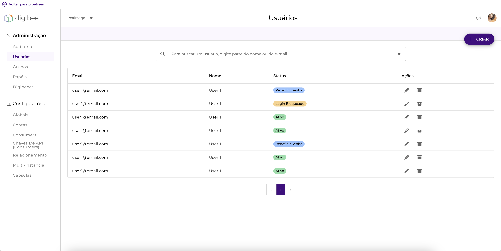

# Usuários


Para realizar cada ação descrita nesta página, você deve ter sua respectiva permissão.



Quando você cria, edita ou arquiva um usuário, essas ações são registradas no histórico de alterações da página Auditoria.


## A página de usuários 

A página Usuários mostra uma tabela com os usuários ativos em seu _realm_.

Esta tabela mostra o **nome de usuário e e-mail**, o **status** do usuário e botões para editá-los e arquivá-los.

<figure><figcaption>
Página de usuários
</figcaption></figure>

A variável **status** pode assumir os seguintes valores:

| Status          | Descrição                                          |
| --------------- | -------------------------------------------------- |
| Ativo           | Usuários ativos                                    |
| Redefinir senha | Usuários ativos que precisam redefinir suas senhas |
| Inativo         | Usuários arquivados                                |

## Ações 

### Como criar um usuário 

Para criar um usuário:

1. Clique no botão **CRIAR**, no canto superior direito;
2. Preencha as informações do usuário;
3. Clique em **SALVAR**.

### Como visualizar ou editar um usuário 

Para visualizar um usuário:

1. Pesquise na tabela o usuário que deseja visualizar ou editar, ou use a barra de pesquisa;
2. Clique no ícone de lápis, na coluna Ações.

Um modal é exibido, como mostrado abaixo:

<figure><figcaption></figcaption></figure>

Se o usuário já tiver feito login anteriormente por meio de um provedor de identidade (IdP), uma mensagem será exibida informando isso. Clique no ícone destacado para ir para a página de integração do grupo. Para saber mais sobre a integração de IdP, leia nossa documentação sobre integração de provedor de identidade.

Na aba **grupos**, você pode atribuir o usuário a grupos ou removê-lo deles. O nome, sobrenome e fuso horário do usuário só podem ser alterados pelo usuário.

Na aba **permissões**, você pode ver quais permissões este usuário tem. Você não pode editar as permissões do usuário nesta guia.

### Como arquivar um usuário 

Ao arquivar um usuário, você desativa suas permissões na plataforma.

Para arquivar um usuário:

1. Pesquise na tabela o usuário que deseja arquivar, ou use a barra de pesquisa;
2. Clique no ícone da caixa, na coluna Ações;
3. Confirme a ação clicando em **ARQUIVAR**.

### Como visualizar ou restaurar um usuário arquivado 

Ao restaurar um usuário arquivado, você restaura as permissões que ele tinha antes de ser arquivado.

Para restaurar um usuário arquivado:

1. Clique na seta na barra de pesquisa;
2. Clique em **arquivado**;

A tabela será atualizada para mostrar apenas os usuários arquivados. Para restaurar um usuário:

1. Pesquise na tabela o usuário que deseja restaurar ou use a barra de pesquisa;
2. Clique no ícone de caixa aberta, na coluna Ações;
3. Confirme a ação clicando em **RESTAURAR**.
