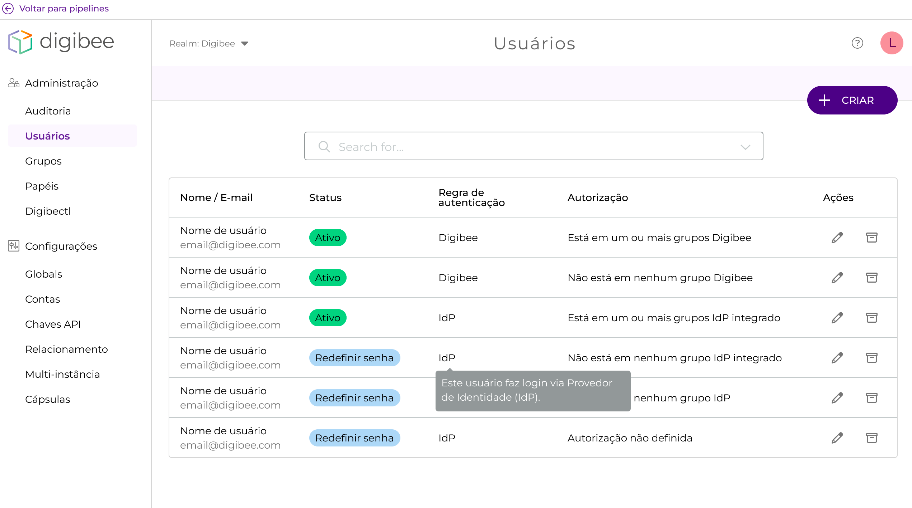
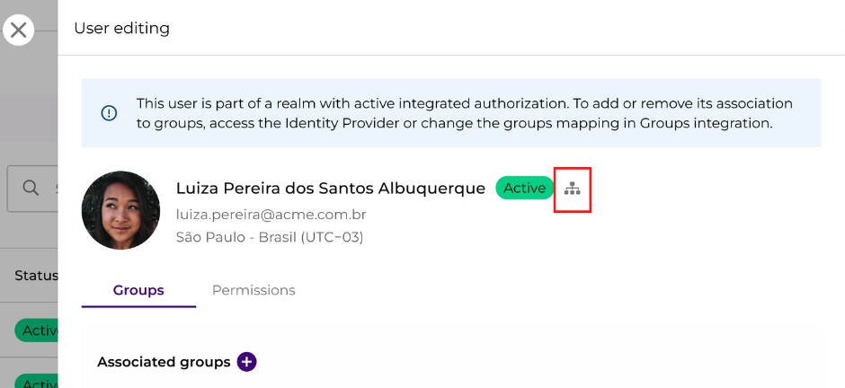

# Usuários (realms integrados)


Esse artigo descreve a experiência da página de Users em _realms_ integrados. Para aprender mais sobre _realms_ integrados, leia [nosso artigo sobre integração de provedor de identidade](../../integracao-de-provedor-de-identidades/).



Para realizar cada ação descrita nesta página, você deve ter sua respectiva permissão.



Quando você cria, edita ou arquiva um usuário, essas ações são registradas no histórico de alterações na página Auditoria.


Usuários são indivíduos que têm acesso à Digibee Integration Platform. Cada conta de usuário é identificada de maneira única por seu e-mail.

## A página de usuários 

A página Usuários exibe uma tabela que mostra os usuários ativos em seu _realm_.

Esta tabela exibe o **nome de usuário e e-mail**, o **status** do usuário, sua **regra de autenticação** e **autorização**, assim como botões para editá-los e arquivá-los.

<figure><figcaption>
Página de usuários
</figcaption></figure>

A variável **status** pode assumir os seguintes valores:

| Status          | Descrição                                          |
| --------------- | -------------------------------------------------- |
| Ativo           | Usuários ativos (não arquivados)                   |
| Redefinir senha | Usuários ativos que precisam redefinir suas senhas |
| Inativo         | Usuários arquivados                                |

A variável **regra de autenticação** pode assumir os seguintes valores:

| Regra de autenticação | Descrição                                                                |
| --------------------- | ------------------------------------------------------------------------ |
| IdP/Digibee           | Este usuário pode fazer login usando suas credenciais Digibee ou via IdP |
| somente IdP           | Este usuário pode fazer login apenas via IdP                             |

Para saber mais sobre os tipos de acesso, leia nosso artigo sobre Acessos IdP.

A variável **autorização** pode assumir os seguintes valores:

| Autorização                            | Descrição                                                                                                        |
| -------------------------------------- | ---------------------------------------------------------------------------------------------------------------- |
| Em um ou mais grupos Digibee           | Este usuário efetuou login pela última vez com credenciais Digibee e está atribuído a um ou mais grupos Digibee. |
| Não está em nenhum grupo Digibee       | Este usuário efetuou login pela última vez com credenciais Digibee e não está atribuído a nenhum grupo Digibee.  |
| Autorização não definida               | Este usuário foi criado, mas ainda não fez login.                                                                |
| Em um ou mais grupos IdP integrados    | Este usuário se conectou pela última vez via IdP e está atribuído a um ou mais grupos IdP integrados.            |
| Não está em nenhum grupo IdP integrado | Este usuário efetuou login pela última vez via IdP e não está atribuído a nenhum grupo IdP integrado.            |
| Não está em nenhum grupo IdP           | Este usuário efetuou login pela última vez via IdP e não está atribuído a nenhum grupo IdP.                      |

## Ações 

### Como criar um usuário 

Para criar um usuário:

1. Clique no botão **CRIAR**, no canto superior direito;
2. Preencha as informações do usuário;
3. Clique em **SALVAR**.

### Como visualizar ou editar um usuário 

Para visualizar um usuário:

1. Pesquise na tabela o usuário que deseja visualizar ou editar, ou use a barra de pesquisa;
2. Clique no ícone de lápis, na coluna Ações.

Um modal é exibido, como na imagem abaixo:

<figure><figcaption></figcaption></figure>

Caso o usuário tenha feito login pela última vez via IdP, uma mensagem será exibida informando isso. Clique no ícone destacado para ir para a página de integração de grupos.

Na aba **grupos**, você pode atribuir o usuário a grupos ou remover esse usuário deles. O nome, sobrenome e fuso horário do usuário só podem ser alterados pelo usuário.

Na aba **permissões**, você pode ver quais permissões este usuário possui.Você não pode editar as permissões do usuário nesta guia.

### Como arquivar um usuário 

Ao arquivar um usuário, você desativa suas permissões na plataforma.

Para arquivar um usuário:

1. Pesquise na tabela o usuário que deseja arquivar, ou use a barra de pesquisa;
2. Clique no ícone da caixa, na coluna Ações;
3. Confirme a ação clicando em **ARQUIVAR**.

### Como visualizar ou restaurar um usuário arquivado 

Ao restaurar um usuário arquivado, você restaura as permissões que ele tinha antes de ser arquivado.

Para restaurar um usuário arquivado:

1. Clique na seta na barra de pesquisa;
2. Clique em **arquivado**;

A tabela será atualizada para mostrar apenas os usuários arquivados. Para restaurar um usuário:

1. Pesquise na tabela o usuário que deseja restaurar, ou use a barra de pesquisa;
2. Clique no ícone da caixa aberta, na coluna Ações;
3. Confirme a ação clicando em **RESTAURAR**.
