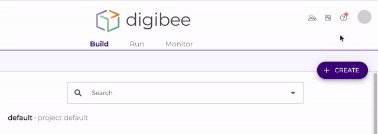

# Papéis de sistema e grupos padrão

### **O que são papéis de sistema?** 

Para auxiliar na governança e controle de acesso, a Digibee disponibiliza uma série de papéis pré-definidos que são alterados exclusivamente pela Digibee. Esses papéis cobrem diversas responsabilidades dentro da Plataforma de maneira granular para auxiliar na composição de permissões de grupos. A soma de todos esses papéis dão acesso completo à Plataforma.

Os papéis de sistema possuem os seguintes arquétipos aplicados em seus contextos específicos:

Builder: tem permissões para executar uma tarefa de ponta a ponta.

Viewer: tem permissão apenas de leitura.

Publisher: tem permissão de publicar, implantar ou tornar disponível publicamente.

Manager: tem permissão completa.

A tabela abaixo apresenta todos os papéis de sistema e suas respectivas permissões:

| Role Name                  | Permission                                                                                                                                                                                                                                                                                  | ACLs                                                                                                                                                                                                                                                                                                                                                                               |
| -------------------------- | ------------------------------------------------------------------------------------------------------------------------------------------------------------------------------------------------------------------------------------------------------------------------------------------- | ---------------------------------------------------------------------------------------------------------------------------------------------------------------------------------------------------------------------------------------------------------------------------------------------------------------------------------------------------------------------------------- |
| Account Manager            | 
Account - read, create, update, delete

Audit - read

Global - read, create, update, delete

Relation - create, read, update, delete

User - read

Oauth - create, update, delete
                                                                           | 
ACCOUNT:CREATE

ACCOUNT:DELETE

ACCOUNT:READ

ACCOUNT:UPDATE

AUDIT:READ

GLOBAL:CREATE

GLOBAL:DELETE

GLOBAL:READ

GLOBAL:UPDATE

RELATION:CREATE

RELATION:DELETE

RELATION:READ

RELATION:UPDATE

USER:READ

OAUTH:CREATE

OAUTH:DELETE

OAUTH:UPDATE
                                   |
| Account Viewer             | 
Account - read

Audit - read

Global - read

Relation - read

User - read
                                                                                                                                                                                        | 
ACCOUNT:READ

AUDIT:READ

GLOBAL:READ

RELATION:READ

USER:READ
                                                                                                                                                                                                                                                                                         |
| Api Key Manager            | 
API Key - read, create, update, delete, create api key, delete api key

Audit - read

User - read
                                                                                                                                                                          | 
APIKEY:CREATE

APIKEY:CREATE:ACL

APIKEY:CREATE:APIKEY

APIKEY:DELETE

APIKEY:DELETE:APIKEY

APIKEY:READ

APIKEY:UPDATE

AUDIT:READ

USER:READ
                                                                                                                                                                                      |
| Api Key Viewer             | 
Consumer - read

Audit - read

User - read
                                                                                                                                                                                                                                 | 
APIKEY:READ

AUDIT:READ

USER:READ
                                                                                                                                                                                                                                                                                                                                |
| Audit Viewer               | Audit - read                                                                                                                                                                                                                                                                                | AUDIT:READ                                                                                                                                                                                                                                                                                                                                                                         |
| Capsule Builder            | 
Account - read

Capsule - read create, update, delete,, create group, create header, update header, delete header

Global - read

Relation - read

Test mode - execute
                                                                                           | 
ACCOUNT:READ

CAPSULE:CREATE

CAPSULE:CREATE:GROUP

CAPSULE:CREATE:HEADER

CAPSULE:DELETE

CAPSULE:DELETE:HEADER

CAPSULE:READ

CAPSULE:UPDATE

CAPSULE:UPDATE:HEADER

GLOBAL:READ

RELATION:READ

TEST-MODE:EXECUTE:CAPSULE
                                                                                         |
| Capsule Manager            | 
Capsule - read create, update, delete, create group, update group, delete group, create header, update header, delete header

Replica - read

Test mode - execute capsule
                                                                                                  | 
CAPSULE:CREATE

CAPSULE:CREATE:GROUP

CAPSULE:CREATE:HEADER

CAPSULE:DELETE

CAPSULE:DELETE:HEADER

CAPSULE:READ

CAPSULE:UPDATE

CAPSULE:UPDATE:HEADER

REPLICA:READ

TEST-MODE:EXECUTE:CAPSULE

CAPSULE:DELETE:GROUP

CAPSULE:UPDATE:GROUP
                                                                         |
| Capsule Publisher          | Capsule - update publish                                                                                                                                                                                                                                                                    | CAPSULE:UPDATE:PUBLISH                                                                                                                                                                                                                                                                                                                                                             |
| Deployment Manager         | 
Configuration - read, create, update

Deployment - read, create, update, delete, redeploy

User - read list JWT, create generate JWT, delete revoke JWT, read open auth config
                                                                                             | 
CONFIGURATION:CREATE

CONFIGURATION:READ

CONFIGURATION:UPDATE

DEPLOYMENT:CREATE

DEPLOYMENT:CREATE:REDEPLOY

DEPLOYMENT:DELETE

DEPLOYMENT:EXECUTE

DEPLOYMENT:READ

USER:READ:LIST-JWT

USER:CREATE:GENERATE-JWT

USER:DELETE:REVOKE-JWT

USER:READ:OPEN-AUTH-CONFIG
                                              |
| Deployment Viewer          | 
Configuration - read

Deployment - read
                                                                                                                                                                                                                                         | 
CONFIGURATION:READ

DEPLOYMENT:READ
                                                                                                                                                                                                                                                                                                                                    |
| Global Manager             | Global - read, create, update, delete                                                                                                                                                                                                                                                       | 
GLOBAL:CREATE

GLOBAL:DELETE

GLOBAL:READ

GLOBAL:UPDATE
                                                                                                                                                                                                                                                                                                     |
| Global Viewer              | Global - read                                                                                                                                                                                                                                                                               | GLOBAL:READ                                                                                                                                                                                                                                                                                                                                                                        |
| Groups Manager             | 
Group - read, create, update, delete, read permission

User - read permission, read inactive permission, update assign group

Permission - read
                                                                                                                            | 
GROUP:CREATE

GROUP:READ

GROUP:READ:PERMISSION

GROUP:UPDATE

GROUP:DELETE

USER:UPDATE:ASSIGN-GROUP

USER:READ:PERMISSION

USER:READ:INACTIVE-PERMISSION

PERMISSION:READ
                                                                                                                                                         |
| Logs Viewer                | 
Log - read

Message - read

Stats - read
                                                                                                                                                                                                                                   | 
LOG:READ

MESSAGE:READ

STATS:READ
                                                                                                                                                                                                                                                                                                                                |
| Multi instance Manager     | Multi-instance - read, create, update, delete                                                                                                                                                                                                                                               | 
REPLICA:READ

REPLICA:CREATE

REPLICA:UPDATE

REPLICA:DELETE
                                                                                                                                                                                                                                                                                                 |
| Multi instance Viewer      | Multi-instance - read                                                                                                                                                                                                                                                                       | REPLICA:READ                                                                                                                                                                                                                                                                                                                                                                       |
| Metrics Viewer             | Metric - read                                                                                                                                                                                                                                                                               | METRIC:READ                                                                                                                                                                                                                                                                                                                                                                        |
| Pipeline Builder           | 
Account - read

Configuration - read, create, update

Consumer - read

Global - reads

Pipeline - read, create, update, read history

Project - read

Relation - read

Replica - read

Test mode - execute
                                   | 
ACCOUNT:READ

CONFIGURATION:CREATE

CONFIGURATION:READ

CONFIGURATION:UPDATE

APIKEY:READ

GLOBAL:READ

PIPELINE:CREATE

PIPELINE:READ

PIPELINE:READ:HISTORY

PIPELINE:UPDATE

PROJECT:READ

RELATION:READ

REPLICA:READ

TEST-MODE:EXECUTE
                                                               |
| Pipeline Executor          | Deployment - execute                                                                                                                                                                                                                                                                        | DEPLOYMENT:EXECUTE                                                                                                                                                                                                                                                                                                                                                                 |
| Pipeline Manager           | 
Account - read

Configuration - read, create, update

Consumer - read

Global - read

Pipeline - read, create, update, delete, read history

Project - read, update link with pipeline

Relation - read

Replica - read

Text mode - execute
 | 
ACCOUNT:READ

CONFIGURATION:CREATE

CONFIGURATION:READ

CONFIGURATION:UPDATE

APIKEY:READ

GLOBAL:READ

PIPELINE:CREATE

PIPELINE:DELETE

PIPELINE:READ

PIPELINE:READ:HISTORY

PIPELINE:UPDATE

PROJECT:READ

PROJECT:UPDATE:LINK-WITH-PIPELINE

RELATION:READ

REPLICA:READ

TEST-MODE:EXECUTE
 |
| Projects Manager           | 
Audit - read

Project - read, create, update, delete, update link with pipeline

Permission - read
                                                                                                                                                                         | 
AUDIT:READ

PROJECT:CREATE

PROJECT:DELETE

PROJECT:READ

PROJECT:UPDATE

PROJECT:UPDATE:LINK-WITH-PIPELINE

PERMISSION:READ
                                                                                                                                                                                                                  |
| Relationship Manager       | Relationship - read, create, update, delete                                                                                                                                                                                                                                                 | 
RELATION:READ

RELATION:CREATE

RELATION:UPDATE

RELATION:DELETE
                                                                                                                                                                                                                                                                                             |
| Relationship Viewer        | Relationship - read                                                                                                                                                                                                                                                                         | RELATION:READ                                                                                                                                                                                                                                                                                                                                                                      |
| Roles Manager              | 
Role - read, create, update, delete

Permission - read
                                                                                                                                                                                                                          | 
ROLE:CREATE

ROLE:READ

ROLE:UPDATE

ROLE:DELETE

PERMISSION:READ
                                                                                                                                                                                                                                                                                       |
| Running Executions Manager | Running Execution - read, cancel                                                                                                                                                                                                                                                            | 
INFLIGHT:CANCEL

INFLIGHT:READ
                                                                                                                                                                                                                                                                                                                                         |
| Running Executions Viewer  | Running Execution - read                                                                                                                                                                                                                                                                    | INFLIGHT:READ                                                                                                                                                                                                                                                                                                                                                                      |
| Users Manager              | 
User - read, create, update, delete

Permission - read
                                                                                                                                                                                                                          | 
USER:CREATE

USER:DELETE

USER:READ

USER:UPDATE

PERMISSION:READ
                                                                                                                                                                                                                                                                                       |

### **Como utilizar os papéis de sistema** 

Acesse a tela de Grupos na página de configurações. Acesse um grupo existente ou crie um novo, selecione a aba Permissões, adicione um novo vínculo, escolha um dos papéis de sistema e salve o registro.

Caso os papéis de sistema não atendam suas necessidades por completo, é possível usar a funcionalidade duplicar para criar uma cópia de um papel de sistema, modificando as permissões conforme suas necessidades.

Para fazer isso, vá até a tela de Papéis na página de configurações, acesse um papel de sistema, clique no botão Duplicar (note que o novo papel terá o nome do original com o sufixo "copy"), faça as modificações desejadas e salve o novo papel.

### **Grupos padrão** 

Para facilitar ainda mais a adoção dos papéis de sistema, cada Realm recebe uma carga de grupos, chamados de grupos padrão. Esses grupos entregam diversos perfis que acreditamos cobrir cenários mais comuns dos usuários da Plataforma.

A seguir apresentaremos os grupos padrão e seus respectivos papéis:

**Developers**

Grupo responsável por construir as integrações através de pipelines, cápsulas e coleções. Possui os seguintes papéis: Pipeline Builder, Capsule Builder, Pipeline Manager e Deployment Viewer.

**Deployers**

Grupo responsável pela implantação dos pipelines e gestão de suas execuções. Possui os seguintes papéis: Deployment Manager e Deployment Viewer.

**Access Managers**

Responsável pela segurança de dados e gestão de acesso, sejam elas chaves de API, tokens, senhas ou permissões de acesso dentro da Plataforma. Possui os seguintes papéis: Users Manager, Roles Manager, Groups Manager e Projects Manager.

**Governance Managers**

Grupo responsável pela organização, padronização e boas práticas na construção de integrações. Garante que os Developers possuam o que precisam para executarem seus trabalhos de forma escalável e estruturada. Possui os seguintes papéis: Account

Viewer, Global Manager, Global Viewer, Capsule Manager, Capsule Publisher, Pipeline Manager, Audit Viewer, Multi instance Manager, Multi instance Viewer, API Key Manager, API Key Viewer, Relationship Manager e Relationship Viewer.

**Credential Managers**

Responsável por manter as senhas, chaves privadas, tokens e chaves de API atualizadas, seguras e com os devidos acessos. Possui os seguintes papéis: Account Manager e API Key Manager.

**Support**

Responsável por analisar o andamento e desempenho das implantações para oferecer o suporte operacional ou para tomar decisões de negócio. Possui os seguintes papéis: Pipeline Logs Viewer, Pipeline Metrics Viewer, Running Executions Manager, Running Executions Viewer e Pipeline Executor.

### **Como utilizar os grupos padrão** 

Acesse a tela de Grupos, selecione um grupo padrão e associe os usuários. Os grupos padrão podem ser alterados ou excluídos, se algum grupo não existir mais, pode ser que algum membro do Realm tenha o excluído. Nesse caso, você pode entrar em contato com o time de suporte para recriar os grupos perdidos ou modificados.

### **Feedback** 

Gostaríamos de saber quais são os seus comentários e sugestões sobre essa funcionalidade. Veja como é fácil enviar o seu feedback:

