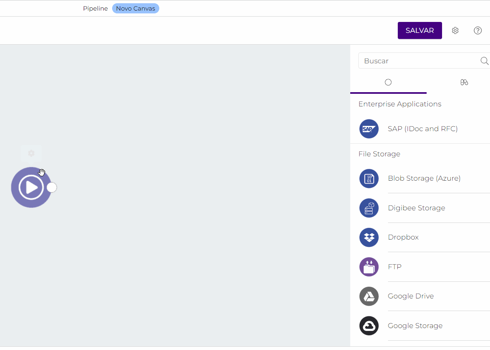

# Canvas

_Canvas_ é o ambiente de construção de _pipelines_ da Digibee Integration Platform. Através dele, você consegue desenvolver integrações simples ou complexas arrastando e soltando componentes pré-configurados com rapidez e precisão.

## Configurações do _pipeline_ 

Para criar seu pipeline, acesse a aba Build e clique em **+CRIAR**, selecionando a opção _**Pipeline**_.

Antes de partir para a construção do fluxo, é preciso configurar o _pipeline_. Para isso, clique na engrenagem () no canto superior direito do Canvas.

Na página de configurações do _pipeline_, se necessário, configure os seguintes campos:

* **Descrição**: descreva o _pipeline_.
* **“É multi-instância?”**: acione esta opção caso o _pipeline_ a ser criado seja multi-instância. Para saber mais sobre essa funcionalidade, leia o artigo [Multi-instância](../../configurations/multi-instancia.md).
* **Campo sensível:** defina quais dados precisam ser mascarados durante a execução do fluxo.
* **InSpec:** especifique a entrada do fluxo do _pipeline_.
* **OutSpec:** especifique a saída do fluxo do _pipeline_.

Após configurar o _pipeline_, você poderá partir para a construção do fluxo.

## Crie um fluxo 

Todo _pipeline_ é composto por um _trigger_ e por pelo menos um componente, que devem ser conectados entre si para que possam estabelecer um fluxo de integração. No _Canvas_ você consegue organizar e configurar o _trigger_ e os componentes do seu _pipeline_ de acordo com a sua necessidade de negócio.

### Trigger 

O primeiro passo para criar um fluxo é escolher um _trigger_. O _trigger_ é o elemento que define como a execução do _pipeline_ será iniciada - através de uma chamada externa, em resposta a um evento ou via agendamento, por exemplo. Atualmente, estão disponíveis diferentes tipos de _trigger_, são eles:

* rest
* event
* scheduler (custom, midnight, 30min, 5min)
* http
* http-file
* email
* email-v2
* kafka
* rabbitmq
* jms

Para defini-lo, basta clicar na engrenagem sobre o trigger () e escolher entre as opções listadas, conforme o exemplo abaixo:

### Componentes 

Os componentes representam etapas do fluxo e são escolhidos de acordo com as suas necessidades de negócio. Combine todas as etapas do processo de integração que deseja realizar utilizando a lista de componentes à direita do _Canvas_.

.gif>)

Para excluir uma conexão ou um componente específico do fluxo, clique na lixeira () e no **X**.

Para configurar o componente a ser utilizado, clique na engrenagem sobre ele () para acessar o formulário de configuração. No exemplo abaixo, é possível visualizar o formulário do [componente Google Drive](../../components/file-storage/google-drive.md).

.gif>)

Para saber mais a respeito de cada componente disponível em nossa lista, acesse a nossa [Documentação de componentes](broken-reference/).

### Navegação em um _pipeline_ 

Além das funcionalidades apresentadas neste artigo, o Canvas conta com outras relacionadas à experiência de navegação no _pipeline_. Para saber mais, leia o artigo [Navegação em um _pipeline_](../navegacao-em-um-pipeline-beta-restrito.md).

### Test mode 

O Test mode é uma funcionalidade da Digibee Integration Platform que permite que você execute e teste seu _pipeline_ diretamente da área de desenvolvimento. Utilize o Test mode sempre que quiser avaliar o fluxo de integração, depurar e solucionar problemas. Para saber mais sobre essa funcionalidade, leia o artigo [Test mode](test-mode/).

## Salve o _pipeline_ 

Por fim, após construir seu fluxo de integração, clique em **Salvar** no canto superior direito da tela, e defina um nome, uma descrição (opcional) e o projeto no qual o _pipeline_ estará alocado.

Caso deseje saber ainda mais sobre _pipelines_, leia o artigo [Pipeline](../pipelines/).
