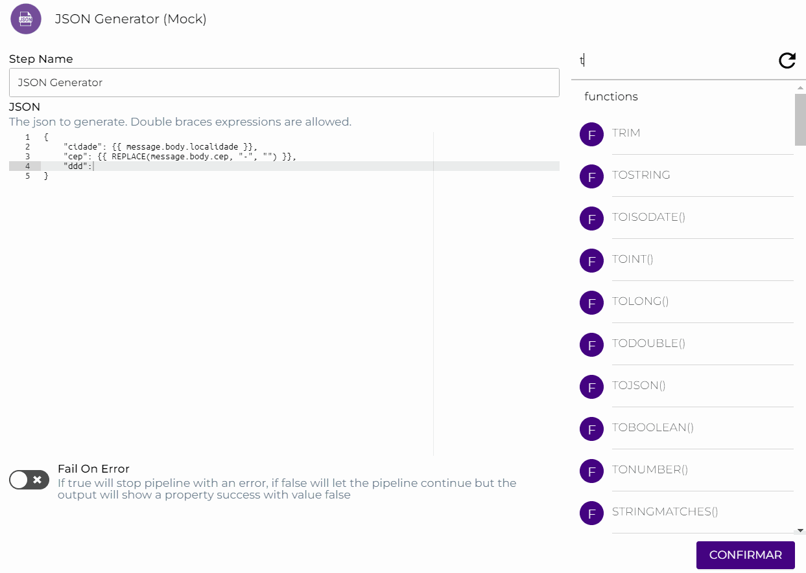

# Intellisense

O Intellisense da Digibee exibe funções e globais que você pode solicitar diretamente do formulário do conector durante a criação do _pipeline_. Desse modo, você pode utilizá-lo para preenchimento de seus conectores de uma maneira mais fácil e rápida.

Neste artigo, vamos utilizar os conectores [REST V2](../../components/web-protocols/rest-v2.md) e [JSON Generator](../../components/tools/json-generator.md) para exemplificar o Intellisense.

### Exemplo <a href="#h_204aed3501" id="h_204aed3501"></a>

No formulário do conector REST V2, é necessário informar uma URL para acessar determinado _endpoint_. Clicando no campo URL, o Intellisense será apresentado à direita da tela.

.gif>)

Neste exemplo, vamos utilizar o _endpoint_ padrão do REST V2 ([`https://viacep.com.br/ws/{{`](https://viacep.com.br/ws/%7B%7B) `DEFAULT(message.$.cep, "04547-130") }}/json/?`), e executar o [Test mode](test-mode/) para testar o _pipeline_ e verificar a sua saída:

```
{
  "status": 200,
  "statusMessage": "OK",
  "body": {
    "cep": "04547-130",
    "logradouro": "Alameda Vicente Pinzon",
    "complemento": "",
    "bairro": "Vila Olímpia",
    "localidade": "São Paulo",
    "uf": "SP",
    "ibge": "3550308",
    "gia": "1004",
    "ddd": "11",
    "siafi": "7107"
  }
```

Observe, na saída desse _endpoint_, os campos “`cep`”, “`ddd`”, “`logradouro`”, “`bairro`”, “`localidade`” e “`uf`”. Vamos utilizar esses campos para elaborar uma nova saída para esse _pipeline_ utilizando o [JSON Generator](../../components/tools/json-generator.md) e as funções [Double Braces](../funcoes-double-braces/) REPLACE, TOINT e CONCAT apresentadas pelo Intellisense.

.png>)

Note que na saída do _pipeline_, o valor do campo "`cep`" é apresentado com hífen (04547-130). Para removê-lo da saída do _pipeline_, podemos utilizar a função REPLACE, como mostrado no GIF abaixo:

.gif>)

Além disso, imagine que precisamos converter o valor String do campo “`ddd`” para um valor inteiro. Nesse caso, utilizamos a função TOINT:



Suponha que eu gostaria de exibir o endereço completo, concatenando o “`logradouro`”, o “`bairro`”, a “`localidade`” e o “`uf`” na saída do _pipeline_. Utilizando a função CONCAT(), podemos concatenar mensagens e palavras que quisermos.


**Nota:** Não há limite de quantos campos podemos concatenar utilizando essa função. Se o campo não existir na mensagem a ser tratada, o conector ignora a requisição.

Dessa forma, este será o resultado da execução:

```
{
  "cidade": "São Paulo",
  "cep": "04547130",
  "ddd": 11,
  "enderecoCompleto": "Alameda Vicente Pinzon - Vila Olímpia - São Paulo - SP"
}
```

Disponibilizamos outras funções no Intellisense além das apresentadas neste artigo, para saber mais, leia o [artigo Funções Double Braces](../funcoes-double-braces/). Os recursos dessa funcionalidade serão acrescidos nos próximos lançamentos da Plataforma.
