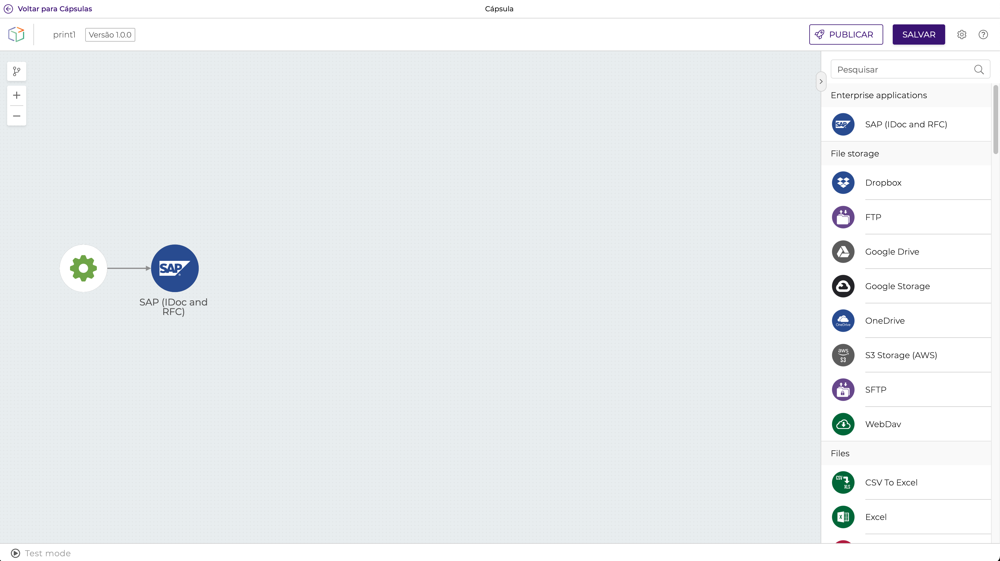
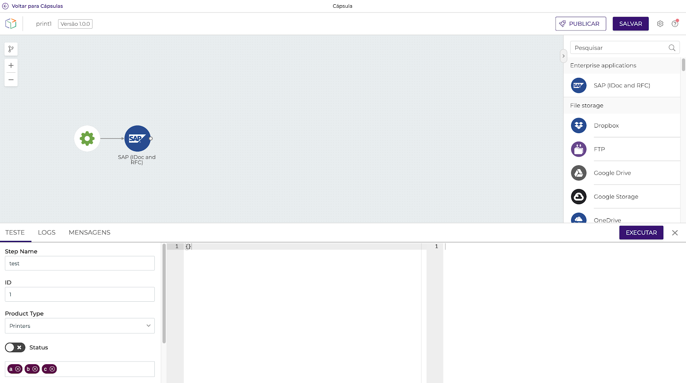
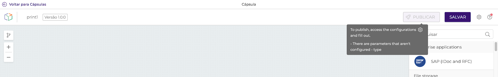
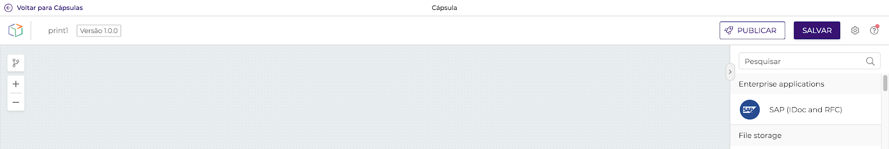
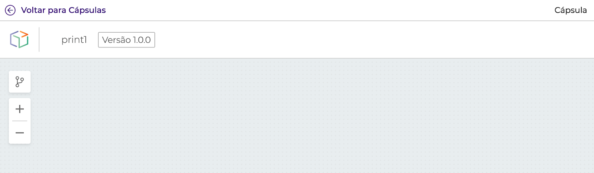
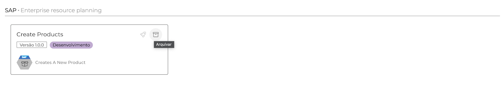
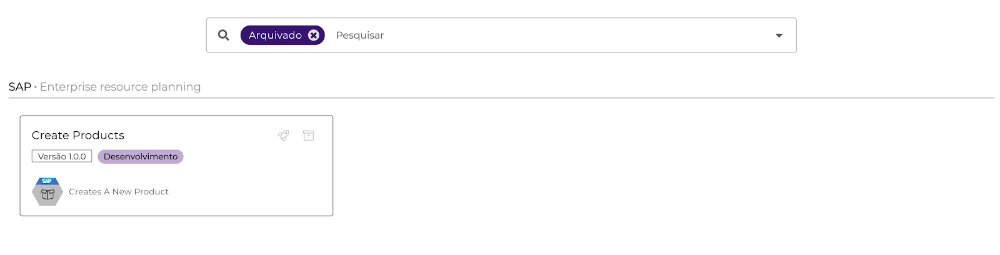

# Cápsulas

### O que são Cápsulas? <a href="#h_4a365c4396" id="h_4a365c4396"></a>

Cápsulas são uma nova e grande funcionalidade da Digibee, parte integrante da Digibee Integration Plaform HIP. As Cápsulas Digibee **** são componentes reutilizáveis que podem ser criados por qualquer usuário da Plataforma ao aplicar o mesmo modelo de desenvolvimento visual concebido na criação do _pipeline_, provendo uma lógica de negócio reutilizável, segura, validada e evolutiva.

Uma Cápsula permite que a integração de fluxos seja publicada na paleta de componentes para ser utilizada em outro momento, de maneira simplificada e ainda mais rápida.

É como se os componentes disponíveis na Plataforma fossem átomos e as Cápsulas fossem moléculas que agrupam os átomos em tarefas mais complexas para resolver um problema específico.

### Por que usar Cápsulas? <a href="#h_bdd47d0394" id="h_bdd47d0394"></a>

A Cápsula é uma ferramenta poderosa na modularização de lógicas de negócios e, com isso, facilita o compartilhamento de conhecimento e a exposição de serviços dentro da sua empresa. Trata-se de um grande facilitador para os arquitetos de sistemas que trabalham com a Plataforma, uma vez que agora ficou mais fácil modularizar funções de negócios e padronizar o seu uso dentro do ambiente, reduzindo o tempo de construção e mantendo o padrão de qualidade.

As Cápsulas também abrem uma nova vertente de trabalho na Plataforma, já que essa funcionalidade vai permitir o desenvolvimento de um verdadeiro ecossistema e promover a troca de conhecimento e serviços entre as empresas.

### Como usar Cápsulas? <a href="#h_b67a17d36d" id="h_b67a17d36d"></a>

Para utilizar a Cápsula dentro da Digibee Integration Plaform, basta acessá-la a partir do menu principal, clicar no botão CRIAR para criar uma nova Cápsula e assim construir uma lógica com a já conhecida interface da Digibee Integration Plaform.

### Cápsula <a href="#h_f4aa32c090" id="h_f4aa32c090"></a>

A Cápsula é composta por alguns elementos que lhe dão apoio na construção, organização e visualização. São eles:

* Header
* Collection
* Group
* Capsule
* Componentes
* Test-Mode
* Publicação
* Versionamento
* Arquivar

Exemplo:

.png>)

#### Header <a href="#h_bce04d81ab" id="h_bce04d81ab"></a>

O _header_ serve para armazenar previamente as opções de imagens a serem utilizadas na representação do componente da Cápsula no _pipeline canvas_.

Veja um exemplo de componente com o _header_:

.png>)

O processo de criação de um _header_ é realizado junto com o processo para salvar uma Coleção. Nesse momento, você pode selecionar um _header_ a partir de uma lista ou optar por criar um _header_ novo.

.png>)

As permissões criadas para gerenciar e acessar o item são:

* CAPSULE:CREATE:HEADER - permite o cadastro de novos _headers_ a serem utilizados na criação de Coleções.
* CAPSULE:READ:HEADER - permite a visualização e escolha de _headers_ para o cadastro de uma nova Coleção.

#### Coleção <a href="#h_f4ed62243d" id="h_f4ed62243d"></a>

Coleção é o repositório onde as Cápsulas são armazenadas. Logo, todas as Cápsulas precisam de uma Coleção.

**Curiosidade:** durante a fase beta, percebemos que é comum que as Coleções sejam representadas por sistemas, como ERP, CRM, etc., ou por áreas de negócios.

É possível criar quantas Coleções você precisar ou desejar, mas recomendamos sempre verificar se existe alguma já disponível. Então, quando decidir criar uma Coleção nova, decida qual nome dará para ela. Por exemplo, em uma companhia as Coleções são definidas a partir de nomes de sistemas, mas para outra pode ser mais interessante definir o nome de uma Coleção com base na área de negócio.

O processo de criação de uma nova Coleção é realizado junto com o processo para salvar a sua Cápsula. Nesse momento, você pode selecionar uma Cápsula a partir de uma lista ou optar por criar uma Cápsula nova.

.png>)

Se você optar por criar uma Coleção nova, o formulário abaixo será exibido:

.png>)

A permissão criada para gerenciar e acessar o item é:

* CAPSULE:CREATE - permite a criação de novas Coleções.

#### Grupo <a href="#h_11f89d9750" id="h_11f89d9750"></a>

Grupo é um organizador de Cápsulas dentro de uma Coleção.

**Curiosidade:** durante a nossa fase beta, percebemos a necessidade desse item organizacional. Por exemplo, uma Coleção de SAP pode ter muitas Cápsulas e elas podem ser organizadas a partir dos módulos desse sistema, assim como Sales, Financial, entre outros.

Grupos são itens organizacionais que vivem dentro de uma Coleção.

O processo de criação de um Grupo é realizado junto com o processo para salvar a sua Cápsula. Nesse momento, você pode selecionar um Grupo a partir de uma lista ou optar por criar um Grupo novo.

.png>)

As permissões criadas para gerenciar e acessar o item são:

* CAPSULE:CREATE:GROUP - permite cadastrar novos Grupos a serem utilizados na criação de Cápsulas.
* CAPSULE:READ:GROUP - permite a visualização e escolha de um Grupo para o cadastro de uma nova Cápsula.

#### **Configurações - Parâmetros** <a href="#h_9d15b65381" id="h_9d15b65381"></a>

Os parâmetros de entrada são apresentados durante a utilização da Cápsula no _pipeline canvas_.

**Dica:** os parâmetros de entrada são semelhantes aos campos já apresentados em componentes _core_. Por exemplo, a URL do REST ou a condição do Choice.

Com esse recurso, o desenvolvedor tem total liberdade para definir quais são os parâmetros e também para documentar as orientações de uso da Cápsula.

Os parâmetros de entrada são o seu contrato de uso, ou seja, quais parâmetros podem e devem ser passados para atender os requisitos solicitados pela Cápsula e utilizados em qualquer componente presente na Cápsula.

Ao acessar o menu de configurações, é possível encontrar as definições dos parâmetros de entrada.

**Dica:** o formulário exibido nesse momento é apenas um exemplo de preenchimento que deixamos disponível para facilitar o seu entendimento e aprendizado. Recomendamos que você faça uma breve análise do exemplo, apague as informações e insira os seus próprios dados.

Veja abaixo um exemplo com 4 tipos diferentes de configurações (TEXT, SELECT TOGGLE e TAGS).

.png>)

Observe o item “Prévia do Formulário” que aparece à direita. Esse recurso ajuda muito na criação do formulário de parâmetros, pois ele é atualizado em tempo real enquanto você adiciona, altera e organiza as suas escolhas.

**Como utilizar os parâmetros declarados nessa seção nos componentes do **_**canvas**_**?**

Na imagem acima, o campo “Property” foi preenchido com os valores _id_, _productType_, _status_ e _tags_.

Veja como utilizar expressões em _Double Braces_ para acessar esses valores:

```
{{ capsule.id }} 
{{ capsule.productType }} 
{{ capsule.status }} 
{{ capsule.tags }} 
```

**Dica:** todas as opções possíveis em _Double Braces_ valem para esse novo recurso \{{ capsule... \}}. Utilize-as combinando com as funções. Clique [aqui](../funcoes-double-braces/double-braces-e-entrada-de-dados.md) para ler o nosso artigo sobre o tema.

#### Configurações - Accounts <a href="#h_e44bbbae31" id="h_e44bbbae31"></a>

_Account_ é uma funcionalidade utilizada por componentes _core_ (por exemplo, o REST) para realizar autenticação nos _endpoints_. Para utilizar uma _Account_, basta encontrar a lista de _Accounts_ na tela _pipeline canvas_, que vem direto do Realm e são gerenciados no menu Configurações > Accounts.

Nas Cápsulas, essa funcionalidade possui uma pequena diferença em relação ao _pipeline_ que irá utilizá-la, já que nem sempre _Accounts_ e _pipelines_ estão no mesmo _Realm_ de construção. Por isso, é necessário definir previamente uma lista de _Placeholder_ de _Accounts_. Essa lista pode ser definida na tela de Cápsulas clicando em:

_**Configurações na tela > aba Accounts**_

Na tela descrita acima serão definidas as _Accounts_ com _Label_ e a descrição para orientar sobre o tipo de _Account_ que deve ser selecionado dentro do _pipeline_ _canvas_.

.png>)

No exemplo da tela acima, o SAP Account é o _placeholder_ apresentado ao usuário da Cápsula que, por sua vez, deve escolher uma _Account_ que possua informações válidas para acesso ao SAP. Dessa forma, as credenciais ficam fora da Cápsula, trazendo mais segurança na sua utilização.

Veja abaixo como fica o componente _core_ quando é configurado dentro da Cápsula e como é o formulário de visualização no test-mode:

.png>)

Test-mode

.png>)

#### Configurações - Documentação <a href="#h_5db64be617" id="h_5db64be617"></a>

Essa é uma área interna da Cápsula e deve ser utilizada para registrar informações detalhadas e relevantes sobre o seu funcionamento e para futuras manutenções.

O conteúdo é restrito aos desenvolvedores de Cápsulas do seu Realm. Portanto, não é apresentado para o usuário da Cápsula.

Para acessar essa área, clique na aba “Documentação”, que fica dentro de “Configurações”.

.png>)

**Dica:** essa é uma área de texto livre, mas recomendamos o uso do sistema de formatação em _markdown_.

#### Configurações - Contrato <a href="#h_2a8cda3eec" id="h_2a8cda3eec"></a>

Contrato é uma configuração criada para garantir que a estrutura dos dados resultante da execução da Cápsula será sempre correspondente ao _JSON Schema_ definido pelo seu desenvolvedor.

Essa configuração é obrigatória para a publicação. Então, é necessário definir o _JSON Schema_ correspondente às saídas da Cápsula. Um _JSON Schema_ bem definido traz mais confiabilidade a quem utilizar a Cápsula.

**IMPORTANTE:** alterações no _JSON Schema_ que causam quebra de contrato fazem com que a Cápsula mude automaticamente de versão e, consequentemente, garante que os _pipelines_ não sejam afetados. Leia mais sobre versionamento na seção correspondente desta documentação.

.png>)

#### Componentes <a href="#h_6e5551897d" id="h_6e5551897d"></a>

Os componentes que podem ser utilizados na implementação das Cápsulas são apresentados tanto na paleta à direita do _canvas_ como na tela de _pipelines_.

Apenas componentes _core_ são suportados. Dentre eles, não são suportados:

* Object Store
* Digibee Storage
* Relation



#### **Test-Mode** <a href="#h_4858369dd7" id="h_4858369dd7"></a>

Essa é uma funcionalidade muito utilizada na construção de _pipelines_, por meio da qual os dados de entrada para a realização de testes são informados e onde os resultados das execuções são visualizados.

Na Cápsula é apresentada uma coluna adicional na qual é solicitado o preenchimento dos parâmetros definidos na área de configurações. Como os testes representam uma execução válida, o desenvolvedor da Cápsula tem a mesma experiência que o futuro usuário terá no _pipeline canvas_.



#### **Publicação** <a href="#h_fc666011f5" id="h_fc666011f5"></a>

O processo de construção de uma Cápsula é sofisticado. Por isso, para tornar algo reutilizável, temos mais responsabilidades e cuidados a serem tomados.

Criamos um ciclo de vida para apoiar a construção e manutenção, garantindo total liberdade ao desenvolvedor e não afetando o usuário do mesmo _pipeline_.

Esse ciclo é gerenciado por 2 status:

* Desenvolvimento - onde todas as Cápsulas nascem. Enquanto uma Cápsula estiver nesse status, nenhum usuário visualiza a sua versão.
* Publicada - para uma Cápsula entrar nesse status, o desenvolvedor deve concluir todos os requisitos obrigatórios e executar a ação de publicação.

Para realizar essa ação, siga estes passos:

* Acesse o Menu _Cápsula_;
* Clique no ícone do foguete ou na tela de _Capsule Canvas_;
* Clique no botão Publicar;

Exemplo de Cápsula que não teve todos os requisitos atendidos e não pode ser publicada:



Exemplo de Cápsula que teve todos os requisitos atendidos e pode ser publicada:



**Obs.:** se nenhuma das opções acima for exibida, consulte o gestor de acesso de sua empresa e solicite a inclusão da permissão _CAPSULE:UPDATE:PUBLISH_.

#### **Versionamento** <a href="#h_cfaf3bcda9" id="h_cfaf3bcda9"></a>

Para garantir confiabilidade nas atualizações das Cápsulas, a Digibee adotou um controle de versionamento composto por 3 níveis. Quando as versões precisam ser atualizadas, a Digibee Integration Plaform HIP analisa uma Cápsula automaticamente e determina quais serão os valores dos níveis.

Estes são os 3 níveis de versionamento:

* **Major:** versão da Cápsula quando um item de configuração (entrada ou saída) é removido ou se torna obrigatório. Essa versão também se aplica quando o contrato da Cápsula é totalmente modificado. O direcionamento para essa versão é feito automaticamente pela própria Plataforma.
* **Minor:** versão da Cápsula quando um item de configuração (entrada ou saída) é acrescentado ou se torna opcional. Essa alteração ainda não é considerada “Major”.
* **Fix:** versão da Cápsula quando ocorrem alterações nada impactantes para os _pipelines_ que a utilizam. Essa alteração não é considerada “Major” nem “Minor”.

É importante saber que essas alterações serão realizadas somente se a versão passando por alteração tiver sido publicada anteriormente. Por exemplo, se você criar uma Cápsula, ela receberá inicialmente a versão "1.0.0". Enquanto não for publicada, essa versão nunca será modificada quando forem feitas atualizações nela.

Após a publicação da Cápsula, a versão “1.0.0” será definida como não editável. Então, quando uma nova atualização for realizada na mesma Cápsula, a Plataforma irá analisar o que foi alterado para determinar se o número da versão será acrescido na versão Major, Minor ou Fix.

A apresentação das versões é semelhante a do _pipeline_:



#### Arquivar <a href="#h_4fa1de30df" id="h_4fa1de30df"></a>

Quando necessário, é possível arquivar as Cápsulas por meio do ícone “Arquivar” apresentado na lista de Cápsulas. Veja abaixo:



Para visualizar a lista de Cápsulas arquivadas, utilize o filtro “Arquivado” na barra de busca:



O arquivamento de uma Cápsula publicada e que está sendo utilizada em um _pipeline_ não afeta o seu funcionamento. Isso apenas impede que novos usuários utilizem a Cápsula.
