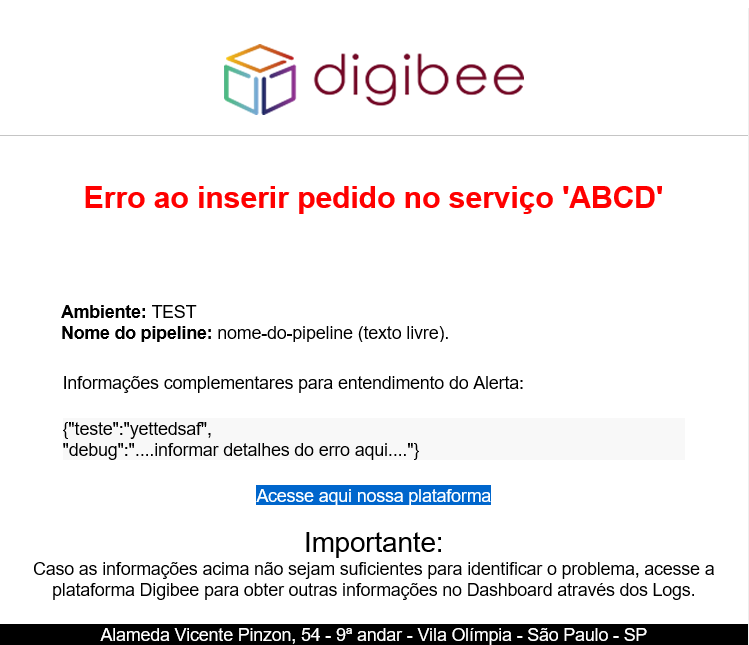

# Enviar Alerta por e-mail

### Biblioteca <a href="#biblioteca" id="biblioteca"></a>

Digibee

### Serviço <a href="#servio" id="servio"></a>

Enviar alerta por e-mail

### Descrição <a href="#descrio" id="descrio"></a>

O Objetivo é receber além das variáveis,  qualquer conteúdo JSON na entrada e enviar por email.

### Parâmetros estáticos de configuração do conector <a href="#parmetros-estticos-de-configurao-do-conector" id="parmetros-estticos-de-configurao-do-conector"></a>

* \* smtp-email: Account para realizar autenticação no servidor de e-mail
* \* from: Endereço do remetente
* environment: indica o ambiente referente ao alerta, ex: TEST|PROD
* destinatario: destinatário para enviar o e-mail, para utilizar uma lista é necessário informar um array JSON no formato string.
* pipeline: Indicar qual é o nome do pipeline (texto livre).
* descricao-alerta: Título que será utilizado no cabeçalho do e-mail
* assunto: Assunto Customizado para identificar o e-mail

### Parâmetros dinâmicos de configuração do conector <a href="#parmetros-dinmicos-de-configurao-do-conector" id="parmetros-dinmicos-de-configurao-do-conector"></a>

* Os parâmetros também podem ser configurados de maneira dinâmica, para isto devem ser informados dentro do objeto "emailParams" : {}
* Os parâmetros informados de maneira dinâmica serão sobrescritos pelos estáticos.

### Entrada <a href="#entrada" id="entrada"></a>

```
{
  "logger": {
    "status": 200,
    "body": {
      "soap:Envelope": {
        "soap:Body": {
          "Erros": {
            "DescricaoErro": "Código de documento 1 não encontrado."
          },
          "ProcessamentoOK": false
        }
      }
    }
  },
  "emailParams": {
    "pipeline": "confirmar-ticket-gera",
    "descricao-alerta": "Erro ao consultar dados para integração.",
    "destinatario": "
test@digibee.com.br
",
    "environment": "TEST",
    "assunto": "Erro Pedido"
  }
}
```

### Saída <a href="#sada" id="sada"></a>

#### Sucesso <a href="#sucesso" id="sucesso"></a>

```
{  "success" : true }
```



#### Erro <a href="#erro" id="erro"></a>

```
{   
    "timestamp": 1559243275088,   
    "error": "Error",   
    "code": 500
}
```

\
