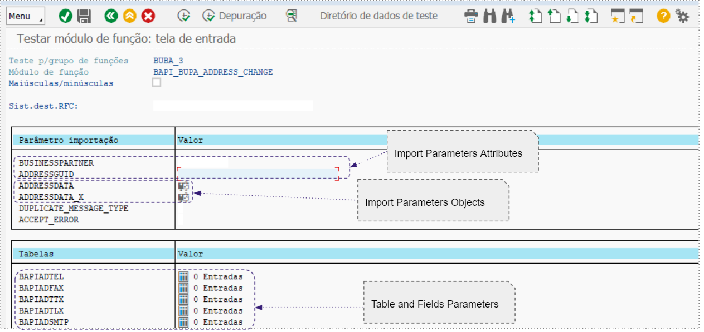

# SAP

As Cápsulas da Coleção SAP foram todas projetadas para abstrair as chamadas ao SAP, encapsulando a capacidade de chamar funções remotas (RFC) ao sistema SAP.

Para utilizar as Cápsulas RFC, é necessário configurá-las com os parâmetros exigidos pelo SAP (como SID, LANGUAGE, CLIENT ID, etc.) e definir os parâmetros esperados pelo SAP.

Após a execução da Cápsula, é possível controlar o fluxo de mensagens, analisar os casos de sucesso e falha e tratar a mensagem de resposta para o formato JSON para facilitar o trabalho dos dados no fluxo do _pipeline_.

## O que é SAP? <a href="#h_680058c34a" id="h_680058c34a"></a>

SAP é um dos líderes mundiais de desenvolvimento de _softwares_ para gerenciamento de processos de negócios, que cria soluções para facilitar o processamento efetivo de dados e o fluxo de informações entre as organizações. Clique [aqui](https://www.sap.com/brazil/about/company/what-is-sap.html) para obter mais informações.

### Pré requisitos <a href="#h_b619770c7a" id="h_b619770c7a"></a>

#### 1) Estabelecer VPN <a href="#h_4e6b1f6eea" id="h_4e6b1f6eea"></a>

As Cápsulas do SAP são utilizadas sempre para o fluxo de envio de informações para o SAP. Logo, é preciso fechar uma _VPN Site-to-Site_ entre a instalação do SAP com a Digibee.

#### 2) Liberações de Porta 33XX e Hostname SAP <a href="#h_66bf61624f" id="h_66bf61624f"></a>

É feita a conexão padrão do SAP. Com isso, portas 33XX (XX é o número de instância do SAP) devem ser liberadas dentro da VPN. Sem essa ação as informações do SAP não podem ser acessadas. Além disso, a conexão exige o _hostname_ do SAP, facilmente acessado via transação SMGW.

**Exemplo**:

Se o _Instance Number_ é 20, então a porta a ser liberada no túnel da VPN será a 3320.

#### **3) Informações SAP Gui**

Assim como o SAP GUI, as Cápsulas precisam das informações de conexão para habilitar o fluxo. Veja abaixo as informações necessárias:

* **Instance Number e System Id**

.png>)

.png>)

* **Logon Language e Client ID (Mandante)**

.png>)

#### **4) Credenciais**

Tanto o usuário quanto a senha para acesso ao SAP devem estar cadastrados na Digibee Integration Platform. Deve ser utilizada uma conta do tipo “Basic”.

## Cápsulas SAP <a href="#h_3121b2fcb2" id="h_3121b2fcb2"></a>

### **SAP RFC - Connectivity test**

Essa Cápsula possibilita a realização de um teste de conectividade sem que seja necessário conhecer as funções e os parâmetros do SAP. A Cápsula abstraí a chamada para uma RFC padrão (RFC\_READ\_TABLE) já com os parâmetros mínimos pré-definidos.

Se houver erro na resposta após a execução da Cápsula, é preciso checar se os pré-requisitos foram atendidos. Mas se o retorno for _“success” : true_, pode-se seguir adiante com a integração e chamar outras funções do SAP.

### **SAP RFC - Connector (JSON Input)**

Cápsula genérica, utilizada para qualquer operação com as funções remotas do SAP. É possível ler dados de tabelas e cadastros de modo mais completo, incluir novos cadastros (Fornecedores, Clientes, Endereços, etc.) e também atualizar cadastros.

Por se tratar de uma Cápsula genérica, todas as funções nativas do SAP estão disponíveis e as funções ABAP customizadas que existem no ambiente SAP também podem ser executadas. Por exemplo, RFC para inclusão de Nota Fiscal, com o cálculo de impostos.

Entenda melhor como é possível trabalhar com esse dinamismo e qual é a relação com os parâmetros da RFC:

#### **1. Import Parameters Attributes**

São os parâmetros de entrada (opcionais) que devem ser preenchidos na chamada da função. O campo não aceita parâmetros estruturais.

```
{  
    "BUSINESSPARTNER": "",  
    "VALID_DATE": ""
}
```

#### **2. Object Params**

São os parâmetros de entrada (opcionais) que devem ser preenchidos na chamada da função. Parâmetros do tipo estrutural são aceitos.

```
{
  "OBJ1": {
    "ATTR1": "V1"
  },
  "OBJ2": {
    "ATTR2": "V2",
    "ATTR3": "V3"
  }
}
```

#### **3. Table and Fields**

Modelo para enviar parâmetros em forma de tabela. Para enviar mais de um item para a mesma tabela, adicione um novo objeto JSON dentro do _array_, conforme exemplo abaixo:

```
[
  {
    "TABLE1": [{
      "ATTR1": "VALUE1",
      "ATTR2": "VALUE2"
    },
   {
      "ATTR1": "VALUE1",
      "ATTR2": "VALUE2"
    }],
    "TABLE2": [{
      "ATTR1": "VALUE1",
      "ATTR2": "VALUE2"
    }]
  }
]
```


**IMPORTANTE:** de acordo com as boas práticas do SAP, recomenda-se que os parâmetros de tabelas não sejam enviados como _Import Parameters._


#### **4. Conhecendo os parâmetros de uma função RFC**

Veja como é possível identificar os parâmetros esperados por uma RFC para realizar o preenchimento na Cápsula SAP RFC (JSON Input).

**Exemplo**

* RFC padrão do SAP, nativa do ambiente SAP
* Função: **BAPI\_BUPA\_ADDRESS\_CHANGE**

Primeiramente, acesse a transação SE37 (Function Builder) no seu SAP:

.png>)

Preencha o nome da função (**BAPI\_BUPA\_ADDRESS\_CHANGE**) e pressione a tecla F8 do seu teclado.

Todos os parâmetros esperados pela RFC e os seus respectivos tipos serão apresentados no seu _SAP GUI Business Client_.



Conforme mostrado no exemplo acima, os campos do tipo _Import Parameters Attributes_ são: **BUSINESSPARTNER** e **ADDRESSGUID** (não são parâmetros estruturais).

Para os demais campos, clique no ícone apresentado na coluna “**Valor**”. Em seguida, acesse o editor de estrutura através do atalho **Shift + F7.**

.png>)

Na imagem acima, **ADDRESDATA\_X** representa o nome do objeto. Os demais campos são os atributos do objeto.

Agora veja um parâmetro estrutural do tipo tabela, por meio do qual é possível enviar uma lista e os seus respectivos atributos a cada item.

.png>)

De acordo com os exemplos de parâmetros apresentados acima, observe um exemplo de JSON simulando o formato esperado pela Cápsula SAP.

#### **Import Parameters Attributes**

```
{  
    "BUSINESSPARTNER": "0000000003"
}
```

#### **Object Params**

```
{
  "ADDRESSDATA": {
    "STANDARDADDRESS": "X",
    "C_O_NAME": "",
    "CITY": "Barueri",
    "POSTL_COD1": "19970000",
    "STREET": "Rua adriano augusto teste",
    "HOUSE_NO": "1",
    "COUNTRY": "BR",
    "REGION": "SP",
    "LANGU": "PT",
    "VALIDFROMDATE": {{FORMATDATE(NOW(), "timestamp", "yyyy-MM-dd", null , "GMT-3") }},
    "VALIDTODATE": "2999-12-31"
  },
  "ADDRESSDATA_X": {
    "STANDARDADDRESS": "X",
    "C_O_NAME": "X",
    "POSTL_COD1": "X",
    "STREET": "X",
    "HOUSE_NO": "X",
    "COUNTRY": "X",
    "REGION": "X",
    "LANGU": "X"
  }
}
```

#### **Table and Fields**

```
{  "BAPIADTEL": [    {      "COUNTRY": "",      "TELEPHONE": "",      "TEL_NO": ""    },    {      "COUNTRY": "",      "TELEPHONE": "",      "TEL_NO": ""    }  ],  "BAPIADFAX": [    {      "COUNTRY": "",      "FAX": ""    }  ]}
```

### **SAP RFC - Read Nota Fiscal**

Cápsula destinada a consultar os dados de qualquer notas fiscais no SAP utilizando o campo DOCNUM.

A RFC utilizada para a consulta é _BAPI\_J\_1B\_NF\_GETDETAIL_. Para obter os detalhes de uma nota fiscal, preencha o valor do campo “DOCNUM”, dentro de _Import Parameters_.

**Nota:** utilize expressões _Double Braces_ para passar os valores dinamicamente. Veja um exemplo:


```
{
  "BAPIADTEL": [
    {
      "COUNTRY": "",
      "TELEPHONE": "",
      "TEL_NO": ""
    },
    {
      "COUNTRY": "",
      "TELEPHONE": "",
      "TEL_NO": ""
    }
  ],
  "BAPIADFAX": [
    {
      "COUNTRY": "",
      "FAX": ""
    }
  ]
}
```

### **SAP RFC - Read Table**

Cápsula destinada a realizar consultas diretamente nas tabelas do SAP. Dentre os parâmetros padrões existentes no item “Pré requisitos” ganham destaque:

**1. TABLE:** nome da tabela para consultar os dados.

**2. Skip & Limit:** parâmetros para controlar a paginação da consulta e limitar a quantidade de registros retornados. Dessa maneira, as consultas são realizadas em blocos e o processo se torna mais eficiente.

**3. FIELDS:** campos a serem retornados na consulta. É obrigatório informar ao menos um campo ao executar a pesquisa.

Para identificar quais campos existem na tabela do SAP, utilize a transação _SE11 ()_. Exemplo para a tabela KNA1:

.png>)

**4. Options Filters:** parâmetro não obrigatório, permite especificar dados adicionais para a execução da _query_ de consulta na tabela do SAP. O parâmetro é comumente utilizado para definir o corte dos dados, ou seja, para reduzir o escopo das informações e evitar a leitura completa da tabela.

Veja alguns exemplos das opções de filtros:

```
MATNR IN (10000,1000001,1000002,100003,100004)
ERDAT = '19990101'
BUKRS EQ '{{ message.company_code_sap }}'
```


**IMPORTANTE**: para identificar o filtro indicado para a sua consulta, verifique os campos da Tabela SAP. A transação _SE37_ permite a realização de testes de consultas através da RFC (READ\_TABLE) e a definição dos parâmetros adequados de busca.

