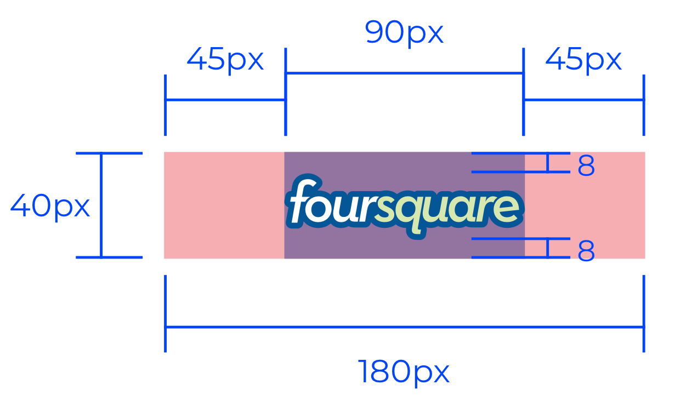

# Criação de Coleções de Cápsulas

Cápsulas são funcionalidades poderosas da Digibee Integration Platform, as quais permitem a criação de componentes personalizáveis e reaproveitáveis em inúmeros _pipelines_, sem requisição de licenças adicionais. Através das Cápsulas também é possível compartilhar unidades funcionais dentro e fora do seu _realm_.

Este artigo apresenta as melhores práticas na criação de Cápsulas e na organização das suas Coleções. Com isso, você deixa as suas Cápsulas ainda mais polidas, seja para uso interno ou externo.

## Elementos de uma Cápsula 

Toda Cápsula pertence a uma Coleção. Portanto, ao criar a sua primeira Cápsula, é obrigatório configurar ou selecionar uma Coleção para ela.

Durante a criação da Coleção, você define a imagem do cabeçalho e a cor de fundo que será aplicada a todas às suas respectivas Cápsulas.

Caso você esteja criando uma nova Cápsula, é preciso definir os 3 elementos que compõem a sua representação no _canvas_: corpo, ícone e cabeçalho.

### Corpo 

Forma e cor de preenchimento da Cápsula, que pode assumir uma das seguintes opções:

.png>)

### Ícone 

Ilustração apresentada no corpo da Cápsula, servindo como uma referência visual do que ela faz. Atualmente a Plataforma possui mais de 700 opções, sendo que você pode pesquisar por uma ilustração digitando no campo de busca palavras em inglês relacionadas às características do ícone (ex.: _write_, _read_, _send_, _download_, etc.):

.png>)

### Cabeçalho 

É por meio do cabeçalho que o usuário identifica Cápsulas que fazem parte de um mesmo agrupamento, sendo que esse agrupamento está sendo chamado de Coleção. Os cabeçalhos também são muito relevantes ao tornar a Cápsula pública, já que eles unem um conjunto de funcionalidades sob um único contexto:

.png>)

## Melhores práticas na personalização de Coleções 

O ponto de partida para uma Cápsula com visual harmônico é o cabeçalho, o qual identifica a Coleção.

A faixa vermelha superior indica onde o cabeçalho da Coleção fica:

.png>)

### Cor 

Para alcançar uma apresentação esteticamente agradável, o time de design da Digibee definiu tons pastéis para o corpo das Cápsulas, já que combinam bem com outras diversas cores. A intenção é atender uma grande diversidade de cabeçalhos com harmonia, porém mantendo consistência com a paleta de cores de outros componentes do _canvas_.

Considerando, por exemplo, a identidade visual antiga do Foursquare, estas são as 6 variações da sua logomarca:

.png>)

É comum que manuais de identidade visual apresentem variações de fundo e versões negativas (em preto ou branco) da logomarca. No entanto, o time de design da Digibee sugere que você dê preferência às logomarcas com fundo colorido invés de cinza, preto ou branco para os cabeçalhos.

Levando isso em consideração, as 2 últimas logomarcas com fundo azul nos exemplos acima seriam melhores candidatas para o cabeçalho ideal.

Fazendo uma comparação com base nas restrições mencionadas, as variações são:

.png>)

Note que com a resolução adotada, a logomarca na segunda coluna é menos legível quando comparada a da primeira coluna. Logo, a primeira é uma escolha melhor.

.png>)

Com o cabeçalho definido, a escolha da cor de corpo é simples. No caso da _Foursquare_, a cor mais presente na logomarca é azul, então a cor do corpo também deve ser azul.

Ainda que a cor cinza não seja recomendada, existem exceções para a sua adoção no corpo. Por exemplo, se a sua logomarca não possui cor de fundo diferente de preto ou se a cor for muito próxima de preto, então a melhor opção é escolher um corpo cinza.

.png>)

Agora só resta escolher o ícone que representa melhor a função da sua Cápsula. Por exemplo, se a Cápsula lida com autenticação no _Foursquare_, você poderia usar o seguinte ícone:

### Tamanho 

Os cabeçalhos devem possuir o tamanho de 180 x 40 pixels, porém a logomarca na imagem deve caber em uma largura um pouco menor, de 90 x 40 pixels, conforme a região roxa demonstrada abaixo:

Também é sugerido que o seu cabeçalho seja criado com os seguintes tamanhos e margens para alcançar uma boa leitura e qualidade da imagem:

