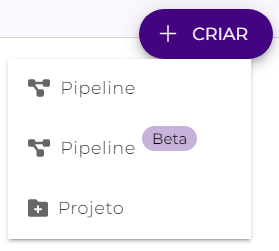
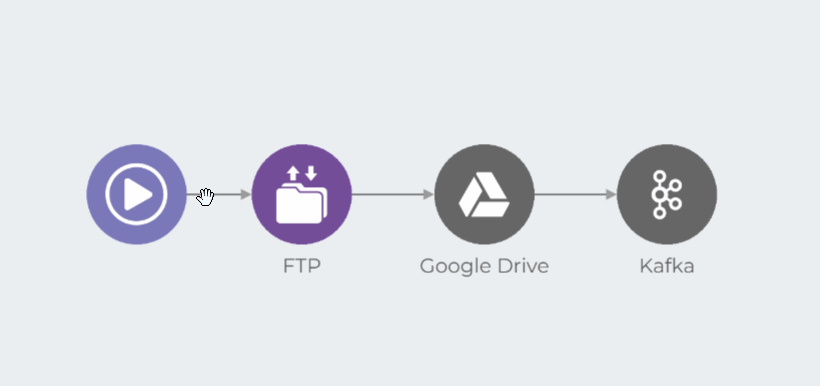

# Novo Canvas (Beta restrito)


**IMPORTANTE:** a nova versão do Canvas está em Beta restrito. Para saber mais, leia o artigo [Programa Beta](../geral/programa-beta.md).


O Canvas é o ambiente de construção de _pipelines_ da Plataforma Digibee. Através dele, você consegue desenvolver integrações simples ou complexas arrastando e soltando componentes pré-configurados com rapidez e precisão.

O Novo Canvas traz melhorias relacionadas à experiência de navegação e construção de _pipelines_ se comparado ao antigo Canvas.


**Nota:** Ambas as versões do Canvas estarão ativas e coexistirão por tempo indeterminado, com suporte disponível para as duas versões.


## Como utilizar o Novo Canvas

Para utilizar o Novo Canvas, acesse a aba **Build** e clique em **USAR NOVO CANVAS**.

<figure><figcaption></figcaption></figure>

Esse aviso também estará presente em todos os _pipelines_ criados no Canvas antigo. Ao clicar em **USAR NOVO CANVAS**, você será redirecionado para o Novo Canvas e o _pipeline_ será transferido para a nova versão sem perder nenhum componente, não necessitando de reimplantação.

Ainda na aba **Build**, você também pode acessar o Novo Canvas clicando em **+CRIAR** e em **Pipeline Beta**.

<figure><figcaption></figcaption></figure>


**Nota:** Você pode copiar e colar elementos do Canvas antigo no Novo Canvas.


A tag **Novo Canvas** estará destacada em azul no cabeçalho:

<figure><figcaption></figcaption></figure>

## Configurações do _pipeline_

Antes de partir para a construção do fluxo, é preciso configurar o _pipeline_. Para isso, clique na engrenagem () no canto superior direito do Canvas.

Na página de configurações do _pipeline_, se necessário, configure os seguintes campos:

<figure><figcaption></figcaption></figure>

* **Descrição**: descrição do _pipeline_.
* **“É multi-instância?”**: ative esta opção caso o _pipeline_ a ser criado seja multi-instância. Para saber mais sobre essa funcionalidade, leia o artigo [Multi-instância](../configurations/multi-instancia.md).
* **Campo sensível:** dados que precisam ser mascarados durante a execução do fluxo.
* **InSpec:** entrada do fluxo do _pipeline_.
* **OutSpec:** saída do fluxo do _pipeline_.

Após configurar o _pipeline_, você poderá partir para a construção do fluxo.

## Crie um fluxo

Todo _pipeline_ é composto por um _trigger_ e por pelo menos um componente, que devem ser conectados entre si para que possam estabelecer um fluxo de integração. No Novo Canvas você consegue organizar e configurar o _trigger_ e os componentes do seu _pipeline_ de acordo com a sua necessidade de negócio.

### Trigger 

O primeiro passo para criar um fluxo é escolher um _trigger_. O _trigger_ é o elemento que define como a execução do _pipeline_ será iniciada - através de uma chamada externa, em resposta a um evento ou via agendamento, por exemplo. Para defini-lo, basta clicar na ícone de engrenagem sobre o trigger () e escolher entre as opções listadas, conforme o exemplo abaixo:

<figure><figcaption></figcaption></figure>

### Componentes 

Os componentes representam etapas do fluxo e são escolhidos de acordo com as suas necessidades de negócio. Combine todas as etapas do processo de integração que deseja realizar utilizando a lista de componentes à direita do _Canvas_.

<figure><figcaption></figcaption></figure>


**Nota:** Nesta nova versão do Canvas, a seta magnética facilita a conexão entre componentes.


Para excluir uma linha conectora ou um componente específico do fluxo, clique no ícone de lixeira (.png>)) e no **X**.

<figure><figcaption></figcaption></figure>

Para configurar o componente a ser utilizado, clique no ícone de engrenagem ( (1).png>)) para acessar o formulário de configuração. No exemplo abaixo, é possível visualizar o formulário do [componente Google Drive](../components/file-storage/google-drive.md).

<figure><figcaption></figcaption></figure>

Para saber mais a respeito de cada componente disponível em nossa lista, acesse a nossa [documentação de componentes](broken-reference).

### Validação de construção do _pipeline_ 

O Novo _Canvas_ exibe alertas durante a construção de _pipelines_. Esses alertas __ ajudam os desenvolvedores a identificarem e corrigirem problemas comuns mais rapidamente. Para saber mais, leia o artigo [Validação de construção do _pipeline_](pipelines/validacao-de-construcao-do-pipeline.md).

### Teste o _pipeline_ 

Usando o Test mode, você pode executar e testar seu _pipeline_ diretamente da área de desenvolvimento. Utilize essa funcionalidade sempre que quiser avaliar o fluxo de integração, depurar e solucionar problemas. Para saber mais sobre essa funcionalidade, leia o artigo [Test mode](canvas/test-mode/).

### Salve o _pipeline_ 

Por fim, após construir seu fluxo de integração, clique em **SALVAR** no canto superior direito da tela, e defina um nome, uma descrição (opcional) e o projeto no qual o _pipeline_ estará alocado.

<figure><figcaption></figcaption></figure>


**Nota:** Caso seu _pipeline_ esteja apresentando alertas do tipo Erro, o botão **SALVAR** estará bloqueado, impedindo que você o salve.


### Navegação em um _pipeline_ 

Além das funcionalidades apresentadas neste artigo, o Novo Canvas conta com outras relacionadas à experiência de navegação no _pipeline_. Para saber mais, leia o artigo [Navegação em um _pipeline_](navegacao-em-um-pipeline-beta-restrito.md).

## Informações adicionais 

Durante a coexistência das duas versões do Canvas, você pode transportar seu _pipeline_ para o Canvas antigo. Para isso, abra seu _pipeline_ no Novo Canvas, clique no menu de ajuda e, em seguida, na opção **Suporte ao novo Canvas**.

<figure><figcaption></figcaption></figure>

Em seguida, basta responder por que você gostaria de usar o Canvas antigo e clicar em **MUDAR**.

<figure><figcaption></figcaption></figure>


**IMPORTANTE**: os componentes desconectados criados no Novo Canvas serão perdidos.

