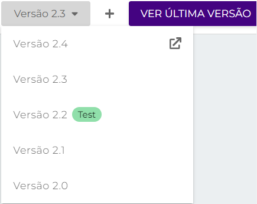

# Histórico de versões de pipelines

## Informações iniciais 

Primeiramente, para um usuário da Digibee Integration Platform poder acessar o Histórico de versões de _Pipelines_, ele precisará ter a permissão **BETA: PIPELINE-HISTORY**. Para saber mais sobre os papéis de sistema da Digibee e suas respectivas permissões, acesse o artigo [Papéis de sistema e grupos padrão](../../administration/novo-controle-de-acesso/papeis-de-sistema-e-grupos-padrao.md).

## Condições de versionamento de _pipelines_ 

O _pipeline_ utiliza o sistema de dois níveis de versionamento. O 1º número em uma versão refere-se à _**Major** ("versão principal"),_ o segundo à _**Minor** ("versão secundária'')._ Ex.: v.1.2, _Major_ = 1, _Minor_ = 2.

Versões _Majors_ são utilizadas para diferenciar as versões principais de um _pipeline_, ou seja, para podermos criar versões principais de um _pipeline_ sem modificarmos as versões geradas anteriormente. Dessa forma, teremos históricos de versões diferentes, pois o histórico de _pipelines_ faz referência a uma única versão _Major_ e às suas respectivas versões _Minor_.

Além disso, versões _Major_ também possibilitam que um mesmo _pipeline_ tenha diferentes implantações simultâneas a partir de suas versões _Major_.

As versões _Minor_, por sua vez, contemplam as alterações realizadas dentro de uma mesma versão _Major_ de um _pipeline_.

Por padrão, toda vez que um _pipeline_ é modificado e salvo, a Plataforma entende que uma nova versão _Minor_ deve ser criada e o faz automaticamente. Por exemplo: quando implantamos a última versão _Minor_ de um _pipeline_ e posteriormente o alteramos, uma outra versão _Minor_ é gerada para que a versão implantada seja preservada.

Além disso, versões Minors não permitem múltiplas implantações simultâneas, pois essas são sempre pertinentes a uma mesma versão _Major_.

**IMPORTANTE:** Para que uma nova versão _Major_ seja gerada, é necessário realizar o procedimento manualmente a partir de uma versão _Major_ existente.

## Visão geral 

O Histórico de versões lista todas as versões _Minor_ de um _pipeline_ com base em sua versão _Major_. Através dele, é possível saber quem editou pela última vez cada versão e quando ela foi alterada, além de saber se determinada versão está implantada e em qual ambiente (**test** ou **prod**).

Também é possível realizar diferentes ações no próprio histórico de versões, como editar a última versão _Minor_ do _pipeline_, visualizar e criar uma nova versão a partir de uma versão existente, e arquivar uma versão específica, conforme explicado neste artigo.

**IMPORTANTE:** A informação referente a quem editou uma versão será apresentada apenas nas versões criadas a partir de 1 de fevereiro de 2022. Versões criadas antes desta data não possuem dados de usuários em seus históricos e exibirão o valor padrão "_No data_". Pipelines criados antes do dia 15 de fevereiro de 2021 não possuem a informação de data de alteração e apresentarão o valor padrão 31/12/1969.

## Como acessar o Histórico de versões do _Pipeline_ 

Em Build, identifique o _pipeline_ que tenha ao menos uma versão _Minor_ do qual você pretende acessar o histórico.

Após isso, clique no botão “Ver histórico” conforme o exemplo abaixo:

.gif>)

Dessa forma, o Histórico de _pipelines_ será exibido contendo informações acerca de todas as versões _Minor_ do _pipeline_. Veja o exemplo abaixo:

.png>)

Dentre as principais informações trazidas pelo Histórico, estão:

* **Versões implantadas:** Caso uma das versões _Minor_ do _pipeline_ esteja implantada, esta informação constará no Histórico do _pipeline_ em questão, bem como em qual ambiente (**test** ou **prod**).
* **Versão:** Cada versão _Minor_ do _pipeline_;
* **Alterado por:** Nome e e-mail do usuário que alterou determinada versão do _pipeline_ pela última vez;
* **Alterado em:** Data e hora em que a versão _Minor_ foi alterada;
* **Descrição do pipeline:** Descrição do _pipeline_.

Também é possível selecionar quantos itens (ou seja, versões) por página você deseja que o histórico apresente e, além disso, navegar por ele utilizando a paginação no canto inferior direito.

## Ações 

.gif>)

A depender da versão _Minor_ do _pipeline_, determinadas ações podem ser realizadas através do próprio Histórico. São elas:

### Editar _pipeline_ .png>) 

Através do Histórico, é possível editar a versão _Minor_ mais recente do _pipeline_ desde que esta não esteja arquivada.

Para editá-la, basta clicar no botão “Editar _pipeline_”, que lhe redirecionará ao _Canvas_.

**IMPORTANTE:** Ao editar a última versão do _pipeline_ e clicar em “Salvar”, você estará criando uma nova versão _Minor_, portanto, a versão atual do _pipeline_. Além disso, é importante informar que apenas a última versão _Minor_ pode ser editada.

### Visualizar _pipeline_ .png>) 

Todas as versões _Minor_ antigas de um _pipeline_ são disponibilizadas para visualização desde que não estejam arquivadas.

Para visualizar determinada versão diretamente no _Canvas_, basta clicar em “Visualizar pipeline”.

No _Canvas_, é possível visualizar o _trigger_ e os componentes da _Minor_ e suas configurações, visualizar todas as versões anteriores do _pipeline_ e gerar uma nova versão de um _pipeline_ (editável) a partir da versão em questão, desde que ela esteja ativa. Veja o exemplo:

Desse modo, é possível navegar entre as versões _Minor_ antigas de um _pipeline_ e visualizá-las através do histórico integrado ao _Canvas_. É importante informar que não é possível editar as configurações do _trigger_ e dos componentes que compõem essas versões, visto que tratam-se de _pipelines_ disponibilizados apenas para consulta. A única versão _Minor_ editável é a mais recente e, portanto, a versão atual do _pipeline_.

No entanto, você pode utilizar as versões _Minor_ antigas para criar a versão atual e editável do _pipeline_. Para isso, basta criar uma versão _Minor_ a partir da versão antiga pretendida através do botão “Criar versão Minor”, situado no canto superior direito da tela.

**IMPORTANTE:** Para realizar essa ação, a versão Minor não deve estar arquivada. Caso esteja arquivada, o botão “Restaurar” substituirá o botão “Criar versão Minor”.

Também é possível visualizar a versão atual do pipeline através do botão “Veja última versão”. Por ser a versão mais recente, este _pipeline_ é totalmente editável.

Por fim, ao clicar em “Voltar para o histórico” no canto superior esquerdo, você será redirecionado ao histórico.

### Arquivar _pipeline_ .png>) 

É possível arquivar qualquer versão do _pipeline_, seja ela antiga ou a mais recente, clicando em “Arquivar pipeline”.

**IMPORTANTE:** Apenas versões não arquivadas podem ser implantadas nos ambientes de **test** e **prod** no menu Run. Ou seja, se uma versão está arquivada, ela não será apresentada no momento da criação de novas implantações.

### Restaurar _pipeline_ .png>) 

Uma vez que uma versão do _pipeline_ é arquivada, é possível restaurá-la através do botão “Restaurar _pipeline_” e, assim, disponibilizá-la acesso.

### Criar nova versão Minor .png>) 

É possível criar uma nova versão _Minor_ a partir de uma versão antiga desde que esta não esteja arquivada. Para isso, basta identificar a versão pretendida e clicar no botão “Criar nova versão Minor”, ação que criará uma cópia da mesma e lhe redirecionará ao _Canvas_, onde será possível editá-la.

**IMPORTANTE:** Ao criar uma cópia de determinada versão do _pipeline_, você estará criando a versão _Minor_ mais recente e, portanto, a versão atual e editável do _pipeline_.

## Termos de uso 

Ao utilizar o Histórico de versões de _pipelines_, você automaticamente faz sua adesão ao programa Beta e concorda com os termos de uso. Para mais informações sobre a adesão, acesse a [documentação sobre versões beta](../../geral/programa-beta.md).
