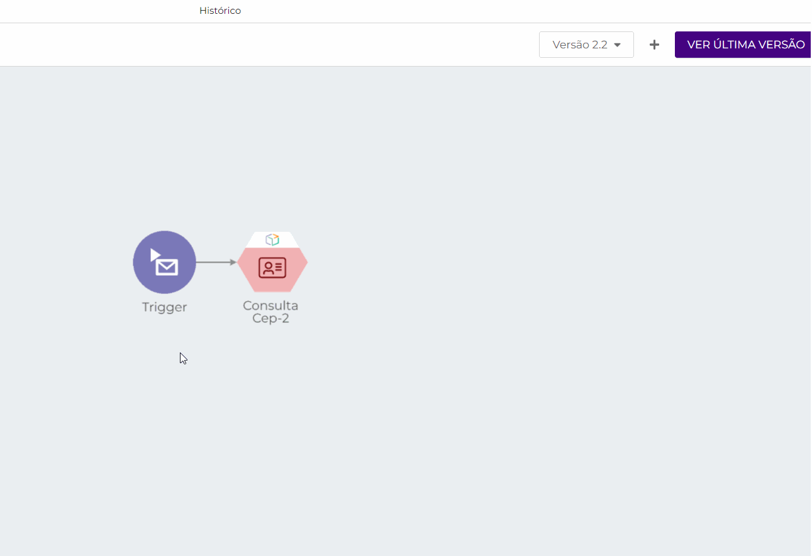

# Histórico de versões de pipelines

## Informações iniciais 

Para acessar o Histórico de versões de _pipelines_ e testar as funcionalidades apresentadas neste artigo, você precisa da permissão **BETA: PIPELINE-HISTORY**. Para saber mais sobre os papéis de sistema da Digibee e suas respectivas permissões, leia o artigo [Papéis de sistema e grupos padrão](broken-reference).

## Visão geral 

O Histórico de versões de _pipelines_ lista todas as versões _Minor_ de um _pipeline_ vinculadas a sua versão _Major_. Através dele, é possível visualizar quem editou pela última vez cada versão e quando ela foi editada, além de saber se determinada versão está implantada e em qual ambiente (**test** ou **prod**).

Na aba do Histórico de versões de um _pipeline_, também é possível editar a última versão _Minor_ do _pipeline_, visualizar e criar uma nova versão a partir de uma versão existente, e arquivar uma versão específica.

Para saber mais sobre as condições de versionamento de pipelines, leia o artigo [Versionamento de pipelines](versionamento-de-pipelines.md).


**IMPORTANTE:** A informação referente a quem editou uma versão é exibida apenas nas versões criadas a partir do dia 1 de fevereiro de 2022. Versões criadas antes dessa data não possuem dados de usuários em seus históricos e exibirão o valor padrão "_No data_". _Pipelines_ criados antes do dia 15 de fevereiro de 2021 não possuem a informação de data de alteração e apresentarão o valor padrão 31/12/1969.


## Como acessar o Histórico de versões de um _pipeline_ 

Na aba Build, identifique o _pipeline_ que tenha ao menos uma versão _Minor_ para acessar o histórico.

Após isso, clique no botão Ver histórico:

.gif>)

Dessa forma, o Histórico de versões do _pipeline_ será exibido contendo informações acerca de todas as versões _Minor_ do _pipeline_.

.png>)

Veja as informações trazidas pelo Histórico de versões de _pipelines_:

* **Versões implantadas:** Caso uma das versões _Minor_ do _pipeline_ esteja implantada (em **test** ou **prod**), esta informação constará no Histórico de versões do _pipeline_.
* **Versão:** versão _Minor_ do _pipeline_;
* **Alterado por:** Nome e e-mail do usuário que editou a versão do _pipeline_;
* **Alterado em:** Data e hora em que a versão _Minor_ foi editada;
* **Descrição do **_**pipeline**_**.**

Também é possível selecionar quantos itens (ou seja, versões) por página você quer que o histórico exiba e, além disso, navegar por ele utilizando a paginação no canto inferior direito.

## Ações 

A depender da versão _Minor_ do _pipeline_, determinadas ações podem ser realizadas através do próprio Histórico. São elas:

### Editar _pipeline_ .png>) 

É possível editar a versão _Minor_ mais recente do _pipeline_ desde que esta não esteja arquivada.

Para editá-la, clique no botão **Editar pipeline**, que lhe redirecionará ao _Canvas_.


**Nota:** Ao editar a última versão do _pipeline_ e clicar em Salvar, você estará criando uma nova versão _Minor_, portanto, a versão atual do _pipeline_. Apenas a última versão _Minor_ pode ser editada.


### Visualizar _pipeline_ .png>) 

Todas as versões _Minor_ antigas de um _pipeline_ são disponibilizadas para visualização desde que não estejam arquivadas.

Para visualizar determinada versão no _Canvas_, clique em **Visualizar pipeline**.

No Canvas, é possível navegar entre as versões _Minor_ antigas de um _pipeline_ através do Histórico integrado ao _Canvas_. Não é possível editar os _pipelines_ dessas versões. A única versão _Minor_ editável é a mais recente, ou seja, a versão atual do _pipeline_.

No entanto, é possível utilizar as versões _Minor_ antigas para criar a versão atual e editável do _pipeline_. Para fazer isso, selecione a versão antiga pretendida no Histórico integrado ao Canvas e clique no botão **Criar versão Minor**, situado no canto superior direito da tela.


**Nota:** para realizar essa ação, a versão _Minor_ não pode estar arquivada. Caso esteja arquivada, o botão **Restaurar** substituirá o botão **Criar versão Minor**.


Ainda no Canvas, é possível visualizar a versão atual do _pipeline_ através do botão **Veja última versão**. Por ser a versão mais recente, esse _pipeline_ é totalmente editável.

Para voltar ao Histórico de versões, clique em **Voltar para o histórico**, no canto superior esquerdo do _Canvas_.

### Arquivar _pipeline_ .png>) 

É possível arquivar qualquer versão _Minor_ do _pipeline_, seja ela antiga ou a mais recente, clicando em **Arquivar pipeline**.


**Nota:** Apenas versões ativas podem ser implantadas. Ou seja, se uma versão estiver arquivada, ela não será exibida no momento da criação de novas implantações na aba Run.


### Restaurar _pipeline_ .png>) 

Você pode restaurar versões arquivadas de um _pipeline_ clicando no botão **Restaurar pipeline** e, assim, disponibilizá-la para visualização.

### Criar nova versão Minor .png>) 

É possível criar uma nova e atual versão _Minor_ a partir de uma versão antiga desde que ela não esteja arquivada. Para isso, identifique a versão pretendida e clique no botão **Criar nova versão Minor**. Isso criará uma cópia dessa versão do _pipeline_ e lhe redirecionará ao _Canvas_, onde você poderá editá-la.

## Termos de uso 

Ao utilizar o Histórico de versões, você automaticamente faz sua adesão ao programa Beta e concorda com os termos de uso. Para mais informações sobre versões beta, leia a documentação [Programa beta](../../geral/programa-beta.md).
