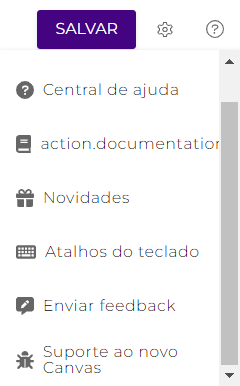

# Navegação em um pipeline


**IMPORTANTE:** parte das funcionalidades apresentadas neste artigo estão em Beta. Para saber mais, leia o artigo [Programa Beta](../../geral/programa-beta.md).


O Novo Canvas contém funcionalidades que melhoram a experiência de navegação em um _pipeline_, facilitando e agilizando a construção de fluxos de integração.

### Botões de controle do Canvas 

<figure><figcaption></figcaption></figure>

Você pode facilmente navegar pelo _pipeline_ através dos botões **Reorganizar** ( (1).png>)), **Ampliar zoom** ( (2).png>)) e **Reduzir zoom** (). O primeiro é utilizado para reorganizar os componentes utilizados de forma que facilite a visualização de cada etapa do fluxo; os outros dois são utilizados para controlar o zoom do Canvas.

Ao reorganizar, os componentes soltos (não conectados ao fluxo) são ajustados à esquerda da tela, um abaixo do outro. Já os componentes conectados ao fluxo, por sua vez, são alinhados horizontalmente.

### Minimapa (Beta) 

No Novo Canvas, você pode navegar pelo _pipeline_ utilizando o minimapa no canto inferior direito da tela.

<figure><figcaption></figcaption></figure>

### Movimentação automática (Beta) 

Com o _auto pan_, ao segurar um componente e o arrastar, a nova tela segue o cursor, facilitando a navegação em _pipelines_ muito grandes. Desse modo, você consegue arrastar um componente para qualquer área do Canvas, e a tela o acompanhará.

### Flow tree (Beta)

Esta funcionalidade é uma estrutura em forma de árvore que exibe os componentes de um _pipeline_ de uma forma mais simples e centralizada. Utilizando a _Flow tree_, você pode visualizar todos os componentes do _pipeline_ principal e de todos os _subpipelines_, conectados ou não, em um só lugar.

<figure><figcaption></figcaption></figure>

Para navegar até um componente ou _subpipeline_ específico, dê um duplo clique sobre ele dentro da estrutura da Árvore ou clique no ícone de destino ().

Você também pode editar os parâmetros de configuração de um componente a partir da _Flow tree_. Para isso, clique no ícone de engrenagem () do componente dentro da estrutura da _Flow tree_ para abrir o formulário de configuração.


A _Flow tree_ simplifica a navegação e o entendimento da lógica aplicada no fluxo de integração, permitindo que você veja os componentes de um _subpipeline_ enquanto visualiza o _pipeline_ principal ou vice-versa, facilitando depuração durante a construção do _pipeline_.


### Campo de busca (Beta)

Use o Campo de busca localizado ao lado esquerdo do Canvas para buscar por componentes, Contas e Globals de maneira fácil e rápida.&#x20;

<figure><figcaption></figcaption></figure>

Na barra de pesquisas, busque pelo nome ou partes do nome de um componente, Conta ou Global.&#x20;

Na barra de resultados da pesquisa, você pode ver onde e com que frequência o item é utilizado no _pipeline_ e editá-lo.
