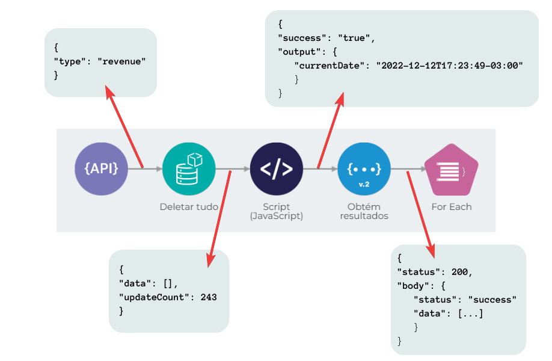

# Processamento de mensagens

De forma simplificada, um _pipeline_ é uma sequência de componentes conectados que se comunicam por meio do processamento de mensagens.

O processamento de mensagens entre componentes é feito em três etapas:

* recebimento de uma mensagem do componente anterior (mensagem _**in**_);
* execução de algum processamento, que pode ou não usar as informações da mensagem recebida;
* envio de uma mensagem ao próximo componente (mensagem _**out**_).

Essas mensagens estão sempre no formato JSON.

## Exemplo

Um _pipeline_ é construído utilizando um _trigger_ REST, que é chamado e fornece o parâmetro recebido (`"type": "revenue"`) para o componente seguinte - um Object Store denominado **Deletar tudo**. Um por um, cada componente finaliza a sua execução e aciona o próximo, fornecendo a mensagem resultante do seu processamento.

<figure><figcaption></figcaption></figure>

Se você optar por trafegar somente mensagens no formato JSON, a manipulação e a transformação serão facilitadas, independente de você usar componentes de transformação ou expressões _Double Braces_. Essas expressões precisam fazer referência a elementos da mensagem de entrada para produzir uma mensagem de saída.&#x20;

Para saber mais, leia o artigo [Double Braces e Entrada de Dados](../funcoes-double-braces/double-braces-e-entrada-de-dados.md).
