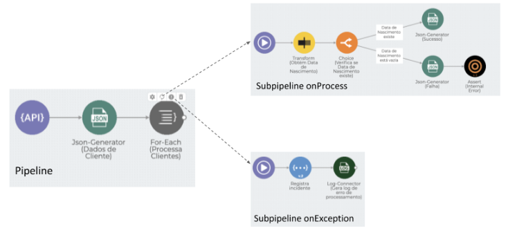
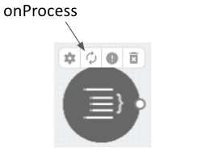
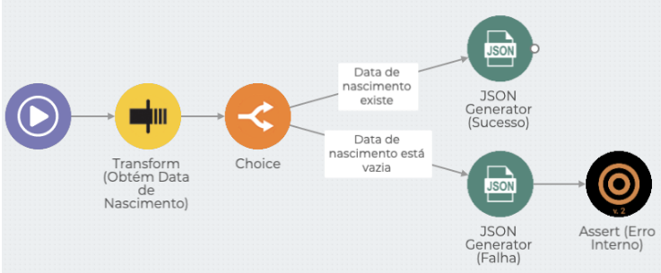
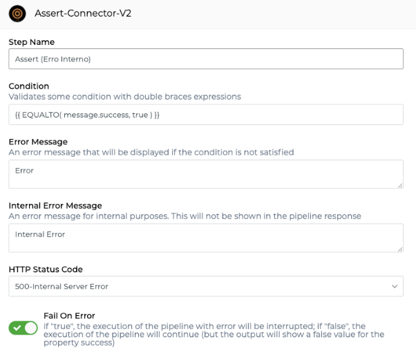
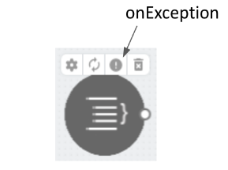
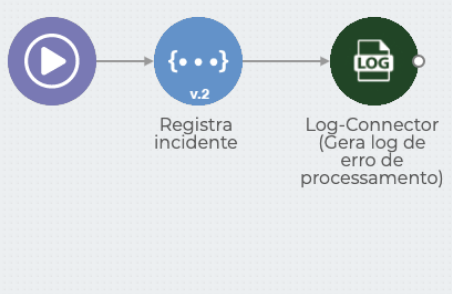

# Subpipelines

_Subpipeline_ é um subprocesso do _pipeline_ principal. _Subpipelines_ são necessariamente vinculados e disparados a partir de um componente no processo principal, como por exemplo o “For Each”.

Vamos imaginar um processo chamado _Validação de Dados de Cliente_. Esse processo obtém os dados de _endpoint_ REST e então verifica se cada registro de cliente possui as informações necessárias. Para iterar por essa coleção de registros, usaremos o componente “For Each” (Processa Clientes).

.png>)

Toda vez que um componente com capacidade de iterar por coleções é adicionado a um _pipeline_, 2 _subpipelines_ são criados: _**onProcess**_** ** e _**onException**_.



### _**onProcess**_ <a href="#onprocess" id="onprocess"></a>

Nesse _subpipeline_ é implementado o fluxo que processa cada item da coleção. Ele tem seu próprio Canvas, que é acessado através do menu do componente:



No caso do processo _Validação de Dados de Cliente_, o _subpipeline **onProcess**_ irá tratar todos os registros da coleção de clientes individualmente, verificando se cada um deles possui o atributo _Data de Nascimento_ preenchido:



Ao término de cada execução do _subpipeline **onProcess**_, um atributo _success_ é retornado, indicando se houve sucesso ou falha na execução. Por padrão, esse atributo é retornado com valor _false_. Assim, você precisa informar explicitamente quando a execução ocorreu conforme esperado.

No processo _Validação de Dados de Cliente_ será retornada uma resposta de sucesso quando o atributo _Data de Nascimento_ estiver preenchido. A resposta é gerada pelo componente _JSON Generator (Sucesso)_ conforme indicado abaixo:

```
{"success": true}
```

Caso o atributo _Data de Nascimento_ esteja vazio, o componente JSON Generator (Falha) retorna o atributo com valor _false_:

```
{"success": false}
```

Nesse caso, uma exceção através do componente Assert (Erro Interno) é gerada:



O atributo _Fail On Error_ indica que, caso a Condição do componente Assert não seja satisfeita, a execução do fluxo do _pipeline_ será interrompida e será lançada uma exceção.

Quando a exceção é originada por um componente que está dentro de um _subpipeline_, é iniciada a execução do _subpipeline **onException**_. Por outro lado, se a exceção ocorre em um componente que está no _pipeline_ principal, a execução do _pipeline_ será interrompida com erro.

### _**onException**_ <a href="#onexception" id="onexception"></a>

Nesse _subpipeline_ é implementado o fluxo que trata uma exceção na execução do _subpipeline **onProcess**_. O Canvas pode ser acessado através do menu do componente:



Quando o _**onException**_** ** é executado no processo _Validação de Dados de Cliente_, uma chamada a um _endpoint_ REST é feita, registrando o incidente e gerando uma mensagem de erro no _log_ da Plataforma.



\
Embora a utilização do _**onException**_ seja opcional, nós a recomendamos fortemente. Diversos componentes da Plataforma suportam o atributo _Fail On Error_ e permitem que estratégias de tratamento de erro e recuperação sejam implementadas através do _**onException**_, tornando o _pipeline_ muito mais robusto e resiliente.

Para entender a composição de um _pipeline_, leia o artigo [_Pipeline_](./).
