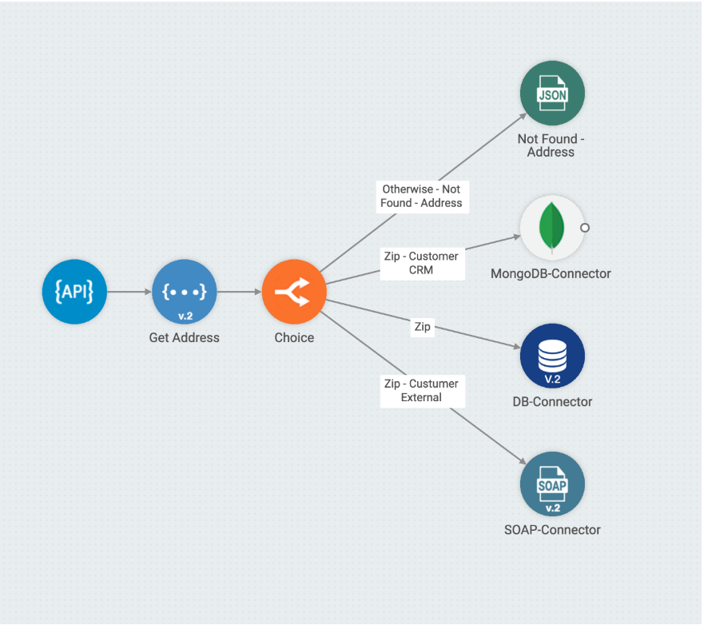

# Choice

O **Choice** permite o desvio de fluxo dentro de um _pipeline_. Ele faz parte de um conjunto de componentes que auxilia na organização das integrações.   &#x20;

Para trabalhar com esse tipo de componente, você precisa conhecer os 2 tipos de estrutura do _**Choice**_. Eles são utilizados para criar os caminhos:&#x20;

* **WHEN:** define uma condição que realiza um desvio no seu fluxo para uma linha de execução específica. É necessário ter pelo menos 1 condição declarada.&#x20;
* **OTHERWISE:** a estrutura é executada quando nenhuma das condições WHEN é atendida. É necessário ter pelo menos 1 condição declarada.&#x20;


Dê uma olhada nos parâmetros de configuração desse componente:

* **Label:** define o nome do caminho. Esse nome deve ser único, não podendo se repetir no _pipeline_.
* **Type:** define a estrutura de desvio (WHEN ou OTHERWISE).
* **Type Rules:** define o tipo de linguagem (SIMPLE ou JSON PATH), que será utilizado para a declaração da condição (quando WHEN for escolhido no parâmetro “Type”).
* **Condition:** declara a condição utilizada para definir se o caminho deve ser executado. Quando as condições previamente definidas gerarem conflito ou causarem uma sobreposição, apenas uma delas será executada (quando WHEN for escolhido no parâmetro “Type”).

&#x20;

### TYPE RULES <a href="#type-rules" id="type-rules"></a>

* **JSON PATH**

Define expressões que passam por um componente JSON para alcançar um subconjunto. Quando você estiver utilizando o _**Choice**_, será feito um _match_ para executar o caminho.\
&#x20;

Imagine que, no passo anterior ao _**Choice**_, o seu fluxo de dados possui a seguinte saída:

```
{
    "cidade" : "Sao Paulo"
}
```

&#x20;        &#x20;

A seguinte Condition declarada como WHEN validaria a execução do desvio:

```
$.[?(@.cidade == 'Sao Paulo')]
```

&#x20;            &#x20;

Conheça as demais opções para a declaração JSON PATH:

* **$:** a raiz do objeto ou vetor.
* **.**_**propriedade:**_** s**eleciona uma propriedade específica no objeto relacionado.
* **\['**_**propriedade**_**']:** seleciona uma propriedade específica no objeto relacionado. Coloque apenas aspas simples ao redor do nome da propriedade. Dica: considere essa instrução caso o nome da propriedade contenha caracteres especiais, assim como espaços, ou caso comece com caracteres diferentes de A..Za..z\_.
* **\[**_**n**_**]:** seleciona o elemento _n_ de um vetor. Os índices começam com 0.
* **\[**_**indice1**_**,**_**indice2**_**,**_**…**_**]:** seleciona elementos do vetor com índices específicos e retorna uma lista.
* **..**_**propriedade:**_** ** recursiva descendente: busca um nome de propriedade decrescentemente e retorna um vetor de todos os valores com esse nome de propriedade. Sempre retorna uma lista, mesmo que apenas 1 propriedade seja encontrada.
* **\*:** o curinga seleciona todos os elementos em um objeto ou vetor, qualquer que seja os seus nomes ou índices. Por exemplo, endereço.\* significa todas as propriedades do objeto endereço e livro\[\*] significa todos os itens de um vetor de livro.
* **\[**_**entrada**_**:saida] / \[**_**entrada**_**:]:** seleciona elementos de um vetor de entrada e até, porém não necessariamente, um vetor de saída. Se a saída é omitida, selecione todos os vetores até o final do vetor. Uma lista é retornada.
* **\[:**_**n**_**]:** seleciona os primeiros _n_ elementos do vetor. Uma lista é retornada.
* **\[**_**-n**_**:]:** seleciona os últimos _n_ elementos do vetor. Uma lista é retornada.
* **\[?(**_**expressao**_**)]:** expressão de filtro. Seleciona todos os elementos em um objeto ou vetor que coincidem com o filtro especificado. Uma lista é retornada.
* **\[(**_**expressao**_**)]:** expressões de script podem ser utilizadas no lugar de nomes explícitos de propriedades ou índices. Por exemplo, \[(@.tamanho-1)], que seleciona o último item de um vetor. Aqui, tamanho se refere ao tamanho do vetor em questão mais do que um arquivo JSON nomeado "tamanho".
* **@:** utilizado em expressões de filtro para fazer referência ao nó atual que está sendo processado.
* **==:** igual a .1 e '1' são considerados o mesmo resultado. Valores de _string_ devem ser anexados em aspas simples (e não em aspas): \[?(@.cor=='vermelho')].
* **!=:** diferente de. Valores de _string_ devem ser anexados em aspas simples.
* **>:** maior que.
* **>=:** maior ou igual a.
* **<:** menor que.
* **<=:** menor ou igual a.
* **=\~:** compatível com uma RedEx Java Script regular. Por exemplo, \[?(@.descricao =\~ /gato.\*/i)] casa itens cuja descrição começa com _gato_ (ignora maiúsculas e minísculas).&#x20;
* **!:** utilizado para negar um filtro. Por exemplo, \[?(!@.isbn)] casa itens que não possuem a propriedade isbn.&#x20;
* **&&:** operador lógico E. Exemplo:

```
[?(@.categoria=='ficcao' && @.preco < 10)]
```

&#x20;           &#x20;

* ||: operador lógico OU. Exemplo:

```
[?(@.categoria=='ficcao' || @.preco < 10)]
```

Para saber mais, clique [aqui](https://goessner.net/articles/JsonPath/).

&#x20;     &#x20;

### SIMPLE <a href="#simple" id="simple"></a>

É basicamente destinada a ser uma linguagem pequena e simples para avaliar Expressões e Predicados sem exigir novas dependências ou conhecimento do JSON PATH.\
&#x20;             &#x20;

Imagine que, no passo anterior ao _**Choice**_, o seu fluxo de dados possui a seguinte saída:

```
{
    "cidade" : "São Paulo"
}
```

&#x20;         &#x20;

&#x20;A condição declarada como WHEN validaria a execução do desvio:

```
#{cidade} == 'São Paulo'
```

&#x20;       &#x20;

Conheça as demais opções para a declaração SIMPLE:

* **==:** igual a.
* **=\~:** igual a, ignorando maiúsculas e minúsculas (quando comparando _strings_).
* **>:** maior que.
* **>=:** maior ou igual a.
* **<:** menor que.
* **!=:** diferente.
* **!=\~:** diferente de, ignorando maiúsculas e minúsculas (quando comparando _strings_).
* **regex:** valida uma RegEx contra a _string_ informada. Exemplo: #{cidade} regex 'S.\*'
* **&&:** operador lógico E. Exemplo:

```
 #{cidade} == 'Sao Paulo' && #{estado} == 'SP'
```

* **||:** operador logico OU. Exemplo:

```
#{cidade} == 'Sao Paulo' || #{estado} == 'RJ'
```

&#x20;                    &#x20;

&#x20;**Exemplo:**


