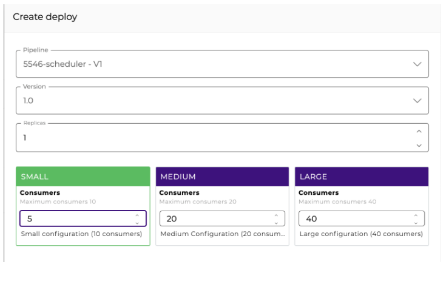

# DB V2

O **DB V2** efetua operações de SELECT, INSERT, DELETE e UPDATE e também faz chamadas em PROCEDURES, retornando os valores para uma estrutura JSON.

Veja alguns dos parâmetros de configuração do componente:

* **Operation:** operação a ser realizada (_Query_ ou _Procedure_).&#x20;
* **Account:** account a ser utilizada pelo componente para se conectar.
* **Database URL:** defina um Database URL.
* **SQL Statement:** aceita qualquer _SQL statement_ suportada pelo banco de dados subjacente. Expressões com _Double Braces_ são permitidas. Ex.: \{{ message.id \}}.
* **Batch:** se a opção estiver habilitada, é realizado o processamento em lote.
* **Rollback On Error:** se esta opção estiver habilitada, os _commits_ das operações são executados apenas se todas forem bem sucedidas. Caso contrário, será executada uma reversão de todas as operações em lote.
* **Batch Items:** se _Batch_ estiver ativado, especifique os itens do _Batch_.
* **Fail On Error:** se a opção estiver habilitada, a execução do pipeline com erro será interrompida; do contrário, a execução do pipeline continua, e o resultado mostrará o valor _false_ para a propriedade "_success_".
* **Blob As File:** se a opção estiver habilitada, todos os parâmetros BLOB para operações _QUERY_ ou _PROCEDURE_ deverão receber o caminho do arquivo.
* **Clob As File:** se a opção estiver habilitada, todos os parâmetros CLOB para operações _QUERY_ ou _PROCEDURE_ deverão receber o caminho do arquivo.
* **Charset:** nome do código dos caracteres para a leitura do arquivo (_standard UTF-8_).
* **Custom Connection Properties:** propriedades específicas de conexão e banco de dados definidas pelo usuário.
* **Keep Connection:** se a opção estiver habilitada, as conexões com o banco de dados serão mantidas por no máximo 30 minutos - caso contrário, serão mantidas por 5 minutos.
* **Advanced:** permite definir uma _Query_ a ser executada antes da definida no _SQL STATEMENT_ para garantir que a conexão com o banco de dados seja estabelecida e erros sejam evitados.
* **Pool Size By Actual Consumers:** se a opção estiver habilitada, o número de conexões agrupadas é igual ao número de consumidores configurados na implantação do pipeline. Se a opção estiver desativada, o tamanho do _pool_ será determinado pelo tamanho da implantação do pipeline, independentemente do número de consumidores.
* **Exclusive DB Pool:** se a opção estiver habilitada, um novo _pool_ não compartilhado sempre é criado para uso exclusivo desse componente. Se a opção estiver desativada, um _pool_ poderá ser compartilhado entre os componentes se a URL for a mesma.
* **Output Column From Label:** para alguns bancos de dados, se seu _SELECT_ usar um _alias_, você deve habilitar este sinalizador para que o nome da coluna seja exibido exatamente como o _alias_.
* **Connection Test Query:** SQL statement a ser usada antes de cada conexão ser estabelecida. Este é um parâmetro opcional e deve ser usado com bancos de dados que não fornecem informações confiáveis sobre o status da conexão.
* **Raw SQL Statement:** se a opção estiver ativada, o parâmetro **SQL Statement** permite o uso de _queries_ dinâmicas através de declarações _Double Braces_. Ao utilizar essa funcionalidade, você deve garantir que o _pipeline_ possua mecanismos de segurança contra instruções SQL indesejadas (_SQL Injection_). Veja mais sobre esse parâmetro na seção abaixo.


**IMPORTANTE:** em casos onde um banco de dados Apache Hive é usado, os dados de _Updatecount_ podem estar indisponíveis devido a uma característica do sistema. Essa informação estará disponível apenas se o controle do _updated row count_ estiver habilitado no servidor Apache Hive. [Para mais informações sobre suporte Apache Hive para a Digibee Integration Platform, leia o artigo Banco de dados suportados.](https://docs.digibee.com/documentation/v/pt-br/plataforma/bancos-de-dados-suportados#apache-hive)


## Raw SQL Statement <a href="#db-v2-em-ao" id="db-v2-em-ao"></a>

Para trazer mais flexibilidade ao utilizar o **DB V2**, podemos ativar a opção **Raw SQL Statement**, configurar previamente uma _query_ e referenciá-la via _Double Braces_ no parâmetro **SQL Statement** da seguinte maneira:

**Query definida previamente via Template Transformer**

<figure><figcaption></figcaption></figure>

**Ativação do Raw SQL Statement**

<figure><figcaption></figcaption></figure>

**Query referenciada no parâmetro SQL Statement**

<figure><figcaption></figcaption></figure>


**IMPORTANTE:** como boa prática, recomendamos fortemente que ao ativar a opção **Raw SQL Statement**, as _queries_ sejam definidas previamente através do componente [**Template Transformer**](https://docs.digibee.com/documentation/components/tools/template-transformer). O uso do **Template Transformer** permite validar parâmetros através da tecnologia FreeMarker e também a declaração de parâmetros via _Double Braces_. Estes parâmetros não são resolvidos pelo **Template Transformer** e sim pelo componente **DB V2**, que por padrão configura e valida os parâmetros da instrução SQL previamente (_PreparedStatement_). Ao aplicar essas medidas de segurança, você diminui os riscos de ataques do tipo _SQL Injection_.


Na imagem abaixo, temos à esquerda um exemplo do uso recomendado do componente (com o _Double Braces_ na cláusula _WHERE_, no destaque verde); e à direita um exemplo do uso não recomendado (com o FreeMarker na cláusula _WHERE_, no destaque vermelho) que pode trazer riscos à segurança do _pipeline_:

<figure><figcaption></figcaption></figure>

## DB V2 em Ação <a href="#db-v2-em-ao" id="db-v2-em-ao"></a>

### Batch mode <a href="#batch-mode" id="batch-mode"></a>

Quando for necessário realizar um processamento em lote de algumas instruções, você pode realizar chamadas em modo _batch_ nas _queries_.

\
**Exemplo**

Digamos que você precise informar no componente um _array_ de objetos, que serão utilizados nessa execução em _batch_:

**ITENS**

```
[   { 
    "name": "Mathews", "type":"A"
    }, { 
    "name": "Jules", "type":"A"
    }, { 
    "name": "Raphael", "type":"B"
    } 
]
```

E na instrução SQL, você deverá informá-lo da seguinte maneira:

**SQL**

INSERT INTO TABLE VALUES ( \{{ item.name \}}, \{{ item.type \}} )

Quando você utiliza expressões em _Double Braces_ \{{ item.name \}}, uma iteração é feita dentro do _array_ (informado em itens) e uma propriedade correspondente é buscada dentro do objeto. Nesse caso, a propriedade é "name".

Após a execução, 3 registros são inseridos. O retorno esperado é:

```
{ 
    "totalSucceeded":3, 
    "totalFailed":0 
}
```

Caso uma das execuções falhe, será retornado um objeto com a propriedade "error":

```
{ 
    "totalSucceeded":1, 
    "totalFailed":1 
}
```

Caso uma das execuções falhe, será retornado um objeto com a propriedade "errors":

```
{ 
    "totalSucceeded":1, 
    "totalFailed":1,
    "errors": ["erro1", "error2"]
}
```


**IMPORTANTE:** os erros retornados na propriedade “errors” variam conforme o _driver_ do banco. Alguns _drivers_ não retornam todos os erros ocorridos durante a execução em modo _batch_.


### Rollback On Error <a href="#rollback-on-error" id="rollback-on-error"></a>

Se essa opção estiver ativada, os _commits_ das operações serão realizados apenas se todas elas forem bem sucedidas. Do contrário, será feito o _rollback_ de todas as operações _batch_.

Se a opção estiver inativa, então o _commit_ e as alterações bem sucedidas por _commit_ serão feitas mesmo que ocorra alguma falha entre as execuções.


**IMPORTANTE:** para alguns bancos de dados, principalmente para o Oracle, não é possível retornar o número consolidado execuções bem ou mal sucedidas.&#x20;


Caso algum erro ocorra, um objeto contendo todos os erros será retornado (dentro da propriedade "errors") e consolidado com o valor -1 também será retornado:

```
{ 
    "totalSucceeded":-1, 
    "totalFailed":-1,
    "errors": ["erro1", "error2"], 
    "success": false
}
```

Para outros bancos, como o Firebird, a ocorrência de erros não é informada. Portanto, um objeto sem nenhum erro pode ser retornado mesmo que tenha ocorrido uma falha:

```
{ 
    "totalSucceeded":0, 
    "totalFailed":3,
    "errors": ["erro1", "error2"], 
    "success": false
}
```

Para esses casos de erro no _Batch Mode_, não deixe de analisar a propriedade "success". Se ela retornar "false", significa que pelo menos um erro ocorreu durante a execução.

## Pool de conexão <a href="#h_f90a8ac5f6" id="h_f90a8ac5f6"></a>

Por padrão, utilizamos um _pool_ de tamanho baseado nas configurações do _pipeline_ implantado. Por exemplo, caso seja um _pipeline_ SMALL, então o tamanho do _pool_ será de 10. Para o MEDIUM o tamanho seria de 20 e para o LARGE seria de 40.

É possível gerenciar o tamanho do _pool_ na hora da implantação também. Para isso, é necessário habilitar a propriedade “Pool Size By Actual Consumers” no componente. Com isso, é utilizado o que for configurado manualmente na tela de implantação.

Veja na figura abaixo a configuração de um _pipeline_ SMALL com 5 _consumers_. Se você quiser que o _pool_ dos componentes de banco de dados (_**DB V2**_ e _**Stream DB V3**_) utilize esse tamanho, será preciso habilitar a propriedade “Pool Size By Actual Consumers” em todos os componentes existentes:




**IMPORTANTE:** atenção ao configurar o tamanho do _pool_ manualmente para que não ocorra nenhum _deadlock_ em chamadas concorrentes ao mesmo banco.


O nosso _pool_ é compartilhado entre os componentes de banco de dados que acessam o mesmo banco de dados dentro do _pipeline_. Caso seja necessário um _pool_ exclusivo para determinado componente, habilite a propriedade “Exclusive Pool”.

## Tecnologia

### Autenticação via Kerberos

É possível realizar autenticação via Kerberos em componentes de banco de dados. Para isso, basta você:

* informar uma conta do tipo KERBEROS
* configurar um Kerberos principal
* configurar uma _keytab_ (que deve ser a base64 do próprio arquivo _keytab_ gerado)

## Mais cenários de uso com DB V2&#x20;

Veja na documentação a seguir como usar o DB V2 em diferentes cenários:


[db-v2-via-kerberos.md](db-v2/db-v2-via-kerberos.md)


### &#x20;<a href="#h_f90a8ac5f6" id="h_f90a8ac5f6"></a>
