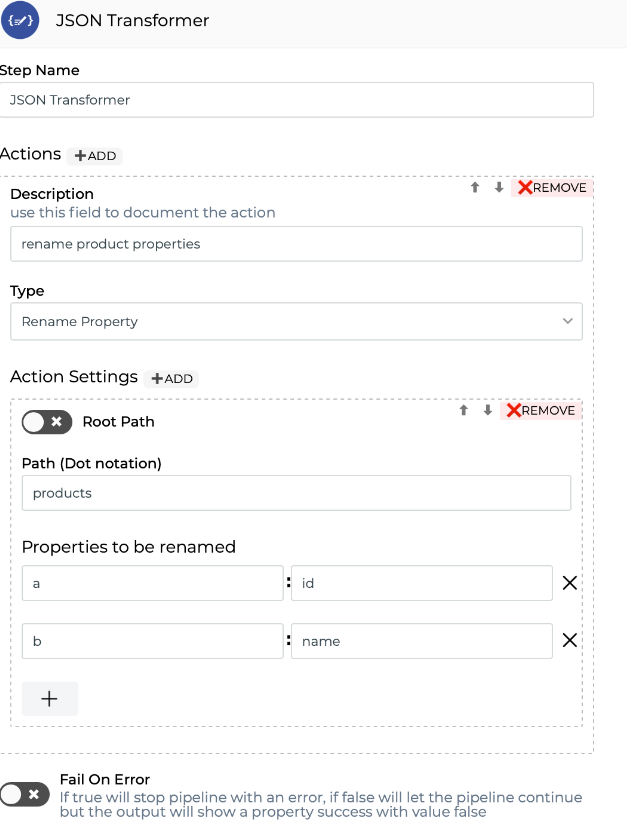
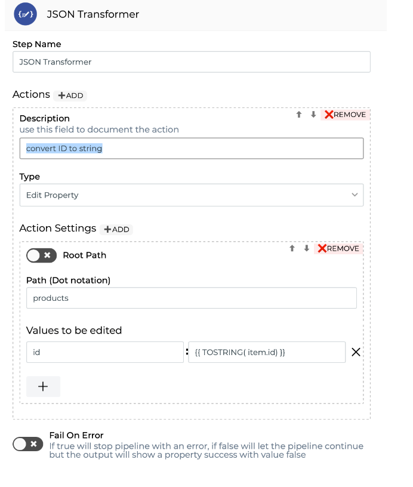
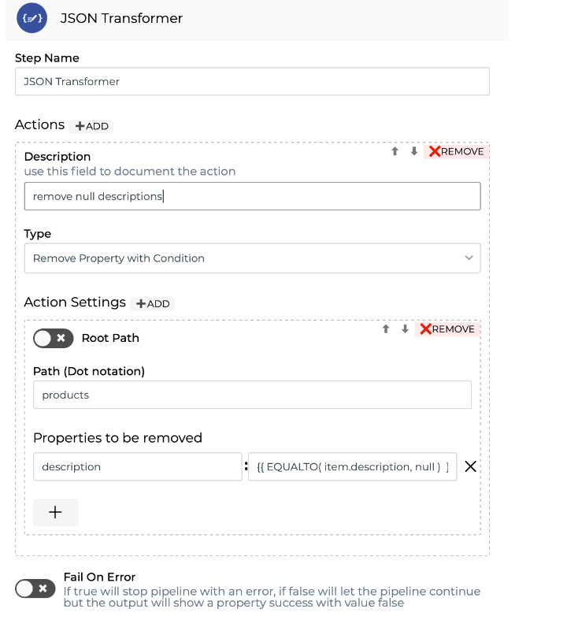

# JSON Transformer

O _**JSON Transformer**_ possibilita a aplicação de transformações no JSON que está sendo processado dentro do seu _pipeline_.

Utilizando um formulário de configurações de componentes é possível realizar uma série de ações.

Dê uma olhada nos parâmetros de configuração do componente:

* **Actions:** é possível adicionar diversas ações como _Rename property, Edit property, Remove property_ e _Remove property with Condition_. Veja mais detalhes abaixo:

**- Rename Property:** renomeia a chave do JSON para uma nova chave que pode ser composta por um valor estático ou dinâmico composto por _Double Braces_.

**- Edit Property:** permite transformar os valores contidos em uma propriedade aplicando _Double Braces_.

**- Remove Property:** remove propriedades em qualquer estrutura do JSON.

**- Remove Property With Condition:** utilizando os operadores lógicos das funções, é possível definir uma condição para que "true" seja retornado indicando quando a propriedade deve ser removida.

* Action Settings

_**-**_** Root path:** deve ser ativada essa opção quando a propriedade JSON está na raiz do objeto.

**- Path (Dot notation):** deve ser preenchida quando a propriedade do JSON não está na raiz. Ela permite indicar _dot notation_, que torna muito simples acessar diferentes níveis do JSON, incluindo atravessar _array_ e _object_ do JSON.

* **Key Values**: deve ser preenchido com a chave que você deseja transformar (será apresentado de acordo com o tipo da _Action_ escolhida).

Ao utilizar _Double Braces,_ os valores das propriedades que serão transformadas deverão ser acessados utilizando a palavra "item". Com a palavra "item" é possível obter valores de todas as propriedades contidas no mesmo nível do JSON que está sendo acessado.

Exemplos:

```
{{ item.keyName }} 
```

```
{{ CONCAT(item.customer.id, item.customer.name) }} 
```

```
{{ FORMATDATE( item.orders.dateAdded, "dd-MM-yyyy", "dd MMM yyyy") }}
```

* **Props to Remove**: deve ser preenchido com 1 ou mais chaves que deseja remover (será apresentado de acordo com o tipo da _Action_ escolhida).
* **Fail On Error:** se a opção estiver habilitada, a execução do pipeline com erro será interrompida; do contrário, a execução do pipeline continua, mas o resultado vai mostrar um valor falso para a propriedade "success".

### Fluxo de mensagens <a href="#fluxo-de-mensagens" id="fluxo-de-mensagens"></a>

#### Entrada <a href="#entrada" id="entrada"></a>

Esse componente não espera nenhuma mensagem de entrada específica, somente se for informada uma expressão em _Double Braces_ em algum dos seus campos.

#### Saída <a href="#sada" id="sada"></a>

Por se tratar de um componente que transforma o JSON de entrada, a saída é resultado das configurações definidas por você.

Se nenhuma propriedade definida nas configurações do componente for encontrada no JSON, o resultado será exatamente o mesmo JSON da entrada.

Para entender melhor o fluxo das mensagens na Plataforma, clique [aqui ](../../build/pipelines/processamento-de-mensagens.md)e leia o nosso artigo.

### JSON Transformer em Ação <a href="#json-transformer-em-ao" id="json-transformer-em-ao"></a>

Veja abaixo como o componente se comporta em determinadas situações e as suas respectivas configurações.

* **Renomeando propriedades**

As propriedades podem ser renomeadas utilizando valores estáticos ou dinâmicos composto por _Double Braces_. Essas propriedades podem estar em um _object_, _array_ ou na raiz.

Neste exemplo, veja como renomear "a" para "id" e "b" para "name". As configurações do componente deverão ser:

**Entrada**

```
{
   "products": [
           {
            "a": 1,
            "b": "Table"
           },
           {
            "a": 2,
            "b": "Chair"
           }
   ]
}
```

**Configurações**




**Saída**

```
{
   "products": [
           {
            "id": 1,
            "name": "Table"
           },
           {
            "id": 2,
            "name": "Chair"
           }
   ]
}

```

* **Editando propriedades**

Os valores podem ser transformados aplicando o _Double Braces_ e funções contidas na Digibee Integration Platform. Essa propriedade pode estar em um _object_, _array_ ou na raiz.

É possível aplicar as funções como _FORMATDATE, CONCAT, REPLACE, FORMATNUMBER_, dentre outras.

Para entender melhor como funcionam esses recursos, leia nosso artigo clicando [aqui](https://intercom.help/godigibee/pt-BR/articles/4623447-double-braces-funcoes).

Neste exemplo, veja como transformar o "id" de _Number_ para _String_. As configurações do componente deverão ser:

**Entrada**

```
{
   "products": [
           {
            "id": 1,
            "name": "Table"
           },
           {
            "id": 2,
            "name": "Chair"
           }
   ]
}
```

**Configurações**



**Saída**

```
{
   "products": [
           {
            "id": "1",
            "name": "Table"
           },
           {
            "id": "2",
            "name": "Chair"
           }
   ]
}
```

* **Removendo propriedades com condições de decisão**

As propriedades podem ser removidas utilizando os operadores lógicos das funções _Double Braces_. É possível definir uma condição que, quando for resolvida para _**true**_, indicará que a propriedade deverá ser removida. Essas propriedades podem estar em um _object_, _array_ ou na raiz.

Neste exemplo, veja como remover "description" com valor _null_. As configurações do componente deverão ser:

**Entrada**

```
{
   "products": [
           {
            "id": 1,
            "name": "Table",
            "description": "Tea Table",    
},
           {
            "id": 2,
            "name": "Chair",
            "description": null
           }
   ]
}
```

**Configurações**



**Saída**

```
{
   "products": [
           {
            "id": 1,
            "name": "Table",
            "description": "Tea Table",      
},
           {
            "id": 2,
            "name": "Chair"
           }
   ]
}
```

* **Removendo propriedades apenas pelo nome**

As propriedades podem ser removidas apenas declarando seus nomes no campo “Properties to be removed”. Essas propriedades podem estar em um _object_, _array_ ou na raiz.

**Informações adicionais**

Alguns dos parâmetros acima aceitam _Double Braces_. Para entender melhor como funciona essa linguagem, leia o nosso artigo clicando [aqui](../../build/funcoes-double-braces/double-braces-e-entrada-de-dados.md).
