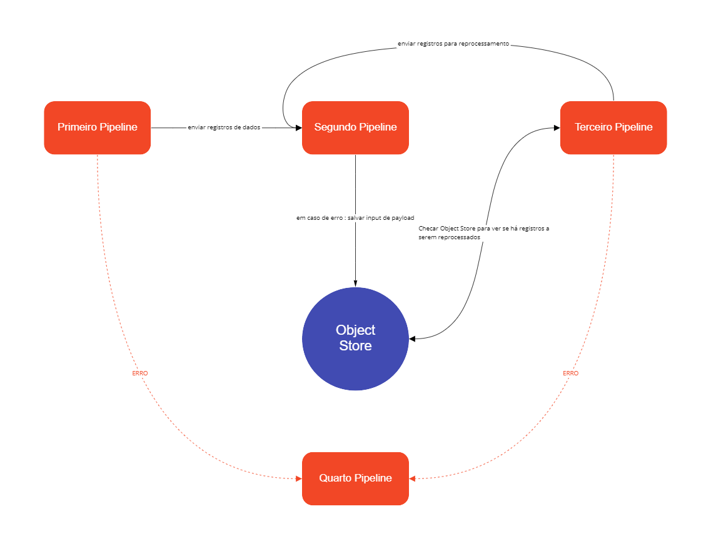

# Scheduler Trigger

Quando um _pipeline_ é configurado e publicado com qualquer variável do **Scheduler Trigger**, é criada uma função que executa o fluxo em intervalos pré-estabelecidos. Para isso, segue-se uma expressão cron, definida nas configurações desse tipo de gatilho.

Clique [aqui](https://pt.wikipedia.org/wiki/Crontab) para saber mais sobre a expressão cron.

O **Scheduler Trigger** possui 4 tipos. Veja quais são elas:

* **5-Minute Scheduler:** possui uma pré-configuração de 5 minutos. Quando você implanta um _pipeline_ com essa variável, as execuções ficam programadas para cada 5 minutos.
* **30-Minute Scheduler:** possui uma pré-configuração de 30 minutos. Quando você implanta um _pipeline_ com essa variável, as execuções ficam programadas para cada 30 minutos.
* **Midnight Scheduler:** possui uma pré-configuração para ser acionada sempre à meia-noite. Quando você implanta um _pipeline_ com essa variável, as execuções ficam programadas para meia-noite.
* **Custom Scheduler:** não possui pré-configuração, permitindo que você customize uma _cron expression_. Quando você implanta um _pipeline_ com essa variável, as execuções ficam programadas de acordo com a _cron expression_ que você especificou.

Dê uma olhada nos parâmetros de configuração do **Scheduler Trigger**:

* **Cron Expression:** expressão que define o segundos, minutos, hora e a recorrência da execução em dias de um _pipeline_. Você pode obter mais informações sobre o formato das expressões clicando [aqui](http://www.quartz-scheduler.org/documentation/quartz-2.3.0/tutorials/crontrigger.html). Mas se você deseja saber como construí-las, então clique [aqui](http://www.cronmaker.com/;jsessionid=node0yg1luk7x2ff1wkkgg3300x42224447.node0?0).
* **Time Zone:** define sob qual _Time Zone_ o _pipeline_ será executado. Se nenhum _Time Zone_ for definido, será seguido o padrão UTC (12h UTC corresponde às 9h no fuso de São Paulo, por exemplo).
* **Maximum Timeout:** tempo limite para que o _pipeline_ processe informações antes de retornar uma resposta (padrão = 30000, limite = 900000). Em milissegundos. Caso o processamento demore mais do que a determinação do parâmetro, a execução é finalizada.
* **Retries:** número máximo de tentativas em caso de falha na execução.
* **Allow Redelivery Of Messages:** se a opção estiver ativada, permite o reenvio da mensagem em caso de falha do _Pipeline Engine_. Leia o artigo sobre o [Pipeline Engine](../../plataforma/pipeline-engine.md) para obter mais detalhes.
* **Allow Concurrent Scheduling:** indica se o _pipeline_ deve seguir a regra, isto é, se deve iniciar a execução mesmo que existam execuções prévias em processamento. Digamos que um _pipeline_ seja configurado para execução a cada 3 minutos. No entanto, uma das execuções anteriores levou 4 minutos para ser finalizada. Assim, temos cenários diferentes:

**- se habilitado**: a execução seguinte acontece simultaneamente com a atual.

**- se desabilitado**: a execução seguinte, além das demais, não será iniciada até que a execução anterior seja finalizada.

## Scheduler Trigger em Ação <a href="#h_f67ca55d12" id="h_f67ca55d12"></a>

Esse _trigger_ pode ser usado em alguns casos em que é necessário buscar dados de sistemas que não têm capacidade de enviar os dados para a Digibee utilizando HTTP, REST, HTTP File, Kafka, RabbitMQ e JMS. Alguns desses cenários são:

* buscar arquivos em diretórios SFTP, FTP, S3, Google Cloud Storage, etc.;
* buscar informações diretamente em bancos de dados (nesse caso, recomendamos a utilização do componente _**Stream DB**_ com paginação);
* executar chamadas de verificação de status em _endpoints_ de Plataforma que não têm capacidade de sensibilizar os _pipelines_ através de _webhooks_.

Veja a seguir como o _trigger_ se comporta em determinada situação e a sua respectiva configuração.

* **Pipeline executado a cada 30 segundos, sem sobreposição usando uma fonte de dados estática**

Observe como configurar um _pipeline_ com o _**Scheduler Trigger**_ para ser executado automaticamente a cada 30 segundos sem que aconteça uma sobreposição de execuções. Também será configurado um _Timeout_ de 2 minutos e que siga o _Time Zone_ de São Paulo (UTC-3).

Primeiramente, crie um novo _pipeline_ e configure o _trigger_. A configuração pode ser feita da seguinte forma:

<figure><figcaption></figcaption></figure>

Agora observe como configurar um [MOCK](../tools/json-generator.md) no _pipeline_ para que ele seja o provedor de dados que o _endpoint_ retorna ao final. Coloque o componente indicado, conecte-o ao _trigge_r e configure-o com o seguinte JSON:

```
{
    "data": {
        "products": [
            {
                "name": "Samsung 4k Q60T 55",
                "price": 3278.99
            },
            {
                "name": "Samsung galaxy S20 128GB",
                "price": 3698.99
            }
        ]
    }
}
```

Feito isso, a cada vez que o _pipeline_ for executado, o JSON definido como resposta será retornado automaticamente.
