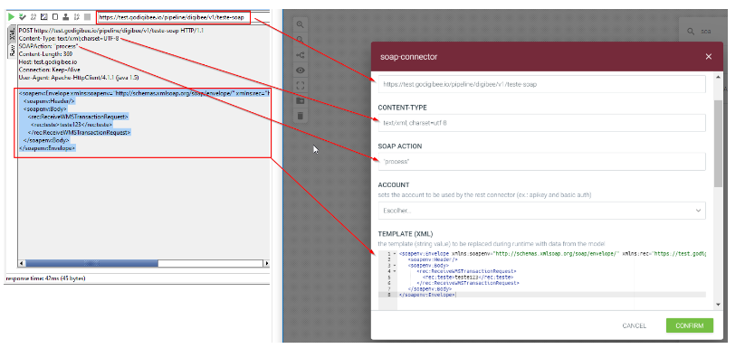

# SOAP V1

O **SOAP V1** invoca SOAP _endpoints_ de um _pipeline_. Ele utiliza um _template_ Apache FreeMarker para gerar a mensagem de solicitação SOAP e converte a resposta de SOAP para JSON, tentando ao máximo não corromper a conversão.

Dê uma olhada nos parâmetros de configuração do componente:

* **URL:** URL a ser chamada - pode conter os parâmetros seguindo o padrão {:param1}, que serão substituídos pela propriedade correspondente da mensagem de entrada.
* **Content Type:** configura o Content Type e a codificação.
* **SOAP Action:** _header_ de chamada XML.
* **Account:** conta a ser utilizada pelo componente.
* **Template:** _template_ Apache FreeMarker para que a mensagem SOAP seja enviada na solicitação.
* **Connection Timeout:** tempo de expiração da conexão (em milissegundos).
* **Reading Timeout:** tempo máximo para leitura (em milissegundos).
* **Stop On Client Error:** se ativada, a opção vai gerar um erro para suspender a execução do _pipeline_.
* **Stop On Server Error:** se ativada, a opção vai gerar um erro para suspender a execução do _pipeline_.
* **Advanced Settings:** configurações avançadas.
* **Allow Insecure Calls To HTTPS Endpoints:** quando ativada, a opção permite que chamadas não seguras a _endpoints_ HTTPS sejam feitas.
* **Enable Retries:** quanto ativada, a opção permite que sejam feitas novas tentativas.
* **Maximum Number Of Retries Before Giving Up:** número máximo de tentativas antes de desistir da chamada.
* **Time To Wait Before Each Retry:** tempo máximo entre tentativas (em milissegundos).

### &#x20;<a href="#h_ac0008ef62" id="h_ac0008ef62"></a>

## Fluxo de Mensagens <a href="#fluxo-de-mensagens" id="fluxo-de-mensagens"></a>

### Entrada <a href="#entrada" id="entrada"></a>

O componente espera uma mensagem no seguinte formato:

```
{
	header: {
		"headerA":"valueA",
		"headerB":"valueB"
	},
	body: {
		// message structure that will be replaced by the Dust template
}
```

### Saída <a href="#sada" id="sada"></a>

* com sucesso

```
{
    status: XXX,
    body: {},
    headers: {}
}
```

* com erro

```
{
    error: "error message",
    code: XXX,
    body: {},  
    headers: {}
}
```

**IMPORTANTE:** para alguns erros, _body_ e _headers_ estão indisponíveis.

## SOAP V1 em Ação <a href="#soap-v1-em-ao" id="soap-v1-em-ao"></a>

### Sobre o template variável <a href="#sobre-o-template-varivel" id="sobre-o-template-varivel"></a>

O nome da variável também pode conter menos (-), ponto (.) e dois pontos (:) em qualquer posição, mas devem conter uma barra invertida (\\) antes. Do contrário, eles podem ser interpretados como operadores.

### **Sobre substituição de números** <a href="#sobre-substituio-de-nmeros" id="sobre-substituio-de-nmeros"></a>

```html
  <#assign x=42>
  ${x}
  ${x?string}  <#-- the same as ${x} -->
  ${x?string.number}
  ${x?string.currency}
  ${x?string.percent}
  ${x?string.computer}
```

Saída

```
  42  
  42  
  42  
  $42.00  
  4,200%  
  42
```

**Formato de número**

```
<#setting number_format="0.####">
```

**Para verificar se o campo não é nulo:**

```
<#if varTest??>${varTest}</#if>
```

### &#x20;Reprodução de chamadas SoapUI no SOAP V1 <a href="#reproduo-de-chamadas-soapui-no-soap-v1" id="reproduo-de-chamadas-soapui-no-soap-v1"></a>


