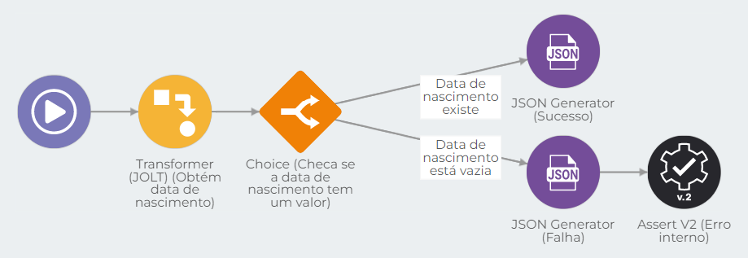

# Chaves de API (Consumers)

Chaves de API são credenciais de acesso fornecidas para consultas em pipelines que utilizam os triggers [REST](../components/triggers/rest-trigger.md), [HTTP](../components/triggers/http-trigger.md) e [HTTP File](../components/triggers/http-file-trigger/). Sua utilização é a garantia mínima de segurança exigida.

**Nota:** Além da utilização de Chaves de API, recomendamos a utilização de JWT (JSON Web Token) com o objetivo de reforçar a segurança.

### Como configurar API Key na Digibee Integration Platform 

1\. Acesse o menu **Configurações**.

<figure><figcaption></figcaption></figure>

2\. No menu de configurações, clique em **Chaves de API (Consumers)**.

<figure><figcaption></figcaption></figure>

3\. Selecione o ambiente (_test_ ou _prod_) e clique em **Criar**.

<figure><figcaption></figcaption></figure>

4\. Defina um nome e uma descrição para a chave de API e, na sequência, clique em .png>) para associar _pipelines_.

<figure><figcaption></figcaption></figure>

5\. Selecione o projeto e os _pipelines_ que utilizarão essa autenticação. Confirme a configuração.

<figure><figcaption></figcaption></figure>

A nova chave de API será gerada e exibida no final da listagem de chaves:

<figure><figcaption></figcaption></figure>

Ao clicar em Editar (.png>)), é possível:

* Visualizar, copiar e remover um valor de chave de API;
* Adicionar uma nova chave de API;
* Associar a chave de API a novos _pipelines_;
* Editar a lista de pipelines que utilizarão a chave de API.

<figure><figcaption></figcaption></figure>

**Recomendação**: Gere uma chave de API diferente para cada sistema consumidor de sua API, restringindo o acesso somente aos pipelines desejados.

### Como utilizar a chave de API em requisições direcionadas para o _pipeline_ exposto 

1\. chave deverá ser enviada no _header_, com o parâmetro "apikey", e seu respectivo valor. Informe também o Content-Type esperado pelo pipeline (_exemplo: application/json):_

<figure><figcaption></figcaption></figure>

2\. Caso não seja possível alterar o _header_ da chamada no sistema legado, outra opção é incluir a chave de API como parâmetro de chamada na URL. Esta, porém, não é uma opção segura para serviços expostos. Neste caso, garanta que apenas o serviço autorizado poderá chamar a API exposta pela Digibee (controle de _consumers_).

<figure><figcaption></figcaption></figure>
