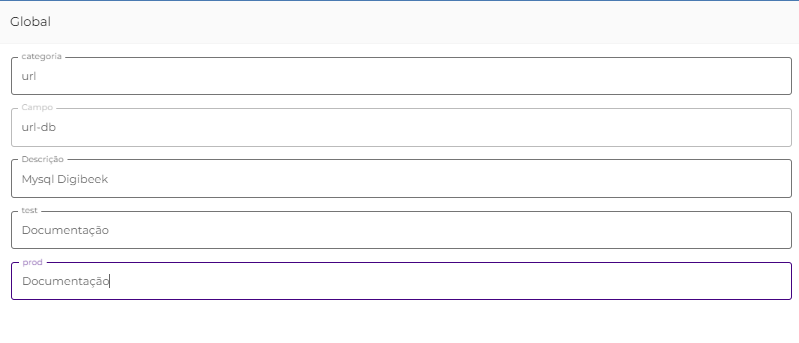
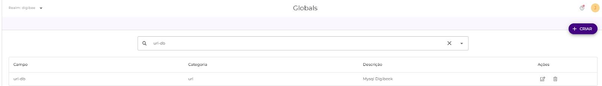

# Globals

A funcionalidade _Globals_ foi criada para auxiliar e agilizar a construção de _pipelines_, através da criação de variáveis globais que permitem utilizar os mesmos parâmetros em diferentes iniciativas, sem a necessidade de repetir as mesmas informações. Ela otimiza o tempo de trabalho no desenvolvimento dos projetos e permite o compartilhamento dessas informações entre os usuários.

A manutibilidade também é facilitada, permitindo alterar os parâmetros utilizados por um conjunto de _pipelines_ somente alterando o valor da _global_.

## **Como criar uma global** 

Para criar uma _global,_ siga os seguintes passos:

1. Faça login na Digibee Integration Platform;
2. Clique no ícone de **Administração**;
3. Entre na opção de menu **Globals**.

.png>)

1. Clique no botão **+ CRIAR** no canto superior direito;
2. Preencha o formulário com as seguintes informações:

.png>)

* **Categoria:** Utilizado para agrupar as _globals_ por categoria.
* **Campo:** Nome da _global_ que será referenciado no _pipeline_.
* **Descrição:** Texto que descreve o que é a _global_.
* **Test:** Valor da _global_ no ambiente de teste.
* **Prod:** Valor da _global_ no ambiente de produção.


**Nota:** Caso existam outros ambientes no seu _realm_ eles também serão listados.


1. Após preencher essas informações, clique em **CONFIRMAR** no canto inferior direito.

Após realizar estes passos, a _global_ será criada com sucesso.


**IMPORTANTE**: Não existe qualquer método de criptografia nas _globals_, portanto, os dados utilizados podem ser acessados por outros usuários com acesso à tela.


Caso necessite armazenar dados criptografados utilize [**Accounts.**](contas-accounts/)

## **Como editar uma global** 

Para editar uma _global,_ siga os seguintes passos:

1. Faça login na Digibee Integration Platform;
2. Clique no ícone de **Administração**;
3. Entre na opção de menu **Globals**;
4. Busque a _global_ na barra de pesquisa;

.png>)

1. Clique no ícone de lápis **Editar global**_._

1. Após alterar as informações, clique em **CONFIRMAR** no canto inferior direito.

Após realizar estes passos, a _global_ será editada com sucesso.

## **Como remover uma global** 

Para remover uma _global,_ siga os seguintes passos:

1. Faça login na Digibee Integration Platform;
2. Clique no ícone de **Administração**;
3. Entre na opção de menu **Globals**.

1. Busque a global na barra de pesquisa;
2. Clique no ícone de lixeira **Remover global**;
3. Um diálogo de confirmação aparecerá. Clique em **CONFIRMAR.**

.png>)

Após realizar estes passos, a _global_ será removida com sucesso.

## **Como utilizar as globals** 

As _globals_ podem ser utilizadas das seguintes maneiras:

.png>)

O _Intellisense_ detecta automaticamente os campos que podem utilizar _globals_ como parâmetro e as exibirá ao lado da configuração do componente, bastando clicar na global desejada.

Também é possível fazer referência à _global_ diretamente pela sua expressão. Basta digitar **\{{global.nomeDaGlobal\}}** substituindo pelo nome da _global_ desejada.
