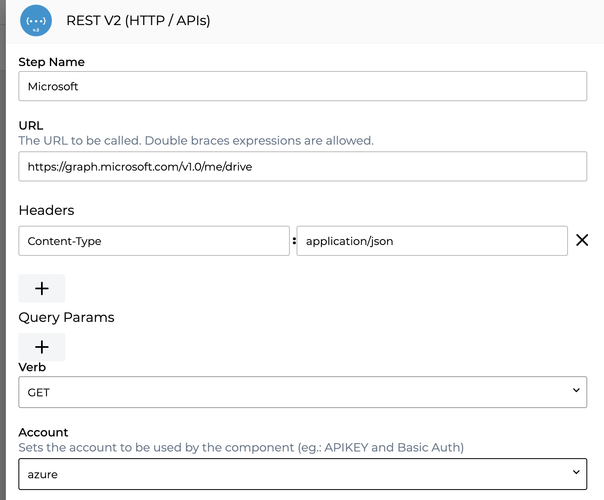
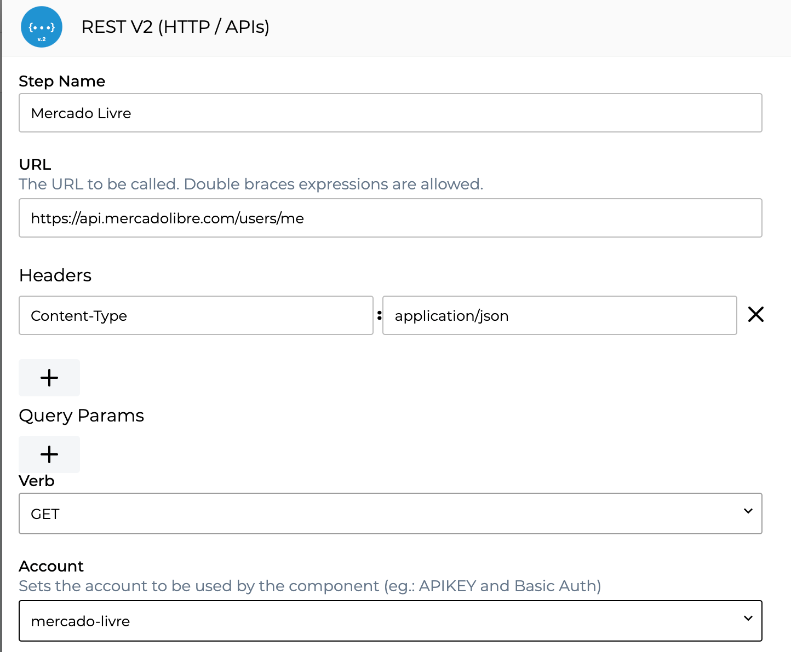

# Nova Arquitetura OAuth

O OAuth2 é um protocolo padrão para autorização comumente utilizado por APIs web. Para realizar integrações que utilizem o OAuth2, basta logar-se em um provedor - podendo ser o Google, Microsoft, Mercado Livre, Amazon, etc. - e receber um token de acesso. Através deste token, é possível acessar os dados de um usuário sem precisar informar suas credenciais.

Para adicioná-lo em nossa Plataforma, é necessário criar previamente uma aplicação no provedor que deseja utilizar. Uma vez criada a aplicação no provedor, será possível cadastrar e utilizar o protocolo OAuth2 na Digibee Integration Platform.

### **Cadastrando um novo provedor OAuth a partir de um provedor existente**

Para criar a sua aplicação, siga as instruções de acordo com o provedor que deseja adicionar à Plataforma clicando nos links abaixo:

* [Google](https://developers.google.com/identity/protocols/oauth2)
* [Microsoft](https://docs.microsoft.com/pt-br/azure/active-directory/develop/scenario-spa-app-registration#create-the-app-registration)
* [Mercado Livre](https://developers.mercadolivre.com.br/pt\_br/registre-o-seu-aplicativo)

No campo **Redirect URI**, será preciso utilizar o seguinte endereço:

* Para SaaS: [https//:www.godigibee.io/oauth2/success](http://www.godigibee.io/oauth/success)
* Para SaaS dedicado: [https//:www.${DEDICATED\_SAAS\_HOST}/oauth2/success](http://www.godigibee.io/oauth/success)

Criada a aplicação, você terá em mãos o **Client ID** e o **Client Secret**, que são as chaves de autenticação do OAuth que deverão ser informados posteriormente durante a criação do novo provedor, em uma conta da Digibee Integration Platform (vide o tutorial ao final deste artigo).

### **Como funciona a obtenção do token?**

Para explicar a obtenção do token, iremos utilizar o fluxo do Google, que é o mesmo para todos os provedores OAuth2 que seguem o fluxo Code Grant Type:

.png>)

1. O primeiro passo é requisitar um token intermediário. Isso ocorre quando o usuário, durante o login, aceita os escopos e permite o uso dos seus dados;
2. Após o consentimento por parte do usuário, é gerado um token intermediário (chamado **code**) que será utilizado para retornar o _access_ _token_, o qual é o token final;
3. Com o _access token_ em mãos, é possível realizar os chamados para os serviços do provedor.

### **Como funciona a duração do token?**

O tempo de expiração do _access token_ é dado pela propriedade _**expires\_in**_. Por exemplo, o valor "7200" indica que o token de acesso irá expirar em duas horas a partir do momento em que a resposta foi gerada.

No que se refere aos provedores cadastrados pela Digibee, temos os seguintes tempos de expiração:

* 6 meses de duração para o Google e Mercado Live;
* 3 meses de duração para a Microsoft.


**IMPORTANTE:** É necessário realizar um novo login na tela de contas depois que o _refresh token_ expirar.


### **O que fazer caso o refresh token não seja retornado?**

O _refresh token_ pode não retornar por diversos motivos, mas são frequentes os casos em que ele não é retornado devido ao número excessivo de _logins_. Caso a sua nova conta não tenha sido salva pelo _refresh token_, você deverá remover a app OAuth2 da sua conta de e-mail de acordo com as diretrizes do provedor utilizado para fazer login na Plataforma. Para saber como, acesse o link abaixo:

* [Provedor Google](https://myaccount.google.com/u/1/permissions);
* [Provedor Microsoft](https://account.live.com/consent/Manage);
* [Provedor Mercado Livre](https://appstore.mercadolivre.com.br/apps/permissions).

Após isso, é necessário realizar o _login_ no provedor através da Digibee Integration Platform novamente e, por fim, salvar a sua conta.

### **Como solicitar novos provedores?**

Para solicitar um provedor inexistente em nossa lista, entre em contato conosco através do _chat_ da Digibee Integration Platform. Assim, poderemos adicioná-lo manualmente.

### **Como utilizar o token no **_**pipeline**_**?**

Uma vez que a conta **oauth-2** esteja criada dentro, basta usá-la no campo _Account_ selecionando o conector Rest V2 no canvas. __ Também é necessário informar a URL do serviço a ser chamado, _headers_ e _query parameters_ necessários para que a chamada seja feita utilizando os tokens de acesso gerados.

**Exemplos de chamadas:**

* **Google:**

Chamando a API de listagem de arquivos do Google Drive no componente Rest V2:

**URL**: [https://www.googleapis.com/drive/v3/files](https://www.googleapis.com/drive/v3/files)

**Verb**: GET

.png>)

* **Microsoft**

Chamando a API de listagem de arquivos do OneDrive no componente Rest V2:

**URL**: [https://graph.microsoft.com/v1.0/me/drive](https://graph.microsoft.com/v1.0/me/drive)

**Verb**: GET

* **Mercado Livre:**

Chamando a API que retorna informações sobre sua conta no Mercado Livre:

**URL**: [https://api.mercadolibre​.com/users/me](about:blank)

**Verb**: GET


**IMPORTANTE:** Uma vez que a conta OAuth criada anteriormente seja informada no campo _Account_ do componente Rest V2, o cabeçalho _Authorization_ será adicionado automaticamente.


Uma vez criada a aplicação no provedor, será possível cadastrar seu novo provedor OAuth2 na Digibee Integration Platform seguindo o tutorial [Cadastro de novos provedores](cadastro-de-novos-provedores-oauth.md).

\
