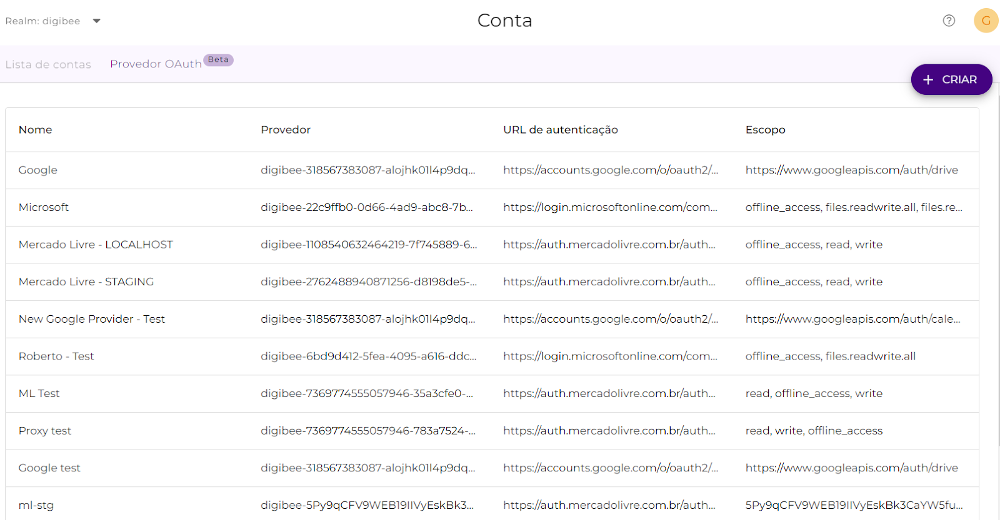

# Cadastro de novos provedores OAuth

O OAuth 2.0 é um protocolo de autorização baseado em token que permite que uma aplicação acesse recursos e informações de um usuário sem precisar requerer suas credenciais.

Até então, era possível integrar novos provedores OAuth2 através de uma solicitação ao time de suporte. Considerando que esse processo acabava por limitar as decisões e a performance dos nossos clientes, implementamos uma nova arquitetura de OAuth2 na qual o próprio usuário da Digibee Integration Plaform conseguirá cadastrar novos provedores e os utilizar em suas integrações de maneira independente e autônoma.

Desse modo, agora é possível adicionar novos provedores OAuth a partir dos já existentes na Digibee Integration Plaform, basta ter em mãos o **Client ID** e o **Client Secret** da sua aplicação OAuth. Para saber como criar sua aplicação, consulte o artigo [Nova Arquitetura do OAuth2](./).

Uma vez criada a aplicação no provedor, será possível cadastrar seu novo provedor OAuth2 na Digibee Integration Plaform seguindo o tutorial abaixo:

### **1. Como cadastrar um novo provedor**

Em Settings, acesse a tela Account. Nesta tela, clique no submenu “Provedor OAuth”. Aqui será possível cadastrar novos provedores a partir de um provedor já existente e cadastrado pela Digibee Integration Plaform.

Desse modo, para criar um novo provedor, clique em + CRIAR. Assim, você poderá configurar a autenticação do novo provedor a partir de um já existente para que ele possa ser utilizado em seu pipeline posteriormente.

### **2. Definindo as configurações do novo provedor**

.png>)

Nesta tela, selecione um provedor-base existente cadastrado pela Digibee Integration Plaform para que o campo “URL de autenticação” seja preenchido automaticamente. Também será necessário definir o nome do seu novo provedor conforme o exemplo abaixo:

.png>)

Finalizada esta etapa, clique em “Continuar”.

### **3. Configurando as credenciais para acessar o provedor**

Após informar os detalhes do novo provedor, é preciso configurar suas credenciais para poder acessá-lo. Nesta etapa, serão necessários o **Client ID** e o **Client secret**, que são as chaves de autenticação do OAuth (para saber como obtê-las, leia o artigo [Nova Arquitetura do OAuth2](./)). Além disso, também será necessário informar os escopos do provedor que você deseja utilizar na sua aplicação, isto é, as ações que você estará permitindo que a plataforma realize por meio deste provedor. Veja o exemplo abaixo:

.png>)

Após fornecer todas as informações requisitadas, basta finalizar o processo de criação do novo provedor clicando em “Finalizar”, que irá lhe redicionar à tela “Provedor OAuth” na qual o novo provedor já estará disponível para ser utilizado.

.png>)

Uma vez que o novo provedor esteja criado, será possível gerenciá-lo, editá-lo e até mesmo excluí-lo na tela “Provedor OAuth”.

### Termos de uso 

Ao utilizar a Arquitetura OAuth, você automaticamente faz sua adesão ao programa Beta e concorda com os termos de uso. Você pode encontrar mais informações sobre as versões beta [clicando aqui](../../../geral/programa-beta.md).
