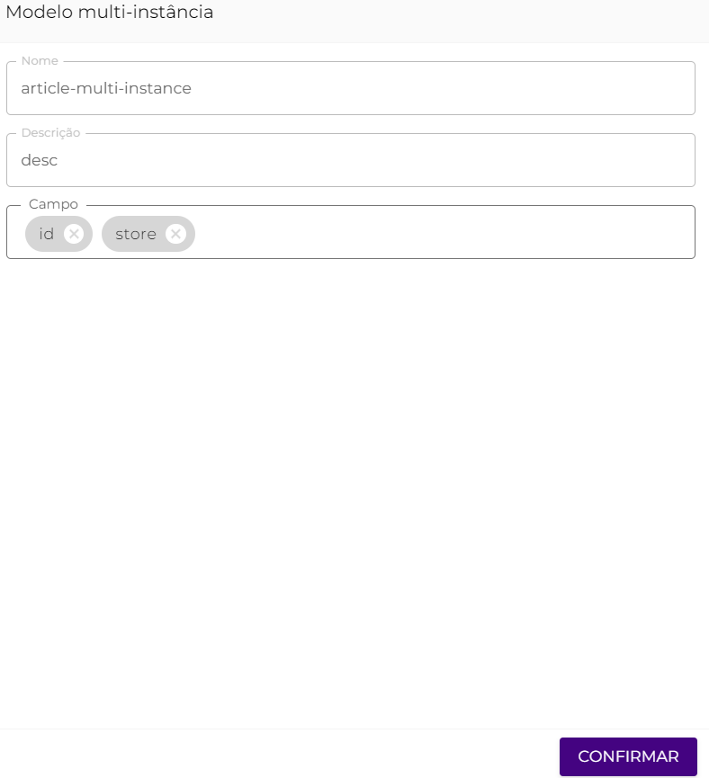
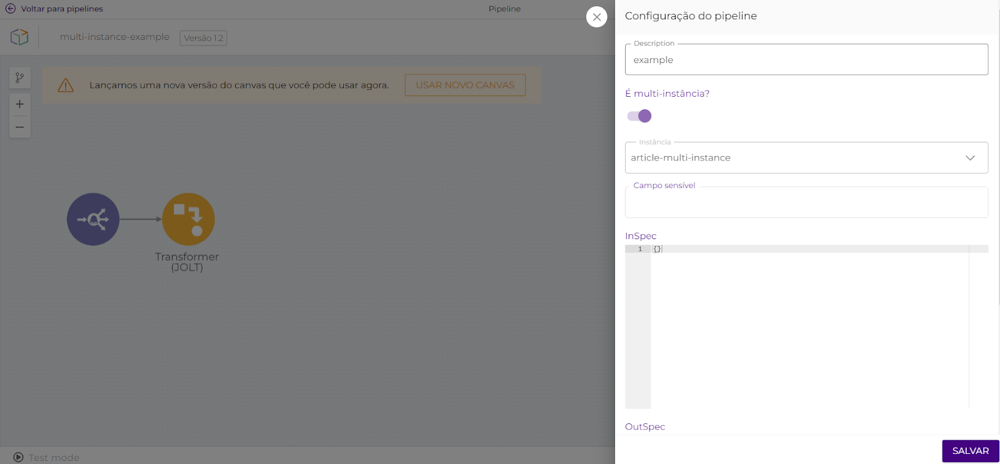
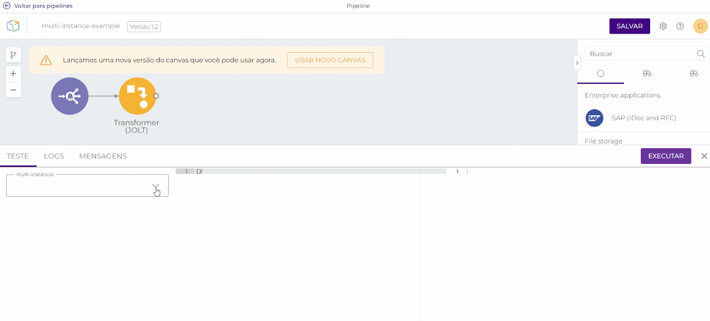
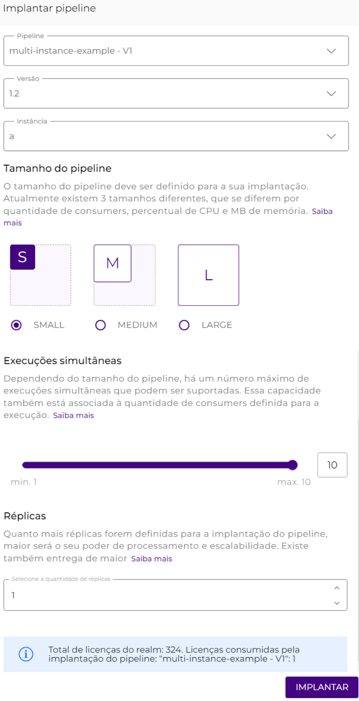

# Multi-Instância

A funcionalidade multi-instância permite a implantação de um mesmo _pipeline_ múltiplas vezes, atendendo a parâmetros diferentes. Desse modo, é possível configurar múltiplas instâncias que processem os dados conforme os parâmetros configurados em cada uma, utilizando o mesmo fluxo de integração.

Esta funcionalidade é muito utilizada quando precisamos utilizar o mesmo _pipeline_, isto é, a __ mesma lógica de construção, para acessar _endpoints_ diferentes, como Contas e _Globals_, dispensando a necessidade de diversas versões do mesmo _pipeline_.

## Casos de uso 

Imagine que você precise extrair grandes quantidades de dados de um único banco de dados, e que o tempo para a execução da extração seja limitado. A partir desta funcionalidade, você consegue arquitetar uma estratégia de extração acelerada de dados, a qual utiliza de _pipelines_ multi-instância para extrair grandes quantidades de dados de um banco de dados de maneira rápida e segura.&#x20;

Para isso, basta criar um _pipeline,_ defini-lo como multi-instância e também criar uma configuração com as instâncias a serem utilizadas, estabelecendo intervalos específicos para cada uma delas. Desse modo, cada instância fica encarregada de extrair dados entre determinadas datas, como no exemplo abaixo:

| **INSTÂNCIA** | **INTERVALO** |
| ------------- | ------------- |
| Período 1     | 1-8/out       |
| Período 2     | 8-16/out      |
| Período 3     | 16-24/out     |
| Período 4     | 24-31/out     |

A instância **Período 1** é responsável por extrair todos os dados entre os dias 1 e 8 do mês de outubro, através de quantas execuções forem necessárias. As instâncias **Períodos** **2**, **3** e **4** utilizam da mesma lógica de extração da primeira para buscarem e extraírem todos os dados nos demais intervalos de tempo.&#x20;

Assim, você estará aplicando uma estratégia que utiliza de datas específicas e de _pipelines_ multi-instância para extrair uma grande quantidade de dados mais rapidamente. Seria perfeitamente possível realizar a extração de dados utilizando um _pipeline_ simples, no entanto, ao utilizar um _pipeline_ multi-instância, a extração pode ser realizada até 4 vezes mais rápido.

Além do caso de uso acima, você consegue utilizar um _pipeline_ multi-instância para executar uma consulta idêntica em bancos de dados instalados em ambientes diferentes.

Também é possível publicar _pipelines_ em dois ambientes diferentes. Para isso, basta publicar um _pipeline_ multi-instância no ambiente _test_ da Plataforma Digibee e configurá-lo para reportar a dois dos seus ambientes, por exemplo, _QA_ e _test_. Assim, teríamos duas publicações em _test_ reportando para dois ambientes.

### Visão geral 

.png>)

Localizado na página de configurações da Plataforma Digibee, a página Multi-instância disponibiliza a listagem de todos os modelos de multi-instância já criados dentro da Plataforma e seus respectivos parâmetros de configuração. São eles:

* **Nome:** nome do modelo de multi-instância;
* **Descrição:** descrição do modelo de multi-instância;
* **Campo: as variáveis que receberão os valores em cada ambiente.**

É possível editar, configurar e excluir os modelos de multi-instância listados através dos seguintes botões de ações:

#### Ação “Editar multi-instância” 

Esta ação permite editar todos os parâmetros de configuração definidos no momento da criação do novo modelo de multi-instância. São eles: Nome, Descrição e Campos.

#### Ação “Configurar” 

Esta ação permite criar, configurar e salvar as instâncias de cada modelo, inserindo e definindo valores para cada campo criado previamente.

#### Ação “Remover modelo” 

Através desta ação, é possível excluir um modelo de multi-instância caso este não esteja sendo utilizado na Plataforma, seja em _pipelines_ implantados, não implantados ou arquivados.

## **Como implantar um **_**pipeline**_** multi-instância?** 

### 1. Crie o modelo de multi-instância 

Antes de criar as instâncias, você deverá criar um modelo de multi-instância. Para isso, acesse a página Multi-instância, em Configurações, e clique em “+ CRIAR” e defina um nome, uma descrição e os campos das instâncias, isto é, as variáveis que receberão os valores em cada ambiente (ex: _test_, qa1, qa2, _prod_). Veja o exemplo abaixo:

Feito isso, clique em “Confirmar” para criar o modelo.

### 2. Configure as instâncias 

Agora, você poderá criar as instâncias que corresponderão ao modelo criado na última etapa. Para isso, localize o modelo na listagem e clique no botão da ação “Configurar” correspondente a ele. Desse modo, você poderá criar as instâncias desse modelo uma a uma inserindo e definindo valores para cada campo.

No exemplo abaixo, _a_ e _b_ são duas lojas que receberão os valores de cada variável (que podem ser configuradas tanto para _test_ quanto para _prod_), e isso se repete para todas as demais instâncias a serem criadas.

.png>)

Abaixo, exemplo de criação de outra instância (_c_):

.png>)

Após informar as variáveis, basta clicar em “Salvar”.

### 3. Crie um _pipeline_ multi-instância 

Nesta etapa, vamos criar um _pipeline_ e defini-lo como multi-instância. Para isso, acesse as configurações clicando no botão de configurações:

.png>)

Selecione a opção "É multi-instância?", como no exemplo abaixo:

Após a opção “É multi-instância?” ser selecionada, informe a qual modelo de multi-instância o _pipeline_ reportará. No nosso exemplo, estamos utilizando o modelo “_article-multi-instance_”.


**IMPORTANTE:** Após definir o _pipeline_ como multi-instância, não será possível reverter essa configuração. Por outro lado, é possível transformar qualquer _pipeline_, implantado ou não, em um _pipeline_ multi-instância.


Por ser um evento, devemos informar no _trigger_ uma variável da instância que será executada através do padrão `-{{replica.nome_da_variavel_da_instância}}`, como no exemplo abaixo:

.png>)

#### **Realizando consultas no **_**Test mode**_

Ao executar o _Test mode_ em um _pipeline_ multi-instância, a primeira coluna da aba TESTE permitirá que você informe a instância a qual pretende executar, como no exemplo abaixo:

Desse modo, é possível consultar os valores previamente configurados na instância selecionada através do padrão `{{replica.nome_da_variável_da_instância}}`.

### 4. Implantando um _pipeline_ multi-instância 

Agora que você já configurou o modelo e definiu o _pipeline_ como multi-instância, é necessário editar a solicitação do _pipeline_ com a instância em que pretende implantá-lo. Desse modo, o nome da instância será adicionado ao nome do _pipeline_ após a implantação. **Por exemplo**: uma vez que o _pipeline_ "_multi-instance-example_” for implantado na instância _a_, seu nome na aba “_Run_" será "_multi-instance-example-a_".

No exemplo abaixo, o _pipeline_ “_multi-instance-example_” __ está __ sendo implantado na instância _a_.

No exemplo abaixo, o _pipeline_ “_multi-instance-example_” está sendo implantado na instância _b_.

.png>)

Após a edição, basta clicar em “IMPLANTAR”.

Abaixo, o _pipeline_ “_multi-instance-example_” __ já __ implantado nas instâncias _a_ e _b_, __ na aba _“Run”_:

.png>)
