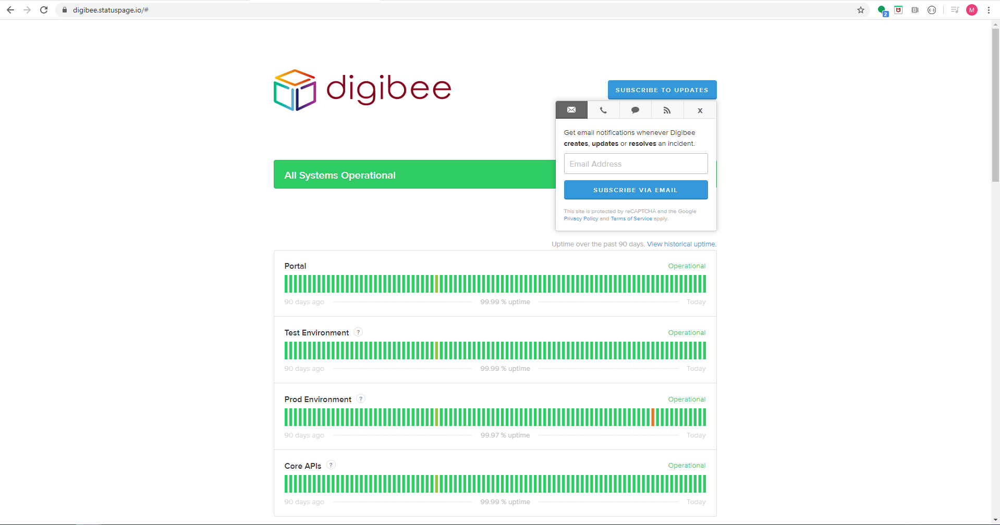
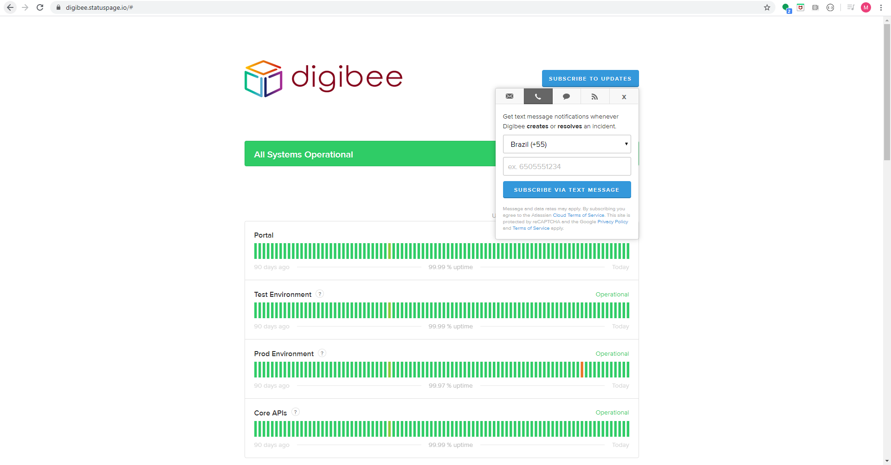

# Status Page

Acesse o site [https://www.digibee.com.br/](https://www.digibee.com.br/) vá até o footer(rodapé) e clique no link Status da Digibee Integration Platform

Após o clique será redirecionado para a página [https://digibee.statuspage.io/](https://digibee.statuspage.io/), nesse ponto clique em **SUBSCRIBE TO UPDATES** e será aberto um box para que escolha em que meio deseja ser acionado.\
\
Por e-mail

Ou por SMS

