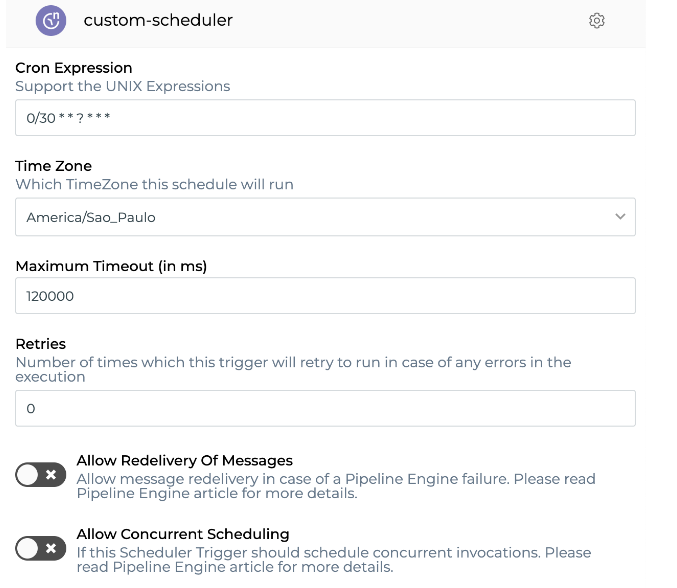

# Consumo de licenças

Na página "Meu consumo", você pode verificar facilmente o consumo de [_pipeline subscriptions_ e _RTUs (Runtime Units)_](https://docs.digibee.com/documentation/v/pt-br/geral/modelo-baseado-em-subscription) disponíveis em seu _realm_, bem como as características de tal consumo de forma detalhada.

Em Configurações no canto superior direito, acesse "Consumo de licenças" sob o menu Licenciamento no painel esquerdo para visualizar o consumo em seu realm. Para ter acesso a esta página, você precisa ter a permissão **license-viewer** concedida à sua conta de usuário ou a um grupo ao qual você pertence.

<figure><figcaption>
Visualização da página "Meu consumo" toda
</figcaption></figure>

## Painel de consumo

<figure><figcaption>
Painel de consumo para um dado ambiente (neste caso, Test)
</figcaption></figure>

Nesta seção você pode selecionar o ambiente que deseja ver o consumo, clicando no menu de opções no lado superior esquerdo. Uma vez selecionado o ambiente, serão mostradas as associadas a elas. Se você passar o mouse sobre cada barra, verá quantas _pipeline subscriptions_ ou _RTUs_ estão sendo consumidas no ambiente.

## Listagem de consumo

<figure><figcaption>
Barra de opções de projeto para obter listagem detalhada
</figcaption></figure>

Você pode pesquisar qual projeto deseja visualizar o consumo. Clique na barra de opções para selecionar qual projeto deseja visualizar e clique no botão "Pesquisar" para obter os detalhes.

<figure><figcaption>
Listagem detalhada de consumo para um dado projeto do <em>realm</em>
</figcaption></figure>

Como resultado, você obterá uma lista detalhada desse consumo: projeto, ambiente, _pipeline_, _trigger_, tamanho da implantação, _RTUs_ e réplicas. Se você passar o mouse sobre um item, uma descrição completa do projeto será fornecida.

Você também pode exportar a lista de consumo para um arquivo CSV clicando no botão "Exportar".

## Lista de contatos

<figure><figcaption></figcaption></figure>

No canto superior direito da página, você encontrará uma lista de contatos das pessoas relevantes responsáveis por sua conta. Clique no ícone de e-mail para enviar um e-mail diretamente para a pessoa.
