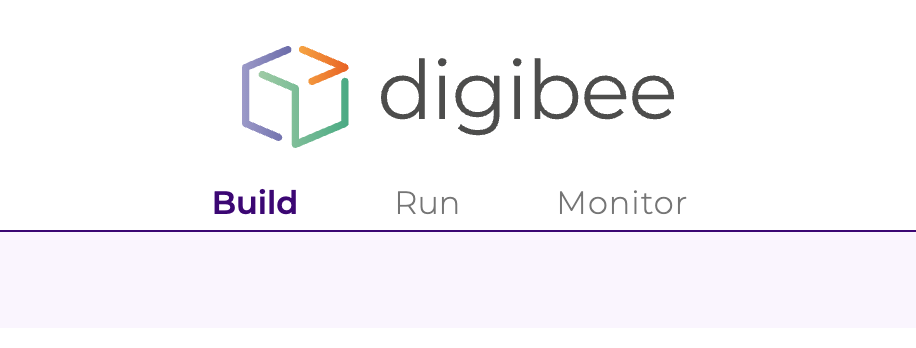

# Visão Geral do Layout da Plataforma

## O que é o novo layout? 

O novo layout da Digibee Integration Plaform é o primeiro passo da revolução que estamos promovendo na nossa interface.

O novo layout foi pensado para representar o ciclo de construção de integrações. Por isso, você encontrará 3 novos menus:

* **Build:** é o agrupamento de _pipelines_ e Cápsulas para facilitar a construção de _pipelines_.
* **Run:** é onde você fará a implantação de _pipelines_.
* **Monitor:** é onde você visualiza os painéis para monitorar as suas integrações.

.png>)

As telas de Configuração e Administração são acessadas através do ícone de "Administração":

 (3).png>)

.png>)

.png>)

 (1).png>)

Você encontrará estruturas fixas que ajudam nas tarefas mais comuns:

.png>)
