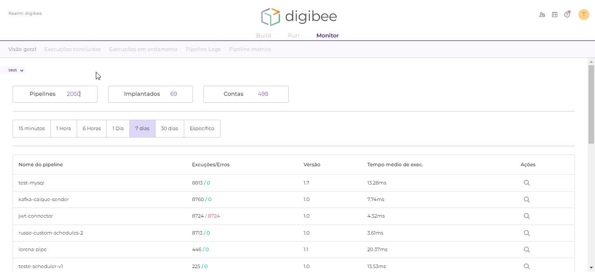

# Visão geral

Na página de **Visão geral**, você pode monitorar os pipelines criados. Por enquanto, essa página exibe dados acerca dos 10 pipelines mais executados.

No canto superior esquerdo da página, você pode selecionar o ambiente desejado: **test** ou **prod**.

Abaixo do seletor de ambiente, os cartões de monitoramento exibem o número de pipelines criados e implementados, assim como o número de contas criadas no ambiente selecionado.

Use a barra de pesquisa para filtrar pipelines por nome ou palavras-chave.

Use o seletor de período para filtrar o intervalo de tempo usado no relatório da visão geral. Você pode selecionar um período de tempo predeterminado entre os últimos 15 minutos e os últimos 30 dias ou dias e horários específicos de início e fim.

<figure><figcaption>
Selecionando um período específico
</figcaption></figure>

A tabela de visão geral mostra um resumo das execuções dos pipelines mais executados no período de tempo selecionado. Você pode clicar no ícone de lupa para ver os detalhes destas execuções na página de **Execuções Concluídas**.

<figure><figcaption>
Tabela de Visão Geral
</figcaption></figure>

No gráfico de visão geral, você pode ver o número de execuções bem-sucedidas ou que apresentaram erros, assim como o tempo de execução médio, mínimo e máximo dos pipelines exibidos na tabela.

<figure><figcaption>
Gráfico de Visão Geral
</figcaption></figure>
