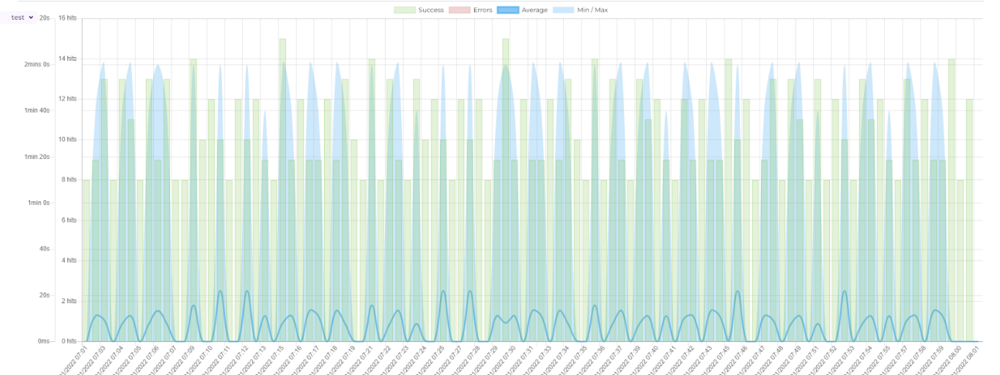
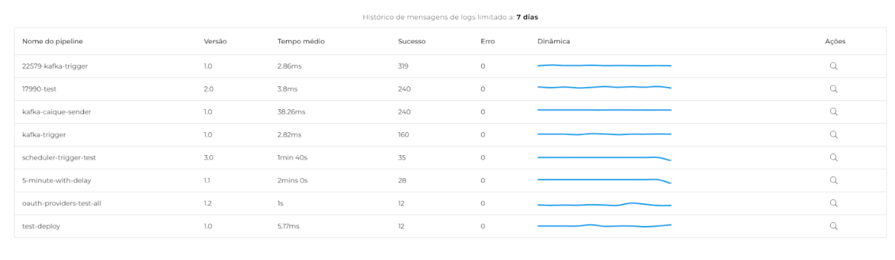

# Visão geral

## **Visão Geral** 

A aba de **Visão Geral** traz mais visibilidade e informação aos usuários, permitindo um acompanhamento detalhado e progressivo da performance dos principais _pipelines_ implantados novamente (teste ou produção).

É possível filtrar os 10 _pipelines_ com maior número de execuções dentro do período selecionado e gerar relatórios com base no monitoramento contínuo, a partir do momento de implantação de um _pipeline_.

### **Seletor de Ambiente** 

.png>)

Na parte superior esquerda da tela, é possível selecionar o ambiente desejado a qualquer momento na página. Ao selecionar o ambiente, a página inteira é atualizada.

### **Seletor de Período** 

Já no lado direito, é possível realizar a seleção do período desejado para o relatório, de 15 minutos a 30 dias.

### **Cards da Monitoração** 

Abaixo, temos alguns números importantes sobre o ambiente selecionado:

* _**Pipelines**_: Quantidade de _pipelines_ criados no realm;
* **Implantados**: Quantidade de _pipelines_ implantados no ambiente selecionado;
* **Contas**: Quantidade de Contas (_Accounts_) criadas no _realm_.

### **Gráfico da Monitoração** 

Na próxima parte da página, será exibido um gráfico feito com base no desempenho dos _pipelines_.

Contendo as taxas de sucesso, erro, tempo médio e os tempos máximo e mínimo de execução.

### **Relatório Individual** 

Logo abaixo será mostrado um relatório individual dos principais _pipelines_ mais executados.

Cada linha contém as seguintes informações:

* **Nome do **_**pipeline**_
* **Versão** implantada do _pipeline._
* **Tempo médio** das execuções.
* **Sucesso**: quantidade de execuções bem sucedidas no período selecionado.
* **Erro**: quantidade de execuções mal sucedidas no período selecionado.
* **Dinâmica**: uma representação gráfica da relação entre as taxas de sucesso e erro no período selecionado.
* **Ações**: ícone de lupa com link para a tela **Execuções Concluídas** contendo detalhes sobre a execução do pipeline selecionado).
