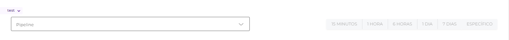
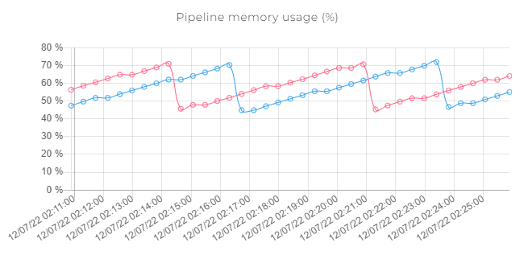
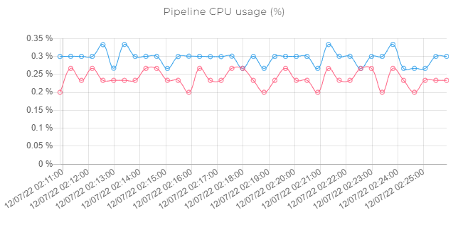

# Pipeline metrics

Na página Pipeline Metrics, você pode analisar gráficos referentes à performance dos pipelines implantados.

## Campos de busca

<figure><figcaption></figcaption></figure>

Selecione o ambiente desejado no canto superior esquerdo. Quando você seleciona um ambiente, toda a página é atualizada.

Depois, escolha um pipeline na barra de busca e selecione o período desejado para a análise. Os períodos predeterminados são os(as) últimos(as) : 15 minutos, 1 hora, 6 horas, 1 dia ou 7 dias. Você também pode escolher um intervalo de tempo específico.

## Gráficos

### Execuções de pipeline por segundo (eps)

.png>)

Esse gráfico mostra o número médio de execuções por segundo, em diversos intervalos de tempo durante o período de tempo selecionado, para todas as réplicas.

### Tempo de resposta do pipeline (ms)

.png>)

Esse gráfico mostra o tempo médio (em milissegundos) decorridos para que o pipeline gerasse uma resposta, em diversos intervalos de tempo durante o período de tempo selecionado, para todas as réplicas.

O tempo de reposta é dado pelo tempo decorrido entre a saída da mensagem da fila de execução e uma resposta ser gerada pelo pipeline. Contenções na fila de execução não afetam essa métrica.

Você pode aprender mais sobre filas de execução na seção "Mensagens de Pipeline na Fila (mensagens)" abaixo.

### Execuções de pipeline em andamento (_inflights_)

.png>)

Esse gráfico mostra o número total de requisições simultâneas feitas ao pipeline - para todas as réplicas - durante diversos intervalos no período de tempo selecionado.

Essa informação é útil para determinar se o número de réplicas e execuções simultâneas escolhido durante a implementação foram apropriados.

Para aprender mais sobre tamanho da implementação, execuções simultâneas e réplicas, [clique aqui](https://docs.digibee.com/help-center/v/pt-br/run/deployments).

### Tamanho da mensagem do pipeline (bytes)

.png>)

As linhas nesse gráfico exibem o tamanho médio (em bytes) das mensagens recebidas e retornadas pelo pipeline. Você pode ver o _label_ de cada linha passando seu cursor por cima dela.

Essa informação é útil para determinar se o tamanho da pipeline escolhido durante sua implementação foi adequado.

Para aprender mais sobre tamanho da implementação, execuções simultâneas e réplicas, [clique aqui](https://docs.digibee.com/help-center/v/pt-br/run/deployments).

### Uso de memória do pipeline (%)

Esse gráfico exibe o uso percentual de memória para cada réplica do pipeline durante diversos intervalos durante o período de tempo selecionado.

Essa informação é útil para determinar se o tamanho de pipeline escolhido durante sua implementação foi adequado, já que a exaustão da memória disponível levará a um erro do tipo "Out of Memory".

Para aprender mais sobre tamanho da implementação, execuções simultâneas e réplicas, [clique aqui](https://docs.digibee.com/help-center/v/pt-br/run/deployments).

### Mensagens na fila do pipeline

 (1).png>)

Esse gráfico mostra o número total de mensagens na fila de execução, isto é, o número de mensagens aguardando para serem processadas, para todas as réplicas do pipeline, durante diversos intervalos durante o período de tempo selecionado.

Todas as réplicas consomem mensagens da mesma fila. Um número alto de mensagens indica que o número de réplicas de pipeline ou de execuções simultâneas deve ser aumentado durante a implementação.

Para aprender mais sobre tamanho da implementação, execuções simultâneas e réplicas, [clique aqui](https://docs.digibee.com/help-center/v/pt-br/run/deployments).

### Uso de CPU do pipeline (%)

Esse gráfico mostra o uso médio percentual do CPU para cada réplica do pipeline, de acordo com o tamanho de implementação escolhido.

Essa informação é útil para determinar se o tamanho de pipeline escolhido durante sua implementação foi adequado, já que a exaustão da memória disponível levará a um erro do tipo "Out of Memory".

Para aprender mais sobre tamanho da implementação, execuções simultâneas e réplicas, [clique aqui](https://docs.digibee.com/help-center/v/pt-br/run/deployments).
