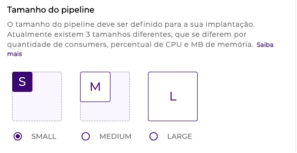

# Conceitos de Run

## **O que é “implantação”?** 

Implantação (_deployment_) é o processo de disponibilização dos _pipelines_ que já possuem _triggers_ configurados.

Essa disponibilização pode acontecer tanto no ambiente de teste (_test_) quanto no ambiente de produção (_prod_), como mostrado na figura a seguir:

<figure><figcaption></figcaption></figure>

O fluxo de trabalho dentro da _Digibee Integration Platform_ é composto por três fases. Entenda melhor cada uma delas:

* **Build**

[Fase na qual os _pipelines_ são construídos.](https://docs.digibee.com/documentation/v/pt-br/build/pipelines)

_Pipelines_ são constituídos por **componentes**, os quais são organizados em uma estrutura lógica, sequencial ou paralela para que se possa realizar uma integração (ex: transformar dados e enviar ao ERP, API ou DB).

**Componentes** são unidades de processamento com papéis bem definidos, por exemplo, realizar uma chamada REST para um endereço HTTP. Eles podem fazer uso de recursos externos ao _pipeline_, assim como __ [_accounts_](https://docs.digibee.com/documentation/v/pt-br/configurations/contas-accounts) e [_globals_](https://docs.digibee.com/documentation/v/pt-br/configurations/conceitos-basicos), que além de armazenar uma ou mais informações, também garantem maior segurança e reaproveitamento.

* **Run**

Segunda fase, caracterizada pelo processo de implantação do _pipeline_. É nesse momento que o _pipeline_ é preparado e disponibilizado para consumo ou execução.&#x20;

O _pipeline_ executa de acordo com as configurações previamente definidas, que determinam o controle e a capacidade de processamento no ambiente (teste ou produção).

* **Monitor**

Na terceira e última fase é possível acompanhar os _pipelines_ implantados para analisar, verificar e rastrear o andamento das execuções.&#x20;

Dessa maneira, os dados sobre o comportamento dos seus _pipelines_ estarão disponíveis para dar suporte à gestão e operação.

Isso permite saber, por exemplo, a quantidade de solicitações executadas com sucesso ou com falha, o tempo de resposta e os logs.

## Conceitos de Run 

Entenda melhor detalhes sobre os conceitos principais de Run.

A implantação abrange três partes. Saiba quais são elas:

### **Tamanho**

O tamanho da implantação está diretamente relacionado ao poder de processamento e memória de cada uma das réplicas.

<figure><figcaption></figcaption></figure>

As três faixas de tamanho de implantação são:

* **SMALL:** 1 a 10 _consumers_
* **MEDIUM:** 1 a 20 _consumers_
* **LARGE:** 1 a 40 _consumers_

Por exemplo, se você configurar 10 _consumers_ (SMALL) para a execução do seu _pipeline_, isso significa que 10 mensagens poderão ser processadas simultaneamente.

### **Réplicas**

A função das réplicas é determinar a quantidade de réplicas que serão disponibilizadas para atender às suas integrações com alta disponibilidade. Isto garante autonomia, quantidade de execuções simultâneas e redundância .

<figure><figcaption></figcaption></figure>

### Execuções simultâneas

_Consumer_ (ou consumidor) contempla o conceito de execuções simultâneas que cada réplica implantada suporta.

A quantidade máxima de _consumers_ é definida com base em três faixas de tamanho de implantação.

<figure><figcaption></figcaption></figure>

Saiba mais detalhes específicos sobre [tamanhos, réplicas e execuções simultâneas dos _pipelines_ em nosso artigo de _Pipeline Engine_.](https://docs.digibee.com/documentation/v/pt-br/plataforma/pipeline-engine#arquitetura-de-operao)
