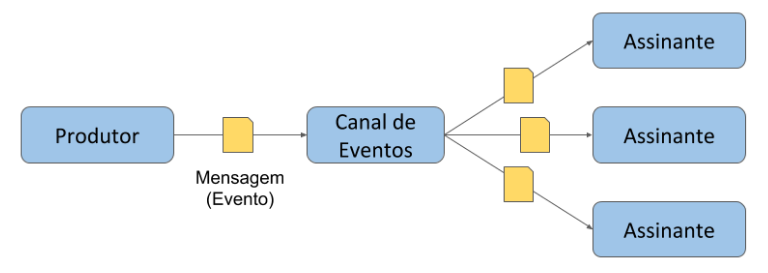

# Arquitetura Orientada a Eventos

Uma das abordagens mais poderosas e flexíveis para a construção de integrações é utilização de uma Arquitetura Orientada a Eventos. Saiba um pouco mais sobre suas características e vantagens e veja como é fácil implementá-la através da Digibee Integration Platform.

Alguns conceitos que você precisa conhecer:

* **Evento:** mensagem que notifica outros componentes sobre uma mudança de estado, uma ação ou um fato que ocorreu para que os componentes possam então reagir à ele
* **Publicador:** processo que gera o evento
* **Assinantes:** processos que consomem o evento
* **Publisher/Subscriber:** ou apenas _Pub/sub_, é o padrão de mensagem

Para ilustrar melhor como isso funciona na prática, se imagine __ em um __ processo de compra. No momento em que você efetua o pagamento e confirma a sua compra, um processo “Efetivar Compra_”_ publica um evento "Compra efetuada".

Outros processos também podem reagir ao evento e efetuar processamentos diferentes, assim como “Consolidar Compras no Histórico do Cliente e Providenciar Reposição de Estoque dos produtos adquiridos”. Nesse caso, o evento publicado pelo **Publicador** (_Efetivar Compra)_ é o gatilho que dispara a execução dos **Assinantes** (_Consolidar Compras no Histórico do Cliente e Providenciar Reposição de Estoque)._

Estas são algumas vantagens proporcionadas pela adoção de uma arquitetura orientada a eventos:

* **Publicador e Assinantes desacoplados:** a partir da publicação de um único evento, qualquer número de processos pode responder à ele sem que seja necessário fazer qualquer alteração no Publicador - ao contrário do que ocorre em integrações ponto-a-ponto;
* **Fácil expansão do modelo para suportar novas funcionalidades**: novos processos Assinantes podem ser desenvolvidos posteriormente sem que seja necessário fazer qualquer alteração no processo do Publicador;
* **Execução assíncrona**: o Publicador gera um evento sem precisar saber do resultado da execução dos Assinantes, garantindo independência de execução entre os processos;
* **Escalabilidade vertical e horizontal**: graças ao desacoplamento proporcionado por esse modelo, cada processo pode ser dimensionado separadamente de acordo com suas características de processamento. Além disso, adicionar novos Assinantes não causa nenhum impacto ao Produtor.

Implementar este modelo através da Plataforma é bastante simples e requer que você siga apenas 2 passos:

**1. Construa o Publicador**

Crie um _pipeline_ que publica um Evento através de um componente _Event_. Clique [aqui](../components/queues-and-messaging/event-publisher.md) para saber como utilizá-lo.

**2. Construa os Assinantes**

Crie _pipelines_ que utilizem o _Event Trigger_ configurado para responder ao evento gerado pelo Publicador. Clique [aqui](../components/triggers/event-trigger.md) para aprender como configurar o _trigger_.
